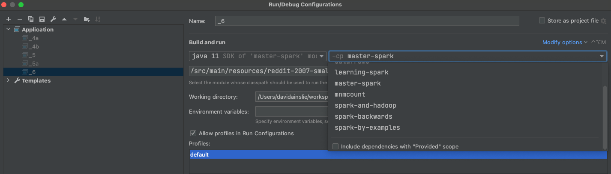

# Spark by Backwards

Scala module with reusable Spark functionality.

Example usage included while covering various courses.

## Table of Contents

- [Setup](docs/setup.md)

- [SBT](docs/sbt.md)

- [Introduction](docs/introduction.md)

- [Hadoop](docs/hadoop.md)

- [Spark Shell](docs/spark-shell.md)

- [SparkConf](docs/spark-conf.md)

- [Resilient Distributed Datasets (RDD)](docs/rdd.md)

- [Architecture](docs/architecture.md)

- [Pair RDD](docs/pair-rdd.md)

- [Application JAR](docs/application-jar.md)

- Courses (module per course/book)

  - [Apache Spark Quick Start Guide](courses/apache-spark-quick-start-guide/README.md)
  
  - [Learning Spark](courses/learning-spark/README.md)
  
  - [Spark and Hadoop](courses/spark-and-hadoop/README.md)
  
NOTE on Intellij - The build has Spark dependencies set to **provided**. This is fine when running from the **sbt** console as the build is configured to handle this.
However, for every **main** application run in Intellij, we have to add the following configuration to include any **provided** dependencies:

