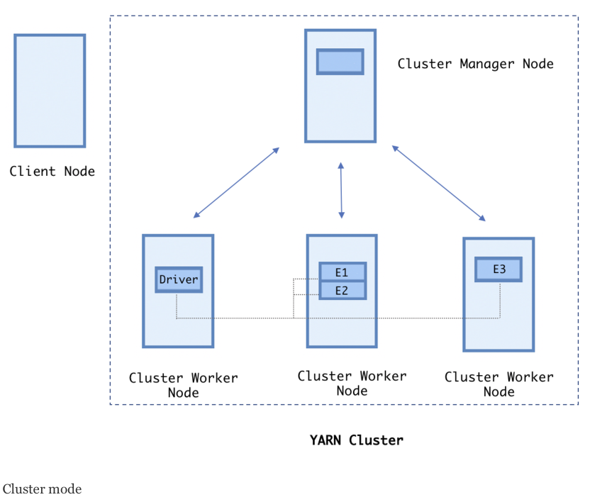

# Architecture & Application Execution Flow

## Application execution modes

**Local mode** runs both driver and executors on a single machine. In this mode, the partitions are processed by multiple threads in parallel. The number of threads can be controlled by the user while submitting the job:

```bash
[root@sandbox-hdp ~]# spark-submit \
  --class com.backwards.sales.Sales \
  --master local \
  ./sales_2.12_0.1.1-SNAPSHOT.jar
```

**Client mode** the driver process runs on the client node (that is, the edge or gateway node) on which the job was submitted. The client node provides resources, such as memory, CPU, and disk space to the driver program, but the executors run on the cluster nodes and they are maintained by the cluster manager, such as YARN. One of the advantages of running your job in client mode is that you can easily access your logs on the same machine. But when your number of Spark applications increase in production, you should not consider client mode for job execution. This is because the client node has limited resources. If some of the applications collect data from executors, there is a high chance of client node failure:

```bash
[root@sandbox-hdp ~]# spark-submit \
  --master yarn \
  --deploy-mode client \
  --num-executors 3 \
  --executor-memory 2g \
  --total-executor-cores 1 \
  --class com.backwards.sales.Sales \
  ./sales_2.12_0.1.1-SNAPSHOT.jar
```

**Cluster mode** is similar to client mode, except that the driver process runs on one of the cluster worker machines, and the cluster manager is responsible for both driver and executor processes. This gives an advantage of running multiple applications at the same time because cluster manager will distribute the driver load across the cluster:

```bash
[root@sandbox-hdp ~]# spark-submit \
  --master yarn \
  --deploy-mode cluster \
  --num-executors 3 \
  --executor-memory 2g \
  --total-executor-cores 1 \
  --class com.backwards.sales.Sales \
  ./sales_2.12_0.1.1-SNAPSHOT.jar
```



The following table shows all the possible options available for --master in spark-submit:

| Master URL                      | Meaning                                                      |
| :------------------------------ | :----------------------------------------------------------- |
| local                           | Run Spark locally with one worker thread (that is, no parallelism at all). |
| local[K]                        | Run Spark locally with K worker threads (ideally, set this to the number of cores on your machine). |
| local[K,F]                      | Run Spark locally with K worker threads and F maxFailures (see [spark.task.maxFailures](https://spark.apache.org/docs/latest/configuration.html#scheduling) for an explanation of this variable). |
| local[*]                        | Run Spark locally with as many worker threads as logical cores on your machine. |
| local[*,F]                      | Run Spark locally with as many worker threads as logical cores on your machine and F maxFailures. |
| spark://HOST:PORT               | Connect to the given [Spark standalone cluster](https://spark.apache.org/docs/latest/spark-standalone.html) master. The port must be whichever one your master is configured to use, which is 7077 by default. |
| spark://HOST1:PORT1,HOST2:PORT2 | Connect to the given [Spark standalone cluster with standby masters with Zookeeper](https://spark.apache.org/docs/latest/spark-standalone.html#standby-masters-with-zookeeper). The list must have all the master hosts in the high availability cluster set up with Zookeeper. The port must be whichever each master is configured to use, which is 7077 by default. |
| mesos://HOST:PORT               | Connect to the given [Mesos](https://spark.apache.org/docs/latest/running-on-mesos.html) cluster. The port must be whichever one your application is configured to use, which is 5050 by default. Or, for a Mesos cluster using ZooKeeper, use mesos://zk://.... To submit with --deploy-mode cluster, the HOST:PORT should be configured to connect to the [MesosClusterDispatcher](https://spark.apache.org/docs/latest/running-on-mesos.html#cluster-mode). |
| yarn                            | Connect to a [YARN](https://spark.apache.org/docs/latest/running-on-yarn.html)cluster in client or cluster mode depending on the value of --deploy-mode. The cluster location will be found based on the HADOOP_CONF_DIR or YARN_CONF_DIR variable. |
| k8s://HOST:PORT                 | Connect to a [Kubernetes](https://spark.apache.org/docs/latest/running-on-kubernetes.html) cluster in cluster mode. Client mode is currently unsupported and will be supported in future releases. The HOST and PORT refer to the [Kubernetes API Server](https://kubernetes.io/docs/reference/generated/kube-apiserver/). It connects using TLS by default. To force it to use an unsecured connection, you can use k8s://http://HOST:PORT. |