# Complete Example

With the basics in place, and before going into details, now is a good time to run through a compete example.

As an aid, there are some other nice examples/references out there:

- [Scala Example with Hortonworks](https://www.cloudera.com/tutorials/setting-up-a-spark-development-environment-with-scala/.html)
- [Java Example with Hortonworks](https://github.com/hortonworks/data-tutorials/blob/master/tutorials/hdp/setting-up-a-spark-development-environment-with-java/tutorial.md)
- [Learning Hortonworks Sandbox](https://www.cloudera.com/tutorials/learning-the-ropes-of-the-hdp-sandbox.html)
- [Introduction to Hortonworks Sandbox](http://indico.ictp.it/event/8170/session/10/contribution/21/material/0/1.pdf)

## Setup

Download [Hortonworks Sandbox](https://www.cloudera.com/downloads/hortonworks-sandbox.html):

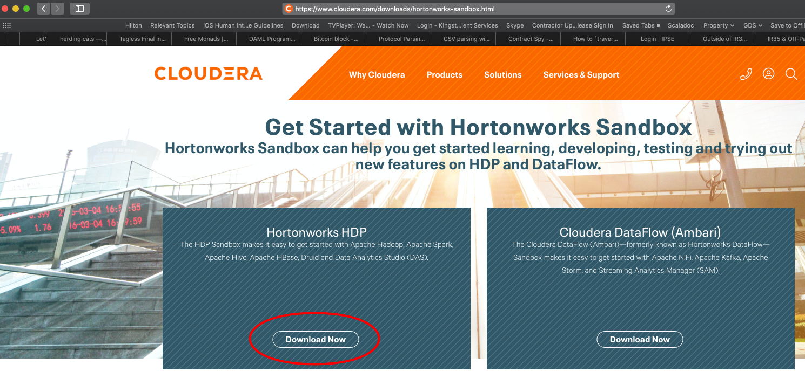

Choose the type of download. This example uses Virtualbox:

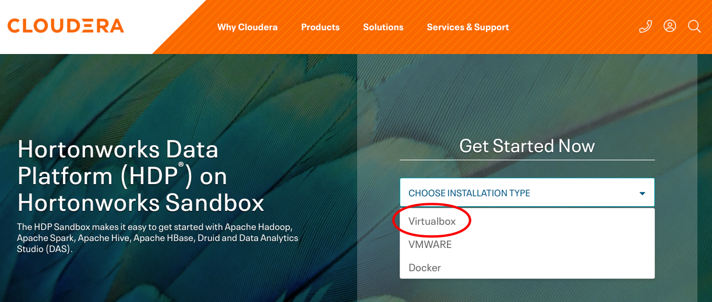

Note that you will be asked to login or sign up (don't worry it is free).

Double click on the **.ova** file that has been downloaded and import into Virtualbox:

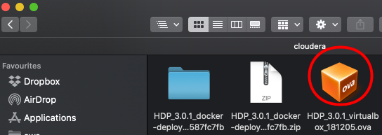

Then **Start**:

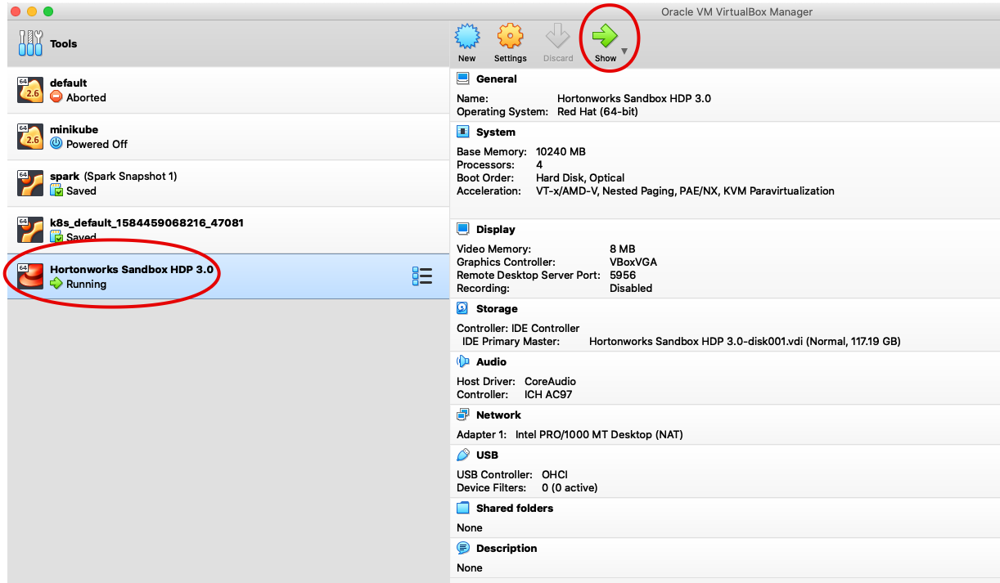

It takes quite a while for things to get going, but you'll end up with a VM:

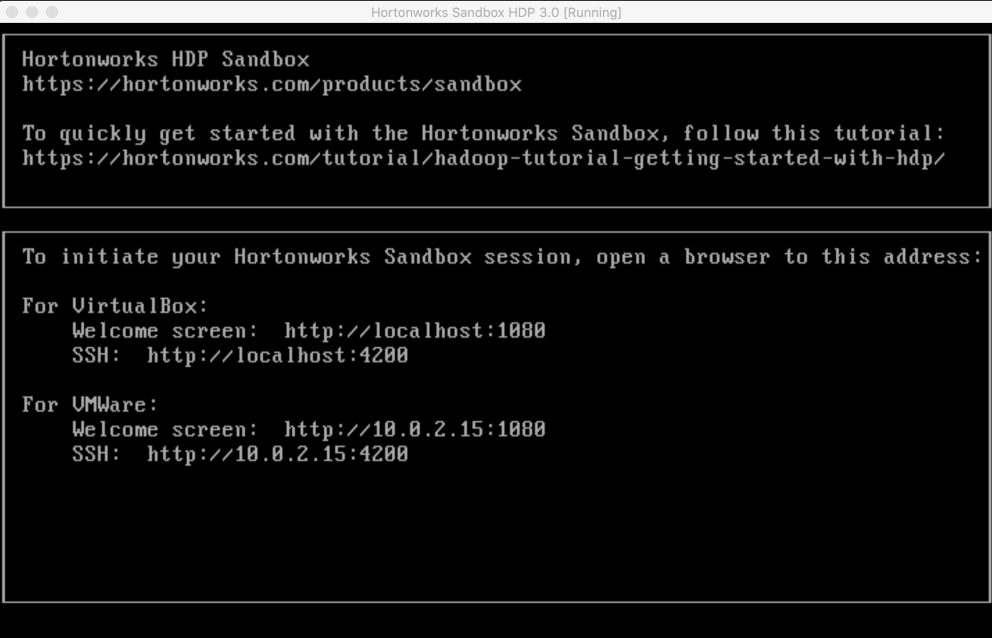

At this point we can navigate to the Sandbox UI in our browser. But first, as the UI and other components relies on a URL of [sandbox.hortonworks.com](sandbox.hortonworks.com) let's add this to the [/etc/hosts](/etc/hosts) file to save us always replacing sandbox.hortonworls.com with **127.0.0.1**. Either do the following or use an editor:

```bash
echo '127.0.0.1 sandbox.hortonworks.com' | sudo tee -a /etc/hosts

echo '127.0.0.1 sandbox-hdp.hortonworks.com' | sudo tee -a /etc/hosts
```

and open a browser at [sandbox.hortonworks.com:8080](sandbox.hortonworks.com:8080) where the login is **maria_dev/maria_dev**:

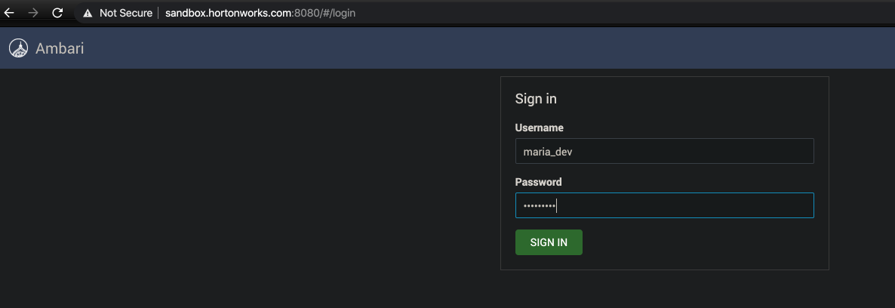

---

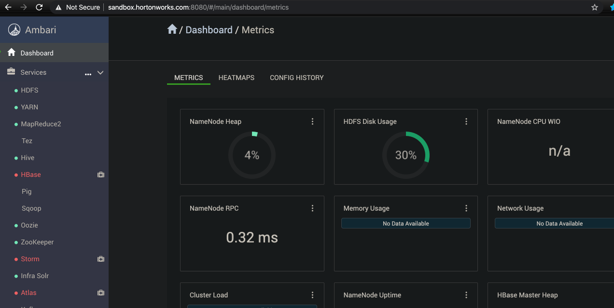

## Example Application

We have one [Scala class](../modules/sales/src/main/scala/com/backwards/sales/Sales.scala) that reads a CSV of Sales from HDFS and calculates total amount/sales per country:

```scala
package com.backwards.sales

import org.apache.spark.sql.{DataFrame, Dataset, Row, SparkSession}
import org.apache.spark.sql.functions._

object Sales {
  def main(args: Array[String]) {
    val spark = SparkSession
      .builder
      .appName("Sales")
      .config("spark.master", "local")
      .getOrCreate

    import spark.implicits._

    val salesDataFrame: DataFrame = spark
      .read
      .option("inferSchema", "true")
      .option("header", "true")
      .csv("hdfs:///tmp/sales.csv")

    val dataset: Dataset[Row] = salesDataFrame
      .groupBy("COUNTRY_CODE")
      .sum("AMOUNT")
      .orderBy(desc("sum(AMOUNT)"))

    dataset.show

    spark.stop()
  }
}
```

We need to first upload the **sales.csv** and copy the application **jar** into HDFS (in the Sandbox).

SSH on the sandbox, as you will first have to change the root password of **hadoop**. It is not easy to change it as the rules are very tight, but this one works: **g0-b@lloon**

```bash
➜ ssh root@sandbox.hortonworks.com -p 2222
The authenticity of host '[sandbox.hortonworks.com]:2222 ([127.0.0.1]:2222)' can't be established.
ECDSA key fingerprint is SHA256:TV0krZaLbRNaLV8D/rOFz/9o6V2l2w8yZJqKqmeOasY.
Are you sure you want to continue connecting (yes/no)? yes
Warning: Permanently added '[sandbox.hortonworks.com]:2222' (ECDSA) to the list of known hosts.
root@sandbox.hortonworks.com's password:
Last login: Thu Mar 19 13:17:03 2020 from 172.18.0.3
[root@sandbox-hdp ~]#
```

Back to the UI. Let's select **Files View** from the top left:

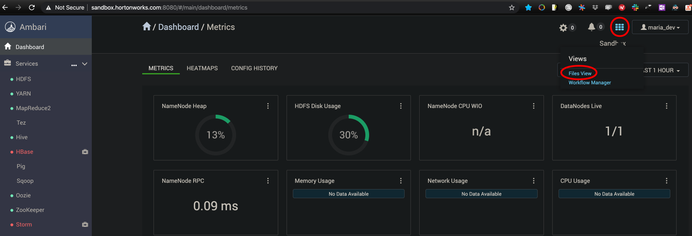

Click on **tmp**:

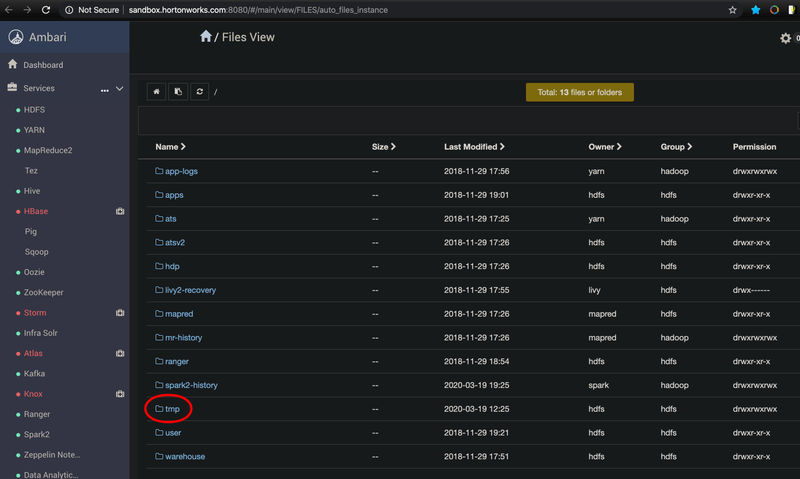

And select **upload** to upload [sales.csv](../modules/sales/data/input/sales.csv) which you can see I've already uploaded:

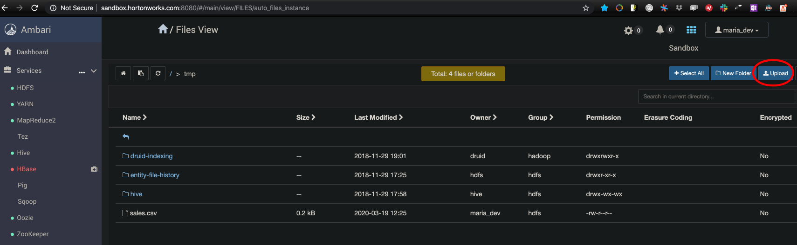

The content of the CSV:

```properties
ORDER_ID,PRODUCT_CODE,COUNTRY_CODE,AMOUNT
1,PC_01,USA,200.00
2,PC_01,USA,46.34
3,PC_04,USA,123.54
4,PC_02,IND,99.76
5,PC_44,IND,245.00
6,PC_02,AUS,654.21
7,PC_03,USA,75.00
8,PC_01,SPN,355.00
9,PC_03,USA,34.02
10,PC_03,USA,567.07
```

Now build the **jar** for uploading:

```bash
spark-backwards/courses/apache-spark-quick-start-guide/modules/sales 
➜ sbt package
```

We **scp**:

```bash
spark-backwards/courses/apache-spark-quick-start-guide/modules/sales
➜ scp -P 2222 target/scala-2.12/sales_2.12-3.0.0-preview2_0.1.0-SNAPSHOT.jar root@sandbox.hortonworks.com:/root
root@sandbox.hortonworks.com's password:
sales_2.12-3.0.0-preview2_0.1.0-SNAPSHOT.jar

```

SSH again:

```bash
spark-backwards/courses/apache-spark-quick-start-guide/modules/sales on  master [!+?] at ☸️ docker-desktop
➜ ssh root@sandbox.hortonworks.com -p 2222
root@sandbox.hortonworks.com's password:
Last login: Thu Mar 19 19:41:43 2020 from 172.18.0.3
[root@sandbox-hdp ~]# ls -las
...
4 -rw-r--r-- 1 root root 2639 Mar 19 19:45 sales_2.12-3.0.0-preview2_0.1.0-SNAPSHOT.jar
```

## Spark Submit

Finally we can submit our job:

```bash
[root@sandbox-hdp ~]# spark-submit \
  --class com.backwards.sales.Sales \
  --master local \
  ./sales_2.12-3.0.0-preview2_0.1.0-SNAPSHOT.jar
  
SPARK_MAJOR_VERSION is set to 2, using Spark2
20/03/19 13:19:24 INFO SparkContext: Running Spark version 2.3.1.3.0.1.0-187
20/03/19 13:19:24 INFO SparkContext: Submitted application: Sales
...
+------------+-----------+
|COUNTRY_CODE|sum(AMOUNT)|
+------------+-----------+
|         USA|    1045.97|
|         AUS|     654.21|
|         SPN|      355.0|
|         IND|     344.76|
+------------+-----------+

```

Take a look at the job at [http://sandbox.hortonworks.com:18081/](http://sandbox.hortonworks.com:18081/):

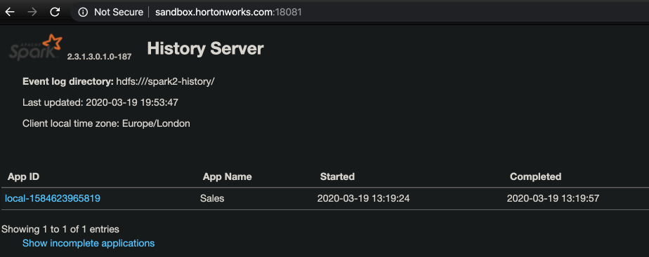