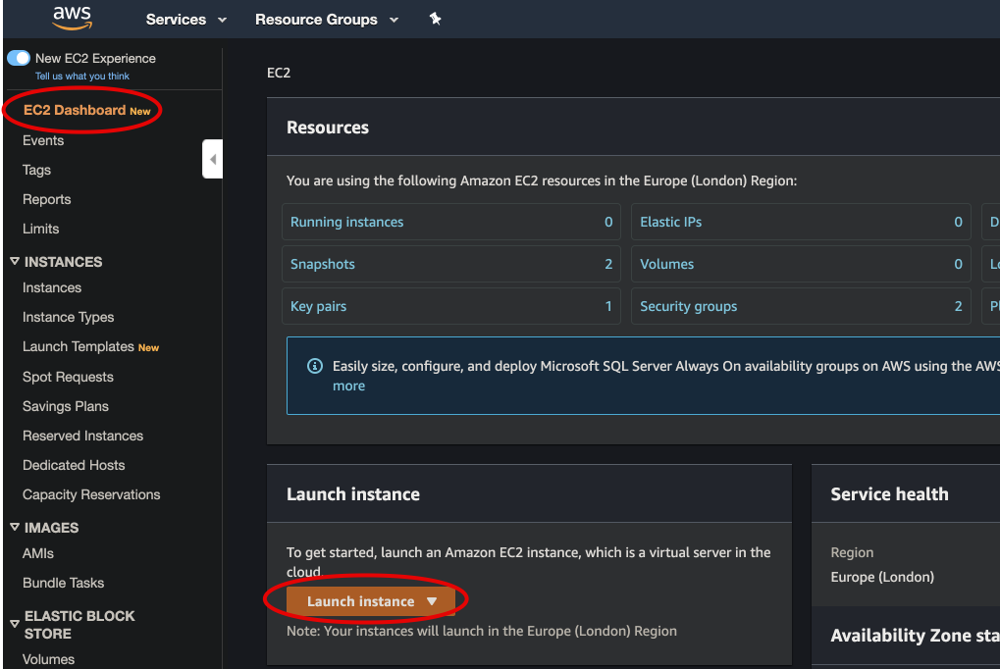
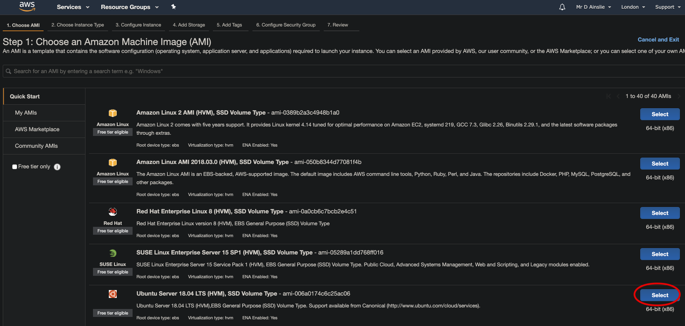
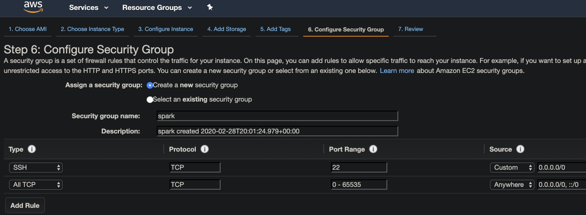
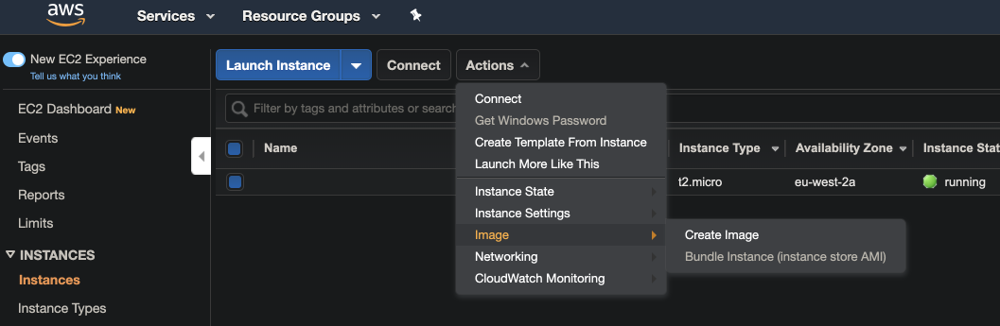

# Installation - AWS

Create an EC2 instance:



Select the desired Amazon Machine Image (AMI) e.g. Ubuntu Server 18.04.



Select Configure Security Group and allow all machines to connect to the instance that you've created:



Now SSH onto the instance - do the following in the location of the downloaded **pem** file:

- Set the permission of the .pem file to 400 and provide a complete path in the ssh command
- The default username for Ubuntu AMI is ubuntu
- ec2-3-10-140-139.eu-west-2.compute.amazonaws.com is the host name of the instance

```bash
~/aws/key-pairs
➜ chmod 400 david.pem

~/aws/key-pairs
➜ ssh -i "david.pem" ubuntu@ec2-3-10-140-139.eu-west-2.compute.amazonaws.com
...
ubuntu@ip-172-31-5-117:~$
```

Install Java:

```bash
ubuntu@ip-172-31-5-117:~$ sudo apt install openjdk-8-jdk
```

Install Scala:

```bash
ubuntu@ip-172-31-5-117:~$ wget https://downloads.lightbend.com/scala/2.12.10/scala-2.12.10.deb

ubuntu@ip-172-31-5-117:~$ sudo dpkg -i scala-2.12.10.deb

ubuntu@ip-172-31-5-117:~$ sudo apt update

ubuntu@ip-172-31-5-117:~$ sudo apt install scala
```

Install SBT:

```bash
ubuntu@ip-172-31-5-117:~$ echo "deb https://dl.bintray.com/sbt/debian /" | sudo tee -a /etc/apt/sources.list.d/sbt.list

ubuntu@ip-172-31-5-117:~$ sudo apt-key adv --keyserver hkp://keyserver.ubuntu.com:80 --recv 2EE0EA64E40A89B84B2DF73499E82A75642AC823

ubuntu@ip-172-31-5-117:~$ sudo apt-get update

ubuntu@ip-172-31-5-117:~$ sudo apt-get install sbt
```

Let's check:

```bash
ubuntu@ip-172-31-5-117:~$ java -version
openjdk version "1.8.0_242"

ubuntu@ip-172-31-5-117:~$ scala -version
Scala code runner version 2.12.10
```

Install Python:

```bash
ubuntu@ip-172-31-5-117:~$ sudo apt-get update

ubuntu@ip-172-31-5-117:~$ sudo apt-get install python3.6
```

Install Spark:

```bash
ubuntu@ip-172-31-5-117:~$ cd /opt

ubuntu@ip-172-31-5-117:/opt$ curl -O https://archive.apache.org/dist/spark/spark-2.4.5/spark-2.4.5-bin-hadoop2.7.tgz

ubuntu@ip-172-31-5-117:/opt$ tar -xzvf spark-2.4.5-bin-hadoop2.7.tgz
```

Set the environment variable in .bash_profile:

```bash
ubuntu@ip-172-31-5-117:/opt$ vi ~/.bash_profile
```

where we add:

```bash
export SPARK_HOME=/opt/spark-2.4.5-bin-hadoop2.7
export PATH=$PATH:$SPARK_HOME/sbin
export PATH=$PATH:$SPARK_HOME/bin

export PYSPARK_PYTHON=python3
export PYTHONPATH=$SPARK_HOME/python:$PYTHONPATH
```

and source it:

```bash
ubuntu@ip-172-31-5-117:/opt$ source ~/.bash_profile
```

After all our hard work, let's save as AMI:



Start Scala Spark REPL:

```bash
ubuntu@ip-172-31-5-117:~$ spark-shell
```

Start Python Spark REPL:

```bash
ubuntu@ip-172-31-5-117:/opt$ pyspark
```

Start Spark SQL REPL:

```bash
ubuntu@ip-172-31-5-117:/opt$ spark-sql
```

The multi-lingual feature of Spark also allows you to use Java for accessing Spark APIs:

```bash
spark-submit \
  --class <main-class> \
  --master <master-url> \
  --deploy-mode <deploy-mode> \
  --executor-memory 20G \
  --total-executor-cores 100 
  --conf <key>=<value> \
  <application-jar> \
  [application-arguments]
```

- --class: This is the class containing the main method, and it is the entry point of the application (for example, org.apache.spark.examples.SparkPi).
- --master: This is the key property to define the master of your application. Depending on the standalone mode or the cluster mode, the master could be local, yarn, or spark://host:port (for example, spark://192.168.56.101:7077). 
- --deploy-mode: This is used to start the driver on any of worker nodes in the cluster or locally where the command is executed (client) (default: client).
- --conf: Spark configurations that you want to overwrite for your application as key=value format. 
- application-jar: This is the path of your application jar. If it is present in HDFS, then you need to specify the HDFS path as hdfs:// path or if it is a file path, then it should be a valid path on a driver node, file://path. 

- application-arguments: These are the arguments that you have to specify for your application's main class.