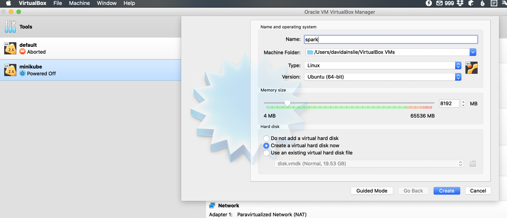
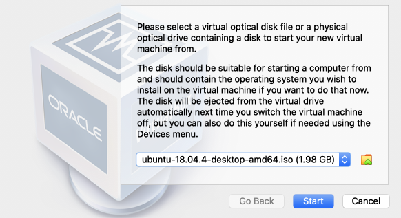
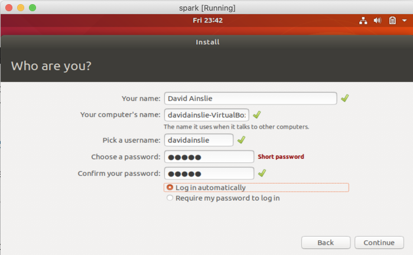

# Installation - Virtualbox

Download an [Ubuntu ISO](https://ubuntu.com/download/desktop/thank-you?version=18.04.4&architecture=amd64).

Virtualbox - new:



---


Upon starting, choose the ISO that was downloaded:



Upon installing Ubuntu, choose user name and password - I went for the uncrackable **admin**:



Install Java:

```bash
$ sudo apt install openjdk-8-jdk
```

Install Scala:

```bash
$ wget https://downloads.lightbend.com/scala/2.12.10/scala-2.12.10.deb

$ sudo dpkg -i scala-2.12.10.deb

$ sudo apt update

$ sudo apt install scala
```

Let's check:

```bash
$ java -version
openjdk version "1.8.0_242"

$ scala -version
Scala code runner version 2.12.10
```

Install Python:

```bash
$ sudo apt-get update

$ sudo apt-get install python3.6
```

Install Spark:

Note that you may have to do:

```bash
$ sudo chmod -R 777 /opt
```

```bash
$ cd /opt

$ curl -O https://archive.apache.org/dist/spark/spark-2.4.5/spark-2.4.5-bin-hadoop2.7.tgz

$ tar -xzvf spark-2.4.5-bin-hadoop2.7.tgz
```

Set the environment variable in .bash_profile:

```bash
$ vi ~/.bash_profile
```

where we add:

```bash
export SPARK_HOME=/opt/spark-2.4.5-bin-hadoop2.7
export PATH=$PATH:$SPARK_HOME/sbin
export PATH=$PATH:$SPARK_HOME/bin

export PYSPARK_PYTHON=python3
export PYTHONPATH=$SPARK_HOME/python:$PYTHONPATH
```

and source it:

```bash
$ source ~/.bash_profile
```

Start Scala Spark REPL:

```bash
$ spark-shell
```

Start Python Spark REPL:

```bash
$ pyspark
```

Start Spark SQL REPL:

```bash
$ spark-sql
```