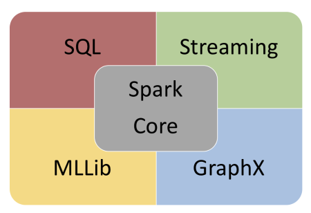

# Introduction

Apache Spark is a distributed computing framework which makes big-data processing quite easy, fast, and scalable.

Spark provides an interface with many different distributed and non-distributed data stores, such as **Hadoop** **Distributed File System** (**HDFS**), Cassandra, Openstack Swift, Amazon S3, and Kudu.

The basic entity of Spark is **Resilient Distributed Dataset** (**RDD**), which is a read-only partitioned collection of data. RDD can be created using data stored on different data stores or using existing RDD.

Spark needs a resource manager to distribute and execute its tasks. By default, Spark comes up with its own standalone scheduler, but it integrates easily with Apache Mesos and **Yet Another Resource Negotiator** (**YARN**) for cluster resource management and task execution.

Spark follows a master-slave architecture, as it allows it to scale on demand. Spark's architecture has two main components:

- **Driver** **Program**: A driver program is where a user writes Spark code using either Scala, Java, Python, or R APIs. It is responsible for launching various parallel operations of the cluster.
- **Executor:** Executor is the **Java Virtual Machine** (**JVM**) that runs on a worker node of the cluster. Executor provides hardware resources for running the tasks launched by the driver program.

**Spark architecture**:

**Spark stack**:

