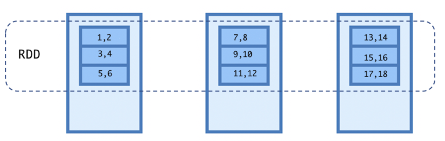

# Resilient Distributed Dataset

The following illustrates a **RDD** of numbers (**1** to **18**) having nine partitions on a cluster of three nodes:



An RDD can be created in four ways (where we need a SparkSession):

```scala
val spark = SparkSession
  .builder
  .appName("test")
  .config("spark.master", "local")
  .getOrCreate()
```

- Parallelize a collection

```scala
val numbersRDD = spark.sparkContext.parallelize(1 to 10)
```

- From an external dataset

  Though parallelizing a collection is the easiest way to create an RDD, it is not the recommended way for the large datasets. Large datasets are generally stored on filesystems such as HDFS, and we know that Spark is built to process big data.

```scala
val filePath = File("./data/input/employees.txt").canonicalPath
val rdd = spark.sparkContext.textFile(filePath)
```

- From another RDD

  RDDs are immutable in nature. They cannot be modified, but we can transform an RDD to another RDD with the help of the methods provided by Spark.

```scala
val oddNumbersRDD = numbersRDD.filter(_ % 2 != 0)
```

- From a DataFrame or DataSet

```scala
val rangeDataFrame = spark.range(1, 5)
val rangeRDD = rangeDataFrame.rdd
```

## RDD types

- Hadoop RDD
- Shuffled RDD
- Pair RDD
- Mapped RDD
- Union RDD
- JSON RDD
- Filtered RDD
- Double RDD
- Vertex RDD

Let's look more closely at:

## Pair RDD

**groupByKey**

A pair RDD is a special type of RDD that processes data in the form of key-value pairs. Pair RDD is very useful because it enables basic functionalities such as join and aggregations.

```scala
scala> rdd.groupByKey.collect.foreach { case (key, group) =>
  println(s"Key: $key, Group: ${group.toList}")
}

Key: 1, Group: List(5, 10)
Key: 2, Group: List(4, 6)
Key: 3, Group: List(1)
```

The **groupByKey()** transformation is a wide transformation that shuffles data between executors based on the key.

Be careful if your data is heavily skewed. For example, let's assume you have a key-value data, where the key is the country code and value is the transaction amount, and your data is highly skewed based on the fact that more than 90% of your customers are based in the USA. In this case, if you use groupByKey() to group your data, then you might face some issues because Spark will shuffle all the data and try to send records with the USA to a single machine.

**reduceByKey**

A reduceByKey() transformation is available on Pair RDD. It allows aggregation of data by minimizing the data shuffle and performs operations on each key in parallel. A reduceByKey() transformation first performs the local aggregation within the executor and then shuffles the aggregated data between each node:

```scala
scala> val rdd = sc.parallelize(Array(1 -> 5, 1 -> 10, 2 -> 4, 3 -> 1, 2 -> 6))
rdd: org.apache.spark.rdd.RDD[(Int, Int)] = ParallelCollectionRDD[4]

scala> rdd.reduceByKey(_ + _).collect
res3: Array[(Int, Int)] = Array((1,15), (2,10), (3,1))
```

Note *A* reduceByKey() *transformation can only be used for associative aggregations, for example:

(A + B) + C = A + (B + C)

## sortByKey

This function can be provided with a sorting function:

```scala
scala> val rdd = sc.parallelize(Array(1 -> 5, 1 -> 10, 2 -> 4, 3 -> 1, 2 -> 6))
rdd: org.apache.spark.rdd.RDD[(Int, Int)] = ParallelCollectionRDD[6]

scala> rdd.sortByKey().collect
res5: Array[(Int, Int)] = Array((1,5), (1,10), (2,4), (2,6), (3,1))
```

## join

```scala
scala> val salesRdd = sc.parallelize(Array("US" -> 20, "IND" -> 30, "UK" -> 10))
salesRdd: org.apache.spark.rdd.RDD[(String, Int)] = ParallelCollectionRDD[10]

scala> val revenueRdd = sc.parallelize(Array("US" -> 200, "IND" -> 300))
revenueRdd: org.apache.spark.rdd.RDD[(String, Int)] = ParallelCollectionRDD[11]

scala> salesRdd.join(revenueRdd).collect
res6: Array[(String, (Int, Int))] = Array((US,(20,200)), (IND,(30,300)))
```