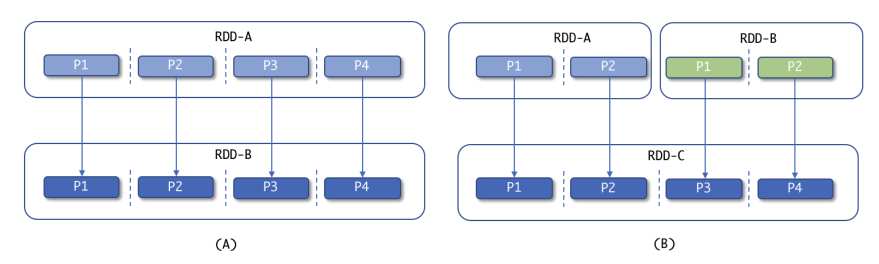
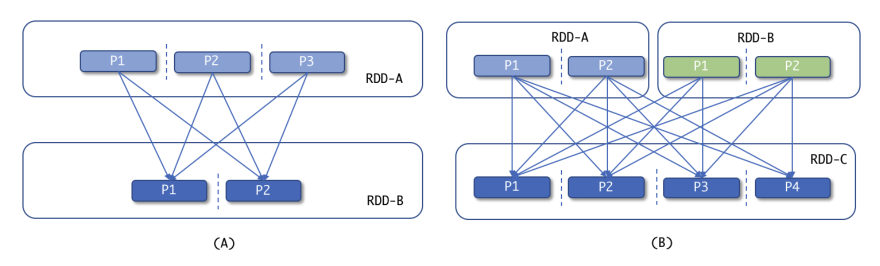

# Transformations

## Narrow

We have an **RDD-A** and we perform a narrow transformation, such as map() or filter(), and we get a new **RDD-B** with the same number of partitions as **RDD-A**. In part **(B)**, we have two, **RDD-A** and **RDD-B**, and we perform another type of narrow transformation such as union(), and we get a new **RDD-C** with the number of partitions equal to the sum of partitions of its parent RDDs (**A** and **B**).

Examples are:

- map
- flatMap
- filter
- union
- mapPartitions

## Wide

Wide transformations involve a shuffle of the data between the partitions.

We have an **RDD-A** and we perform a wide transformation such as groupByKey()and we get a new **RDD-B** with fewer partitions. **RDD-B** will have data grouped by each key in the dataset. In part **(B)**, we have two RDDs: **RDD-A**, and **RDD-B** and we perform another type of wide transformation such as join() or intersection() and get a new **RDD-C**.

Examples are:

- groupByKey
- reduceByKey
- join
- distinct
- intersect
- sortBy
- subtract
- cartesian

