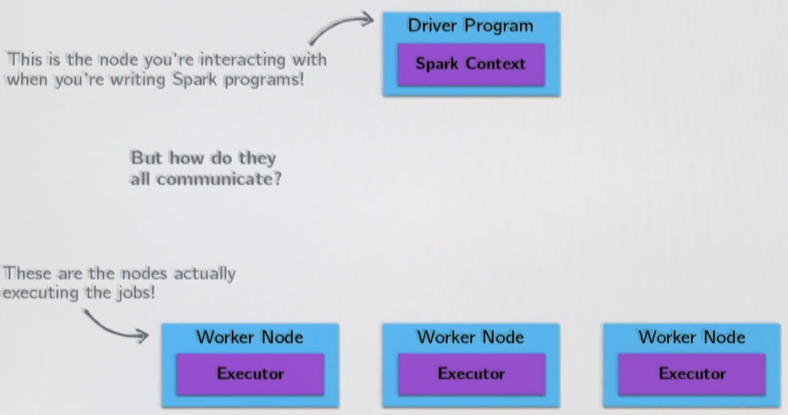
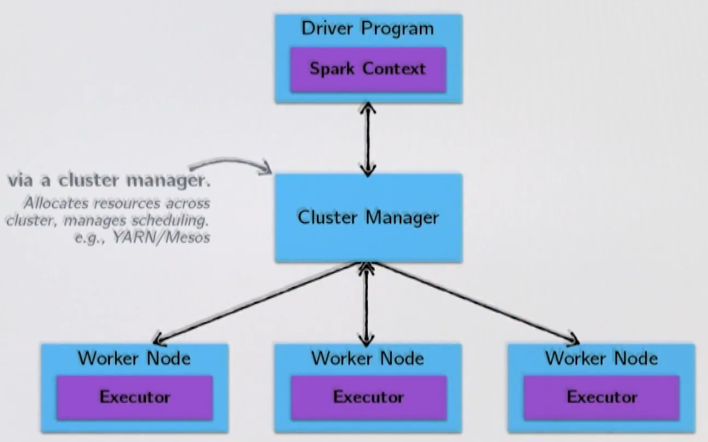
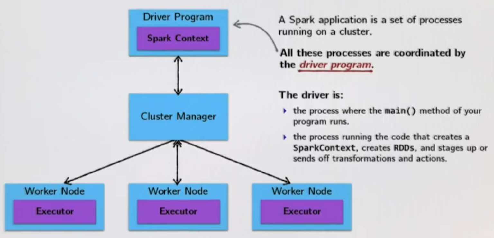
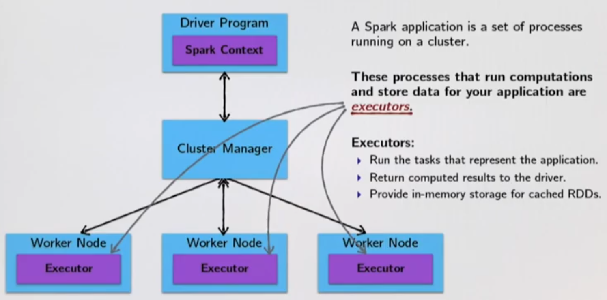
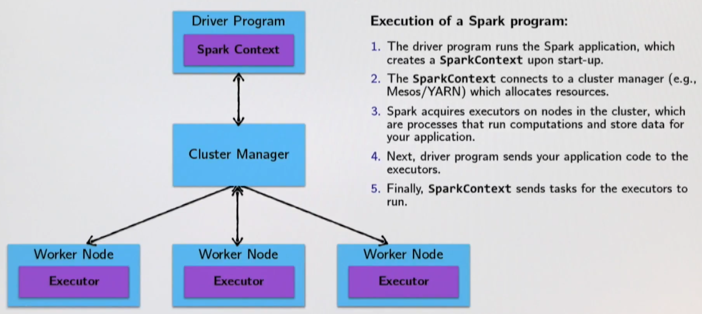

# Introduction



The nodes communicate via the **Cluster Manager**:



So the **driver** is the **brain**:



and then the **executors** do the actual work:



So in summary:



## Examples

```scala
final case class Person(name: String, age: Int)

// What does the following code snippet do?
val people: RDD[Person] = ...

people foreach println
```

On the driver? Well nothing.

**foreach** is an **action** with return type **Unit**. It is eagerly executed on the executors, not the driver.
Therefore, any calls to **println** are happening on the **stdout** of the worker nodes and are thus not visible in the stdout of the driver node.

Another example:

```scala
val first10 = people take 10
```

Where will the **Array[Person]** representing **first10** end up?

The driver program - In general, executing an action involves communication between worker nodes and the node running the driver program.