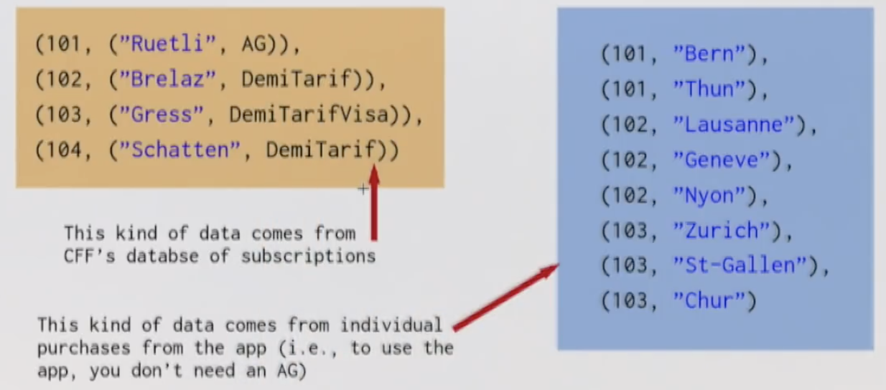
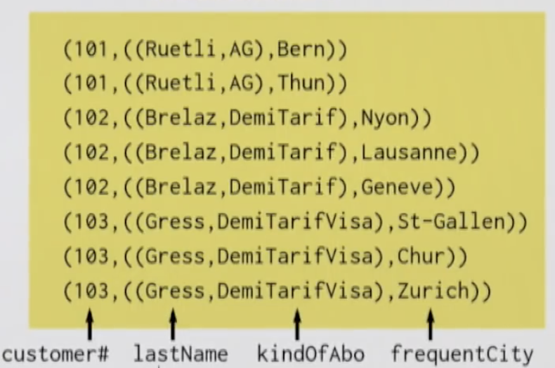
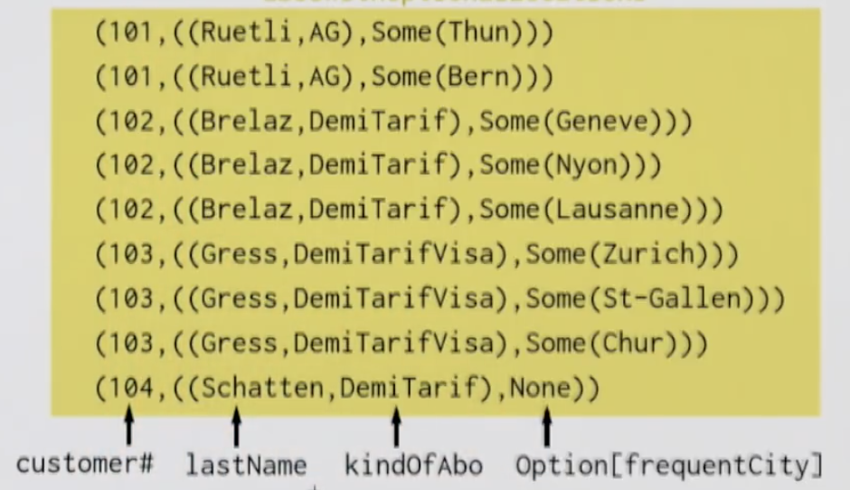
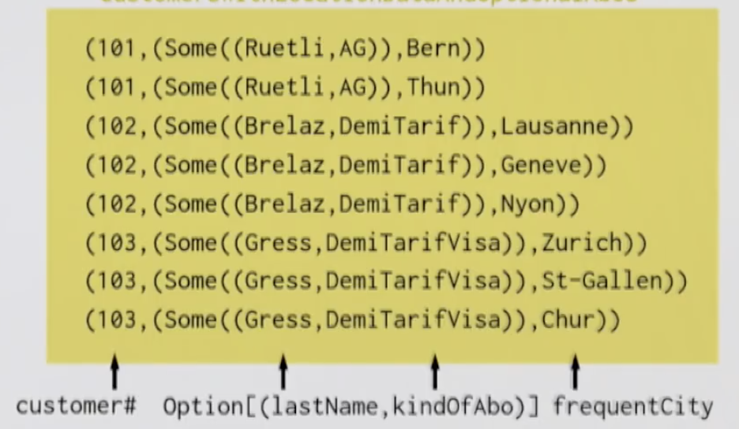

# Pair RDDs - Distributed Key/Value Pairs

Useful because **Pair RDDs** allow you to act on each key in parallel or regroup data across the network.

Pair RDDs have additional specialized methods for working with data associated with keys.
RDDs parameterized by a pair are Pair RDDs:

```scala
RDD[(K, V)] // Treated specially by Spark.
```

When a RDD is created with a pair as its element type, Spark automatically adds a number of extra useful methods (extension methods) for such pairs.

Some of the most important extension methods for RDDs containing pairs (e.g. RDD[(K, V)]) are:
```scala
def groupByKey(): RDD[(K, Iterable[V])]

def reduceByKey(f: (V, V) => V): RDD[(K, V)]

def join[W](other: RDD[(K, W)]): RDD[(K, (V, W))]
```

We can create a Pair RDD from an already existing non-pair RDD e.g.
```scala
final case class WikipediaPage(title: String, text: String)

val rdd: RDD[WikipediaPage] = ???

val pairRdd: RDD[(String, String)] = rdd.map(page => page.title -> page.text)

// Once created you can now use transformation specific key-value pairs such as "reduceByKey", "groupByKey" and "join"
```

As with regular RDDs we have **transformations** and **actions** e.g.

- Transformations
    - groupByKey
    - reduceByKey
    - mapValues
    - keys
    - join
    - leftOuterJoin / rightOuterJoin
- Action
    - countByKey
    
From Scala collections there is **groupBy**:
```scala
def groupBy[K](f: A => K): Map[K, Traversable[A]]
```

Example:
```scala
val ages = List(2, 52,44, 23, 17, 14, 12, 82, 51, 64)

val grouped = ages.groupBy { age =>
  if (age >= 18 && age < 65) "adult"
  else if (age < 18) "child"
  else "senior"
}

// Giving:
// val grouped: scala.collection.immutable.Map[String, List[Int]] =
//   HashMap(child -> List(2, 17, 14, 12), adult -> List(52, 44, 23, 51, 64), senior -> List(82))
```

## groupByKey

Spark's **groupByKey** is specialized on grouping all values that have the same key (as a result, it takes no argument):
```scala
def groupByKey(): RDD[(K, Iterable[V])] 
```

Example:
```scala
final case class Event(organizer: String, name: String, budget: Int)

val eventsRdd = sc.parallelize(...).map(event => event.organizer -> event.budget)

val groupedRdd = eventsRdd.groupByKey()

groupedRdd.collect().foreach(println)

// Giving:
// (Prime Sound, CompactBuffer(42000))
// (Sportorg, CompactBuffer(23000, 12000, 1400))
```

## reduceByKey

Conceptually **reduceByKey** can be thought of as a combination of **groupByKey** and reducing on all the values per key:
```scala
def reduceByKey(f: (V, V) => V): RDD[(K, V)]
```

Let's use the above **eventsRdd** to calculate the total budget per organizer for all of their organized events:
```scala
val budgetsRdd = eventsRdd.reduceByKey(_ + _)

budgetsRdd.collect().foreach(println)

// Giving:
// (Prime Sound, 42000)
// (Sportsorg, 36400)
```

## mapValues

```scala
def mapValues[U](f: V => U): RDD[(K, U)]
```

and as a sidenote:
```scala
def countByKey(): Map[K, Long]
```

Example:

Compute the average budget per event organizer via calculating a pair, as a key's value, containing (budget, #events):
```scala
// As before
val eventsRdd = sc.parallelize(...).map(event => event.organizer -> event.budget)
// So we have:
// org -> budget, org -> budget ...

val intermediate = eventsRdd.mapValues(b => b -> 1)
// Now we have:
// org -> (budget, 1), org -> (budget, 1) ...

// We want:
// org -> (totalBudget, total number of events organized)
val nextIntermediate: RDD[(String, (Int, Int))] = intermediate.reduceByKey { case ((b1, oneForB1), (b2, oneForB2)) =>
  (b1 + b2) -> (oneForB1 + oneForB2)
}

val averageBudgets = nextIntermediate.mapValues { case (budget, numberOfEvents) =>
  budget / numberOfEvents
}

averageBudgets.collect().foreach(println)

// Giving:
// (Prime Sound, 42000)
// (Sportorg, 12133)
```

## Joins

Joins are another sort of transformation on Pair RDDs. They're used to combine multiple datasets. There are two kinds of joins:

- inner joins (join)
- outer joins (leftOuterJoin / rightOuterJoin)

Example:

- first RDD represents customers and their Swiss Rail subscriptions (subscriptions)
- second RDD represents customers and cities they frequently travel to (locations)

```scala
val subscriptions: RDD[(Int, (String, Abonnement))] =
  sc parallelize List(101 -> ("Ruetli" -> AG), 102 -> ("Brelaz" -> DemiTarif), 103 -> ("Gress" -> DemiTarifVisa))

val locations: RDD[Int, String] =
  sc parallelize List(101 -> "Bern", 101 -> "Thun", 102 -> "Lausanne", 102 -> "Geneve", 102 -> "Nyon", 103 -> "Zurich", 103 -> "St-Gallen", 103 -> "Chur")
```



## join (inner join)

Inner joins return a new RDD containing combined pairs whose keys are present in both input RDDs.

```scala
def join[W](other: RDD[(K, W)]): RDD[(K, (V, W))]
```

How do we combine only customers that have a subscription and where there is location info?

```scala
val trackedCustomers: RDD[(Int, ((String, Abonnement), String))] =
  subscriptions join locations
```



```scala
trackedCustomers.collect().foreach(println)
// 101 -> (("Ruetli" -> AG) -> Bern)
// 101 -> (("Ruetli" -> AG) -> Thun)
// ...
```

## leftOuterJoin / rightOuterJoin

Outer joins return a new RDD containing combined pairs whose keys don't have to be present in both input RDDs.

```scala
def leftOuterJoin[W](other: RDD[(K, W)]): RDD[(K, (V, Option[W]))]

def rightOuterJoin[W](other: RDD[(K, W)]): RDD[(K, (Option[V], W))]
```

We want to know which subscribers don't use the app and only pays cash for tickets.

```scala
val subscriptionsWithOptionalLocations: RDD[(Int, ((String, Abonnement), Option[String]))] =
  subscriptions leftOuterJoin locations

// 101 -> (("Ruetli" -> AG) -> Some(Bern)
// 101 -> (("Ruetli" -> AG) -> Some(Thun)
// ...
```



```scala
val customersWithLocationDataAndOptionalSubscription: RDD[(Int, (Option[(String, Abonnement)], String))] =
  subscriptions rightOuterJoin locations
```

