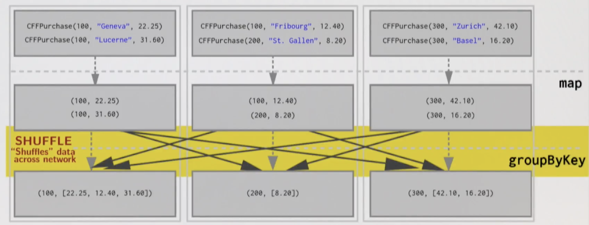
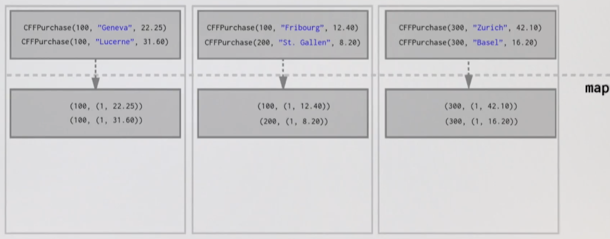
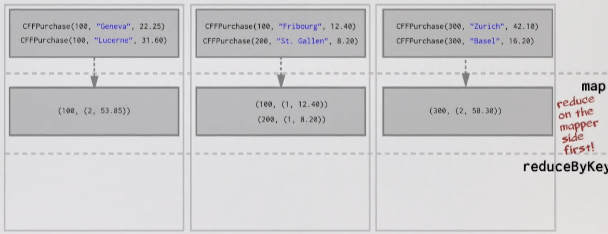
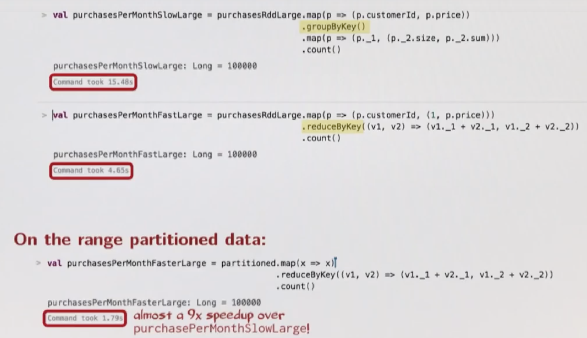
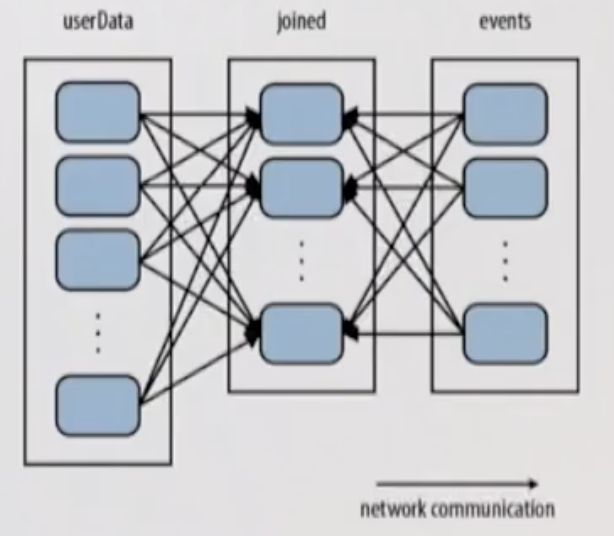
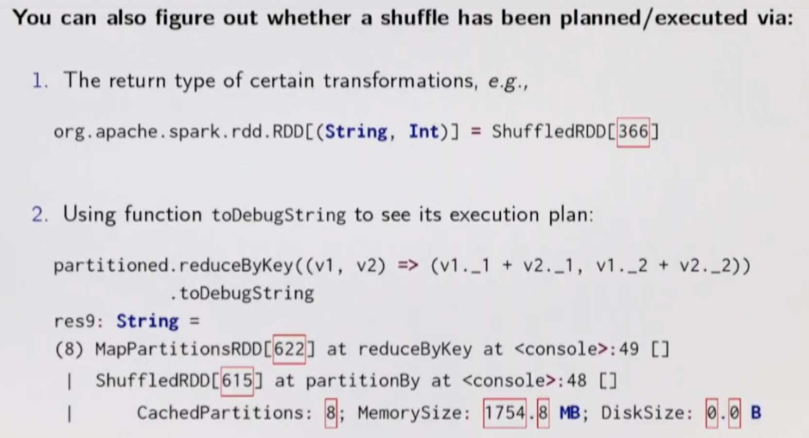

# Partitioning and Shuffling

## Shuffling

```scala
val pairs = sc.parallelize(List(1 -> "one", 2 -> "two", 3 -> "three"))

pairs.groupByKey()
// res: org.apache.spark.rdd.RDD[(Int, Iterable[String])] = ShuffledRDD[16] at groupByKey at <console>:37
```

Interesting! ShuffledRDD!

Well, moving data around the network is called **shuffling**. We typically have to move data from one node to another to be *grouped* with its key.

Shuffles can be an enormous hit because it means that Spark must send data from one node to another - Latency.

Example: Assume we have a RDD of the purchases that users of Swiss train company CFF made in the past month.

```scala
final case class CFFPurchase(customerId: Int, destination: String, price: Double)

val purchasesRdd: RDD[CFFPurchase] = sc.textFile(...)
```

Goal: Calculate how many trips and now much spent by each customer over the last month.

```scala
val purchasesPerMonth: Array[(Int, (Int, Double))] =
  purchasesRdd
    .map(purchase => purchase.customerId -> purchase.price) // Pair RDD
    .groupByKey()                                           // groupByKey returns RDD[(K, Iterable[V])]
    .mapValues(price => price.size -> price.sum)
    .collect()
```

Let's apply the above with some data:
```scala
val purchases = List(
  CFFPurchase(100, "Geneva", 22.25),
  CFFPurchase(300, "Zurich", 42.10),
  CFFPurchase(100, "Fribourg", 12.40),
  CFFPurchase(200, "St. Gallen", 8.20),
  CFFPurchase(100, "Lucerne", 31.60),
  CFFPurchase(300, "Basel", 16.20)
)
```

How might the cluster look like with this data distributed over it? We have 3 nodes.



How can be reduce the shuffling to improve performance? Perhaps we don't need to send all pairs over the network.

Perhaps we can reduce before we shuffle. This could greatly reduce the amount of data we have to send over the network.
To achieve this we can use the **reduceByKey** operator.

Conceptually **reduceByKey** can be thought of as a combination of first doing **groupByKey** and then **reducing** on all the values grouped per key. It's more efficient though than using each separately.
```scala
def reduceByKey(f: (V, V) => V): RDD[(K, V)]
```

So,
```scala
val purchasesPerMonth =
  purchasesRdd
    .map(purchase => purchase.customerId -> (1, purchase.price)) // Pair RDD
    .reduceByKey { case ((p1, price1), (p2, price2)) =>          // Looking to end up with:
      (p1 + p2) -> (price1 + price2)                             // (customerId, (numTrips, totalSpent))
    }
    .collect()
```

Now how will this look like on the cluster?

Before reduce:



After reduce:



And reduce again after shuffle:


**In summary - by reducing the dataset first, the amount of data sent over the network during the shuffle is far less.**


> As a sidenote, "how does Spark know which key to put on which machine when using say groupByKey?" - think Kafka. By default, Spark uses **hash partitioning** to determine which key-value pair should be sent to which machine.

## Partitioning

The data within a RDD is split into several partitions.

Properties of partitions:
- Partitions never span multiple machines i.e. tuples in the same partition are guaranteed to be on the same machine.
- Each machine in the cluster contains one or more partitions.
- The number of partitions to use is configurable; by default it equals the total number of cores on all executor nodes.

Two kinds of partitioning are available in Spark:
- Hash partitioning.
- Range partitioning.

**NOTE - Customising partitioning is only possible on Pair RDDs; this is because partitioning is based on keys.**

#### Hash Partitioning

Following on from the above examples:

```scala
val purchasesPerCustomer =
  purchasesRdd
    .map(purchase => purchase.customerId -> purchase.price) // Pair RDD
    .groupByKey()
```
**groupByKey** first computes per tuple (k, v) its partition p:
```scala
p = k.hashCode() % numPartitions
```

Then, all tuples in the same partition **p** are sent to the machine hosting **p**.

So, hash partitioning attempts to spread data evenly across partitions based on the key.

Example: Consider a Pair RDD with keys

[8, 96, 240, 400, 401, 800]

and a desired number of partitions of 4. To keep thing simple assume that **hashCode** is the identity i.e. **n.hashCode() == n**.
In this case, hash partitioning distributes the keys as follows amoung the partitions:
- partition 0: [8, 96, 240, 400, 800]
- partition 1: [401]
- partition 2: []
- partition 3: []

The result is a very unbalanced distribution which hurt performance.

#### Range Partitioning

Pair RDDs may contain keys that have an ordering defined e.g. Int, Char, String.

For such RDDs, **range partitioning** may be more efficient.

Using a range partitioner, keys are partitioned according to:
1. An ordering for keys.
2. A set of sorted ranges of keys.

Property: Tuples with keys in the same range appear on the same machine.

The example above which showed poor performance with hash partitioning, can be greatly improved with range partitioning:

Some simple assumptions for this example:
- keys non-negative
- 800 is the biggest key in the RDD
- set of ranges: [1, 200], [201, 400], [401, 600], [601, 800]

In this case, range partitioning distributes the keys as follows amoung the partitions resulting in a better balance thus better performance:
- partition 0: [8, 96]
- partition 1: [240, 400]
- partition 2: [401]
- partition 3: [800]

## Customise Partitioning

There are two ways to create RDDs with specific partitioning:
1. Call **partitionBy** on a RDD providing an explicit Partitioner.
2. Using transformations that return RDDs with specific partitioners.

Example:
```scala
val pairs = purchasesRdd.map(purchase => purchase.customerId -> purchase.price)

val tunedPartitioner = new RangePartitioner(8, pairs)
// Here we specify the number of partitions we have,
// and we provide our RDD allowing Spark to sample this with the number of partitions to come up with the ranges.

val partitioned = pairs.partitionBy(tunedPartitioner).persist()
// And we persist to ask Spark not to keep repartitioning.
```

In summary, creating a RangePartitioner requires:
1. Specifying the desired number of partitions.
2. Providing a Pair RDD with ordered keys - This RDD is sampled to create a suitable set of sorted ranges.

**The result of partitionBy should be persisted, otherwise partitioning is repeatedly applied (involving shuffling) each time the partitioned RDD is used.**

Regarding partitioning data using transformations:
By default when using **sortByKey** a RangePartitioner is automatically used.

## Partitioning with map and flatMap

Interestingly **map** and **flatMap** result without a partitioner. Why?

Regarding **map**, given that we have a hash partitioned Pair RDD, why would it make sense for **map** to lose the partitioner in its result RDD?

Because it is possible for **map** to change the **key** e.g.
```scala
rdd.map((k: String, v: Int) => "doh!" -> v)
```

In this case, if the **map** transformation preserved the partitioner in the result RDD, it no longer makes sense, as now the keys are all different.

**But mapValues enables us to do map transformations without changing the keys, thereby preserving the partitioner.**

## Partitioner Optimisation

Let's optimise the **reduceByKey** example above so that it does not involve any shuffling over the network.

```scala
val pairs = purchasesRdd.map(purchase => purchase.customerId -> purchase.price)

val tunedPartitioner = new RangePartitioner(8, pairs)

val partitioned = pairs.partitionBy(tunedPartitioner).persist()

val purchasesPerCustomer = partitioned.map(p => p._1 -> (1, p._2))

val purchasesPerMonth =
  purchasesPerCustomer
    .reduceByKey((v1, v2) => (v1._1 + v2._1) -> (v1._2 + v2._2))
    .collect()
```

Performance comparision of the above approaches:


## Example

Consider an application that keeps a large table of user information in memory:

- userData: BIG, containing (UserId, UserInfo) pairs, where UserInfo contains a list of topics the user is subscribed to.

The application periodically combines this big table with a smaller file representing events that happened in the past 5 minutes:

- events: Small, containing (UserId, LinkInfo) pairs for users who have clicked a link on a website in those 5 minutes.

We may wish to count how many users visited a link that was not to one of their subscribed topics.
We can perform this combination with Spark's **join** operation, which can be used to group the UserInfo and LinkInfo pairs for each UserId by key.

Here is a possible solution, but is it a good one?

```scala
val sc = new SparkContext(...)

val userData = sc.sequenceFile[UserId, UserInfo]("hdfs://...").persist()

def processNewLogs(logFileName: String) = {
  val events = sc.sequenceFile[UserId, LinkInfo](logFileName)

  val joined: RDD[(UserId, (UserInfo, LinkInfo))] = userData join events

  val offTopicVisits = joined filter {
    !userInfo.topics.contains(linkInfo.topic)
  } count()

  println(s"Number of visits to non-subscribed topics: $offTopicVisits")      
}
```

It is very inefficient. The **join** operation, called each time **processNewLogs** is invoked, does not know anything about how the keys are partitioned in the datasets.



By default, this operation will hash all the keys of both datasets, sending elements with the same key hash across the network to the same machine and then join together the elements on that machine.
**Even though userData doesn't change.**

This can be easily fixed - Just use **partitionBy** on the **big userData** RDD at the start of the program:
```scala
val userData =
  sc.sequenceFile[UserId, UserInfo]("hdfs://...")
    .partitionBy(new HashPartitioner(100)) // Create 100 partitions
    .persist()
```

As we called **partitionBy** when building **userData**, Spark will now know that it is hash-partitioned, and calls to **join** on it will take advantage of this information.
In particular, when we call **userData.join(events)**, Spark will shuffle only the **events** RDD, sending events with each particular UserId to the machine that contains the corresponding hash partition of userData.

Now that **userData** is pre-partitioned, Spark will shuffle only the **events** RDD, sending events with each particular UserId to the machine that contains the corresponding hash partition of userData.

## How Do I Know a Shuffle Will Occur?



## Operations That Might Cause a Shuffle

- cogroup
- groupWith
- join
- leftOuterJoin
- rightOuterJoin
- groupByKey
- reduceByKey
- combineByKey
- distinct
- intersection
- repartition
- coalesce

There are a few ways to use operations that might cause a shuffle and to still avoid much or all network shuffling. Examples:

1. **reduceByKey** running on a pre-partitioned RDD will cause the values to be computed **locally**, requiring only the final reduced value has to be sent from the worker to the driver.
2. **join** called on two RDDs that are pre-partitioned with the same partitioner and cached on the same machine will cause the join to be computed **locally**, with no shuffling across the network.