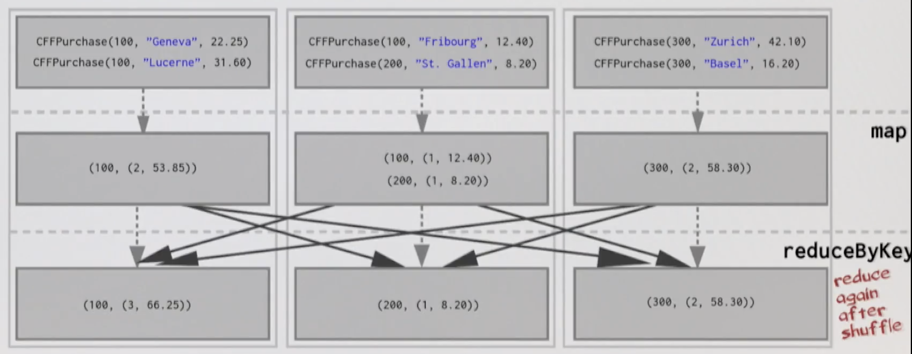
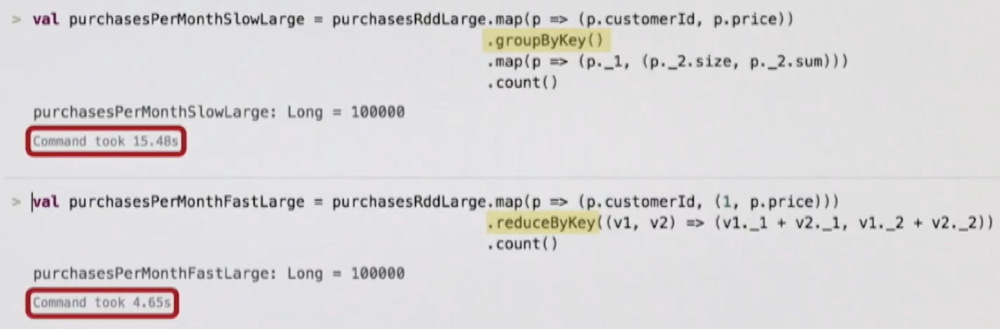

# Partitioning and Shuffling

```scala
val pairs = sc.parallelize(List(1 -> "one", 2 -> "two", 3 -> "three"))

pairs.groupByKey()
// res: org.apache.spark.rdd.RDD[(Int, Iterable[String])] = ShuffledRDD[16] at groupByKey at <console>:37
```

Interesting! ShuffledRDD!

Well, moving data around the network is called **shuffling**. We typically have to move data from one node to another to be *grouped* with its key.

Shuffles can be an enormous hit because it means that Spark must send data from one node to another - Latency.

Example: Assume we have a RDD of the purchases that users of Swiss train company CFF made in the past month.

```scala
final case class CFFPurchase(customerId: Int, destination: String, price: Double)

val purchasesRdd: RDD[CFFPurchase] = sc.textFile(...)
```

Goal: Calculate how many trips and now much spent by each customer over the last month.

```scala
val purchasesPerMonth: Array[(Int, (Int, Double))] =
  purchasesRdd
    .map(purchase => purchase.customerId -> purchase.price) // Pair RDD
    .groupByKey()                                           // groupByKey returns RDD[(K, Iterable[V])]
    .mapValues(price => price.size -> price.sum)
    .collect()
```

Let's apply the above with some data:
```scala
val purchases = List(
  CFFPurchase(100, "Geneva", 22.25),
  CFFPurchase(300, "Zurich", 42.10),
  CFFPurchase(100, "Fribourg", 12.40),
  CFFPurchase(200, "St. Gallen", 8.20),
  CFFPurchase(100, "Lucerne", 31.60),
  CFFPurchase(300, "Basel", 16.20)
)
```

How might the cluster look like with this data distributed over it? We have 3 nodes.


How can be reduce the shuffling to improve performance? Perhaps we don't need to send all pairs over the network.

Perhaps we can reduce before we shuffle. This could greatly reduce the amount of data we have to send over the network.
To achieve this we can use the **reduceByKey** operator.

Conceptually **reduceByKey** can be thought of as a combination of first doing **groupByKey** and then **reducing** on all the values grouped per key. It's more efficient though than using each separately.
```scala
def reduceByKey(f: (V, V) => V): RDD[(K, V)]
```

So,
```scala
val purchasesPerMonth =
  purchasesRdd
    .map(purchase => purchase.customerId -> (1, purchase.price)) // Pair RDD
    .reduceByKey { case ((p1, price1), (p2, price2)) =>          // Looking to end up with:
      (p1 + p2) -> (price1 + price2)                             // (customerId, (numTrips, totalSpent))
    }
    .collect()
```

Now how will this look like on the cluster?

Before reduce:


After reduce:


And reduce again after shuffle:



**In summary - by reducing the dataset first, the amount of data sent over the network during the shuffle is far less.**



> As a sidenote, "how does Spark know which key to put on which machine when using say groupByKey?" - think Kafka. By default, Spark uses **hash partitioning** to determine which key-value pair should be sent to which machine.