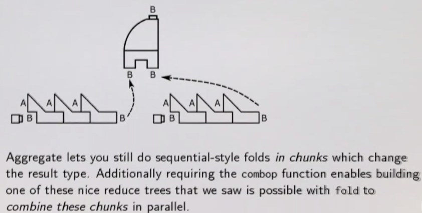

# Reduce

Reduction operations:
Walk through a collection and combine neighbouring elements of the collection together to produce a single combined result.

## Fold and FoldLeft

**foldLeft** is not parallelizable but **fold** is.

```scala
def foldLeft[A, B](z: B)(f: (B, A) => B): B
```
Applies a binary operator to a start value and all elements of this collection/iterator, going left to right.

Why is **foldLeft** not parallelizable?

Being able to change the result type from A to B forces us to have to execute **foldLeft** sequentially from left to right e.g.

```scala
val xs = List(1, 2, 3, 4)

val result = xs.foldLeft("")((s: String, i: Int) => s + i)
```
We are looking for the String result of: "1234".

What happens if we try to break this collection in two and parallelize?

```
   List(1, 2)                   List(3, 4)
----------------            -----------------
""  + 1 ---> "1"            ""  + 3 ---> "3"
"1" + 2 ---> "12"           "3" + 4 ---> "34"
```
but how can we now combine the above two results which are Strings with our binary function which takes String as a **seed** and Int?

**fold** is parallelizable because it is defined as:

```scala
def fold[A](z: A)(f: (A, A) => A): A
```
It enables us to parallelize things as it **restricts** us to always return the same type.

## Aggregate

Example of regular Scala **aggregate** function:

```scala
def aggregate[A, B](z: => B)(seqop: (B, A) => B, combop: (B, B) => B): B
```
So **aggregate** resembles both **foldLeft* given the "sequential operation" and **fold** given the "combinator operation".
**aggregate** is said to be (more) general because it gives you the best of both worlds:

- parallelizable
- possible to change the return type



## Reduction Operations on RDDs

```
Scala collections               Spark
-----------------               -----
fold                            fold
foldLeft/foldRight
reduce                          reduce
aggregate                       aggregate
```