# AWS with Glue & Athena

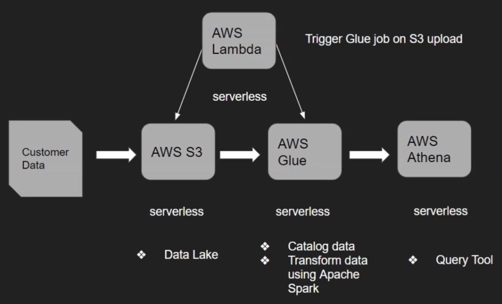

## Example

In S3 create source and target buckets, and in the source we will upload [consumer-purchase-data.csv](../src/main/resources/consumer-purchase-data.csv):

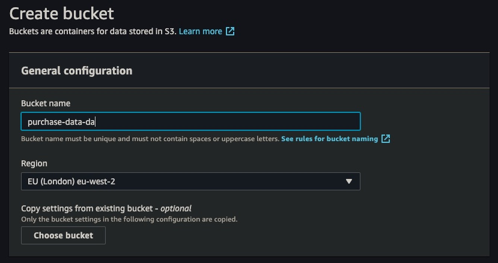

The suffix "da" is simply to give a bucket a unique name (you can use any naming convention).

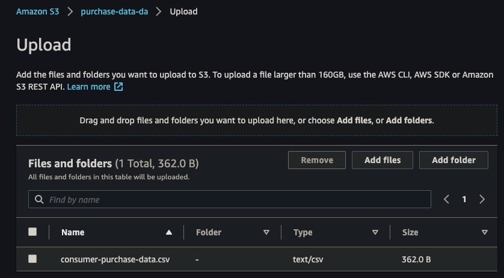

---

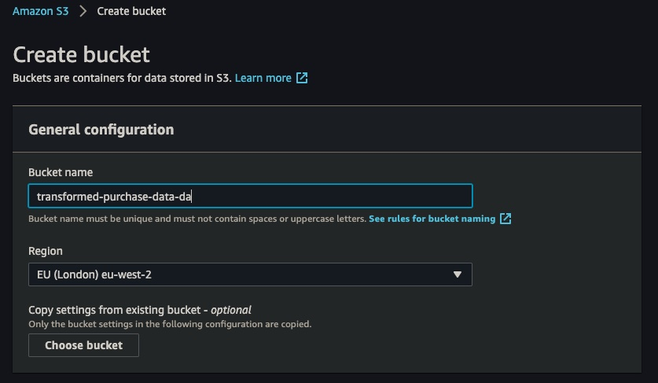

Go to Glue and add a database:

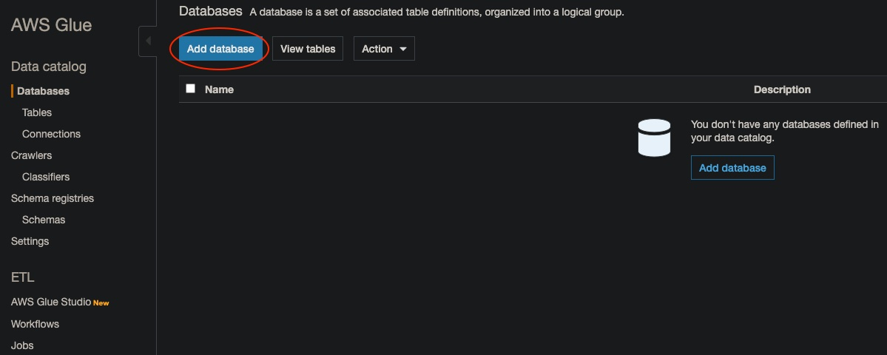

---

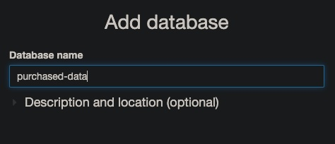

Next add a crawler:

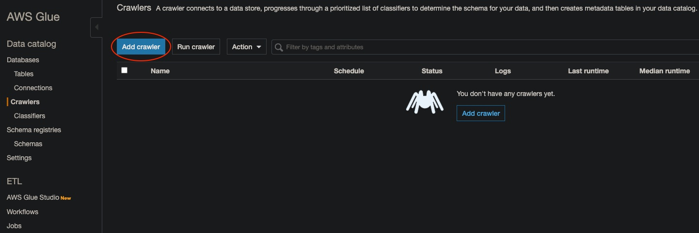

---

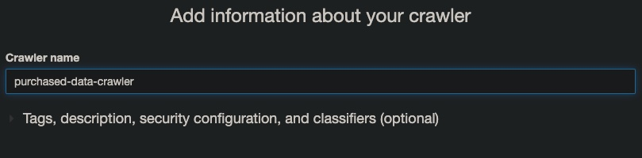

---

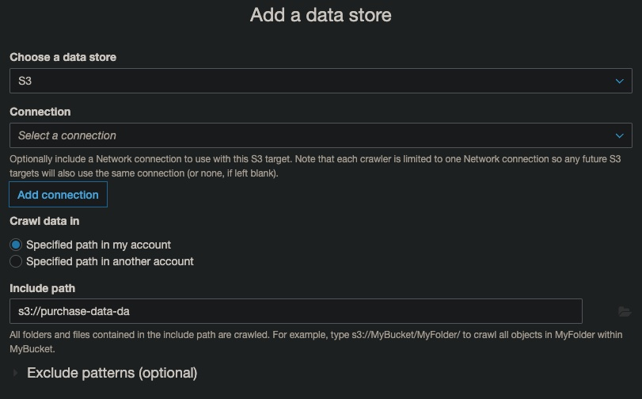

We'll create a new IAM role: **AWSGlueServiceRole-purchased-data**

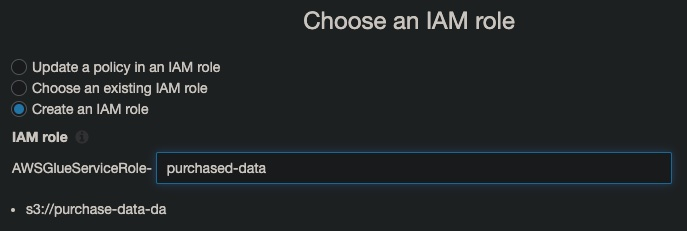

Finally the output of meta data:

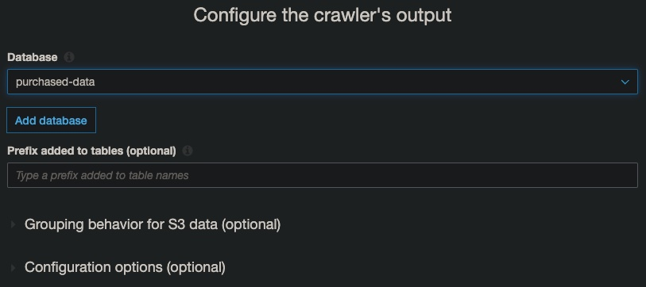

Now follow the same steps as above for the "transformed data":

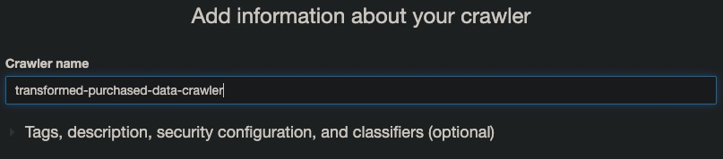

---

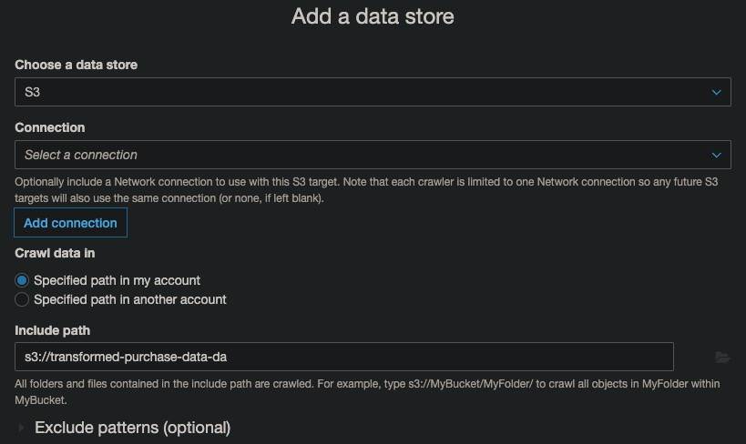

We can reuse the IAM role previously generated:

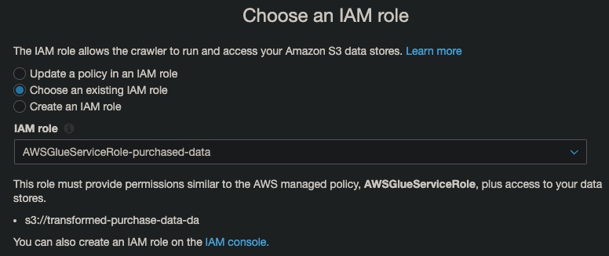

And use same database:

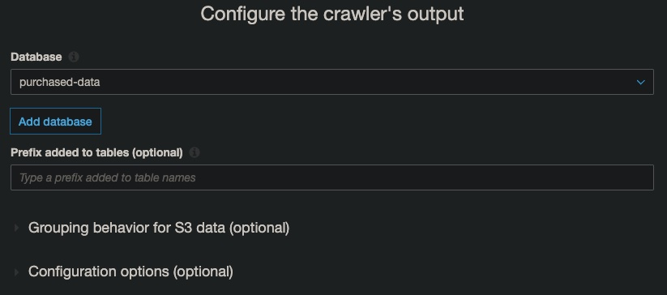

Execute the first **purchased-data-crawler** to generate metadata for our input data:

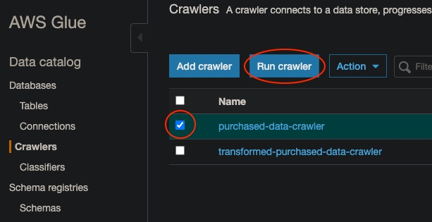

Let's view the generated schema:

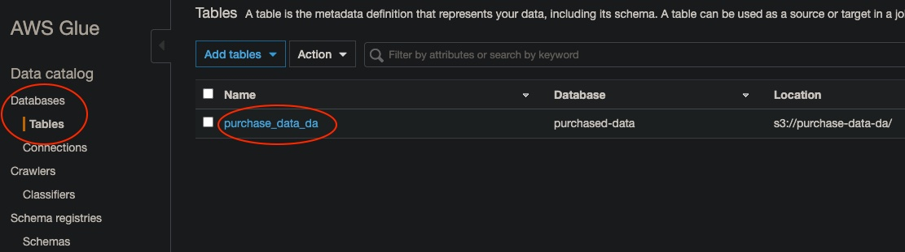

---

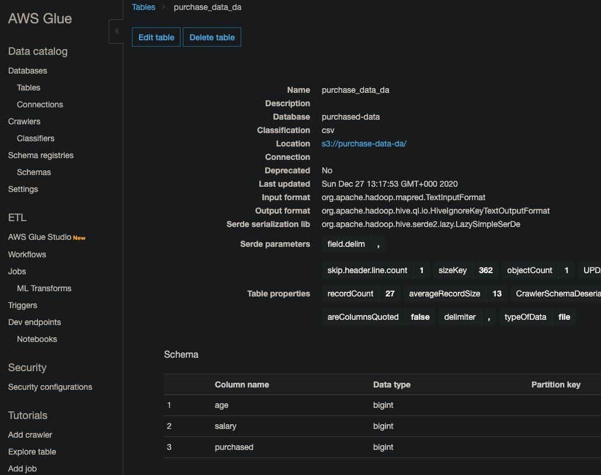

We can now view the data through the Athena interface (which works seamlessly with Glue):

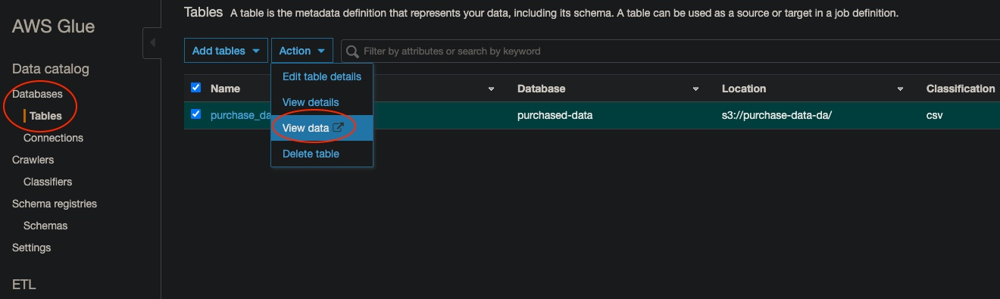

---

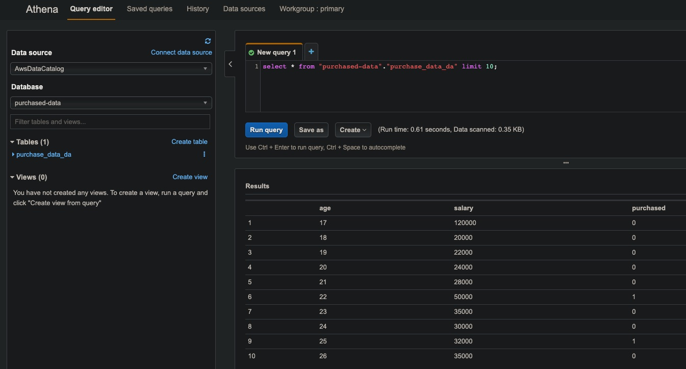

Next, we want to create a transformation of our data (our CSV file). For this we can set up a Glue job:

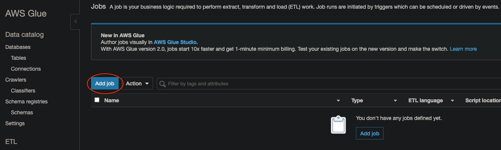

---

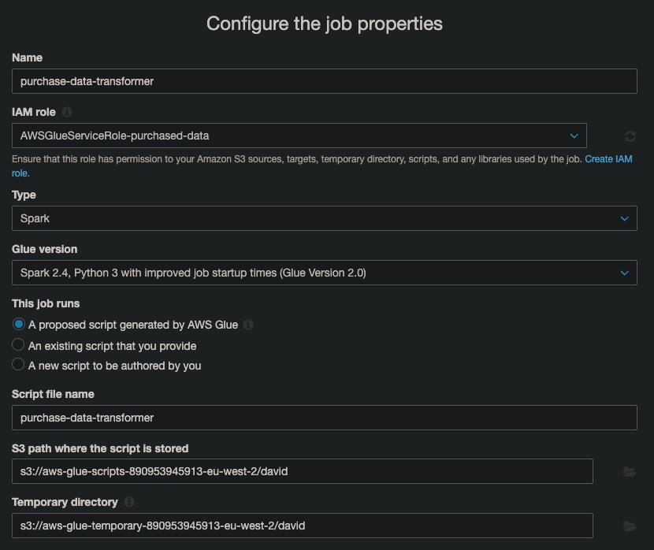

---

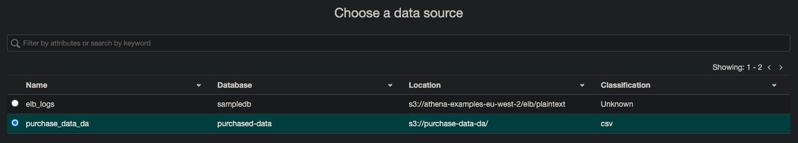

---

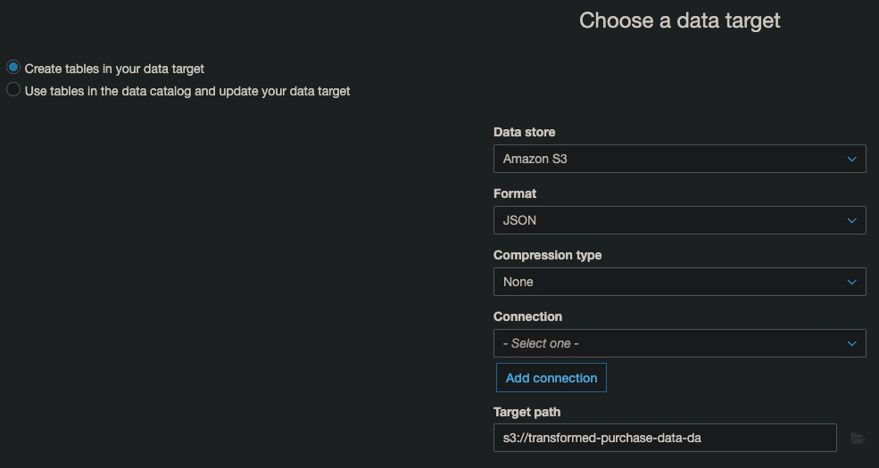

---

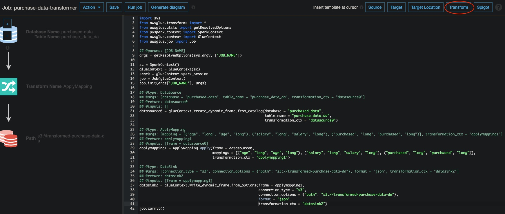

---

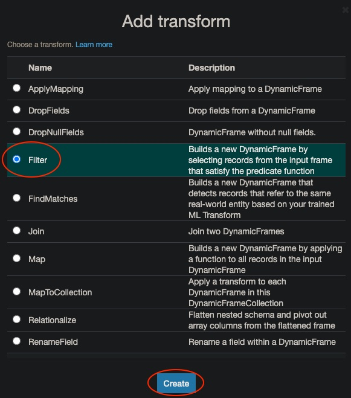

Upon adding and editing a given transformation, our Spark Python code will be:

```python
import sys
from awsglue.transforms import *
from awsglue.utils import getResolvedOptions
from pyspark.context import SparkContext
from awsglue.context import GlueContext
from awsglue.job import Job

## @params: [JOB_NAME]
args = getResolvedOptions(sys.argv, ['JOB_NAME'])

sc = SparkContext()
glueContext = GlueContext(sc)
spark = glueContext.spark_session
job = Job(glueContext)
job.init(args['JOB_NAME'], args)

## @type: DataSource
## @args: [database = "purchased-data", table_name = "purchase_data_da", transformation_ctx = "datasource0"]
## @return: datasource0
## @inputs: []
datasource0 = glueContext.create_dynamic_frame.from_catalog(database = "purchased-data",
                                                            table_name = "purchase_data_da",
                                                            transformation_ctx = "datasource0")

## @type: Filter
## @args: [f = <function>, transformation_ctx = "<transformation_ctx>"]
## @return: <output>
## @inputs: [frame = <frame>]
transf= Filter.apply(frame = datasource0, f = lambda x: x["age"] >= 18, transformation_ctx = "transf")


## @type: ApplyMapping
## @args: [mapping = [("age", "long", "age", "long"), ("salary", "long", "salary", "long"), ("purchased", "long", "purchased", "long")], transformation_ctx = "applymapping1"]
## @return: applymapping1
## @inputs: [frame = datasource0]
applymapping1 = ApplyMapping.apply(frame = transf,
                                   mappings = [("age", "long", "age", "long"), ("salary", "long", "salary", "long"), ("purchased", "long", "purchased", "long")],
                                   transformation_ctx = "applymapping1")

## @type: DataSink
## @args: [connection_type = "s3", connection_options = {"path": "s3://transformed-purchase-data-da"}, format = "json", transformation_ctx = "datasink2"]
## @return: datasink2
## @inputs: [frame = applymapping1]
datasink2 = glueContext.write_dynamic_frame.from_options(frame = applymapping1,
                                                         connection_type = "s3",
                                                         connection_options = {"path": "s3://transformed-purchase-data-da"},
                                                         format = "json",
                                                         transformation_ctx = "datasink2")
job.commit()
```

Run the job.

First time I ran it, the job failed because the IAM role that had been created did not have enought S3 privileges.
Upon opening the transformed data:

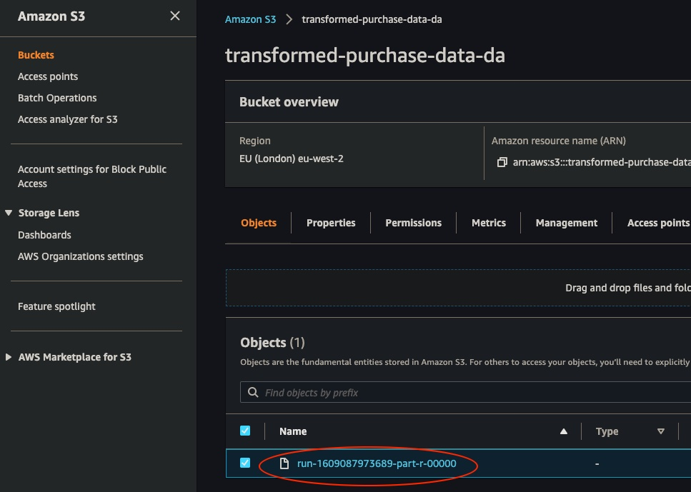

we see:

```json
{"age":18,"salary":20000,"purchased":0}
{"age":19,"salary":22000,"purchased":0}
{"age":20,"salary":24000,"purchased":0}
{"age":21,"salary":28000,"purchased":0}
{"age":22,"salary":50000,"purchased":1}
{"age":23,"salary":35000,"purchased":0}
{"age":24,"salary":30000,"purchased":0}
{"age":25,"salary":32000,"purchased":1}
{"age":26,"salary":35000,"purchased":0}
{"age":27,"salary":37000,"purchased":0}
{"age":28,"salary":80000,"purchased":1}
{"age":29,"salary":40000,"purchased":0}
{"age":30,"salary":45000,"purchased":0}
{"age":31,"salary":50000,"purchased":0}
{"age":32,"salary":45000,"purchased":0}
{"age":33,"salary":47000,"purchased":0}
{"age":34,"salary":46000,"purchased":0}
{"age":35,"salary":56000,"purchased":1}
{"age":36,"salary":60000,"purchased":1}
{"age":37,"salary":23000,"purchased":0}
{"age":38,"salary":53000,"purchased":1}
{"age":39,"salary":30000,"purchased":0}
{"age":40,"salary":60000,"purchased":1}
{"age":41,"salary":63000,"purchased":1}
{"age":42,"salary":45000,"purchased":0}
{"age":43,"salary":52000,"purchased":1}
{"age":44,"salary":51000,"purchased":1}
{"age":45,"salary":60000,"purchased":1}
{"age":46,"salary":22000,"purchased":0}
{"age":47,"salary":55000,"purchased":1}
```

We ran the Glue job manually. It can also be scheduled, or, as shown next, triggered via a **lambda**:

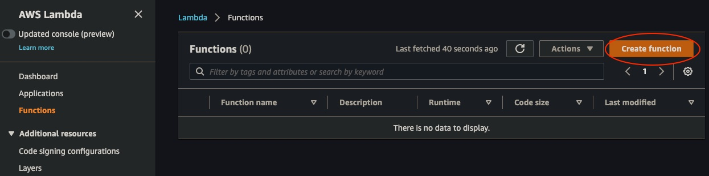

---

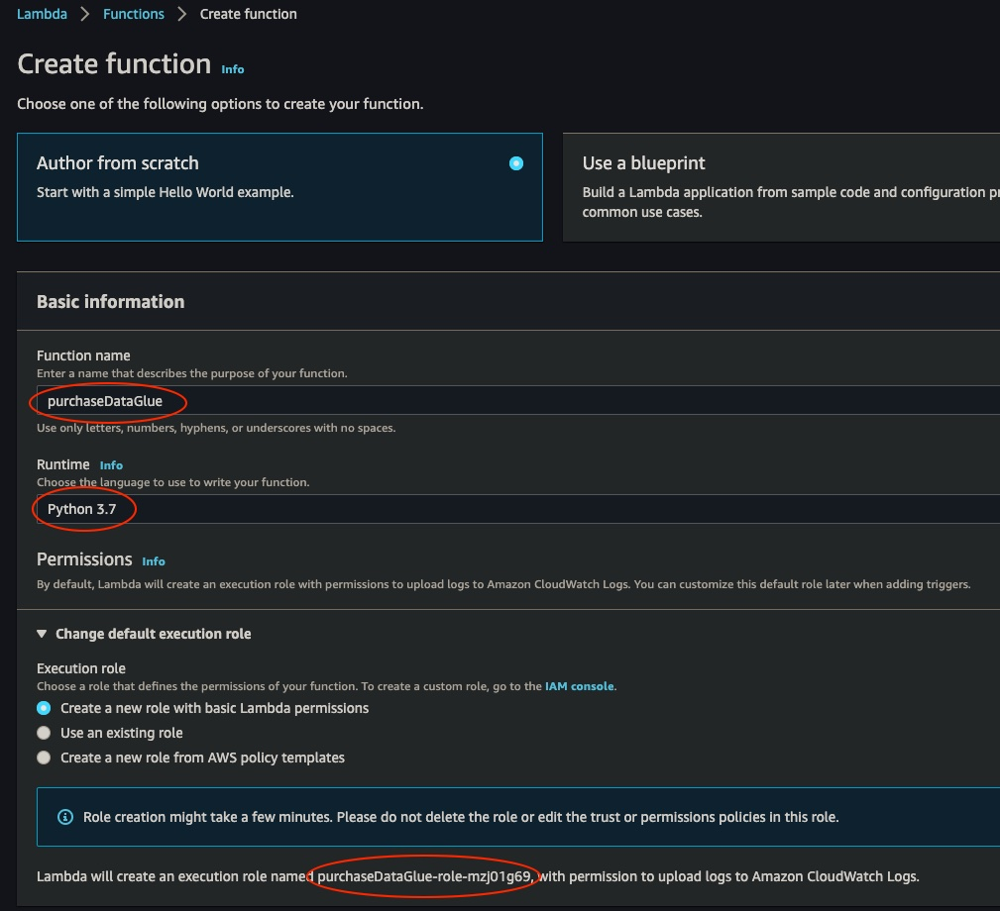

We can trigger our lambda (which in turn will trigger Glue) via a S3 upload:

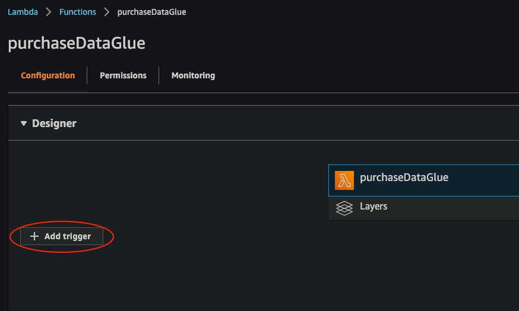

and don't forget to update the newly created lambda role to include the **Glue** policy:

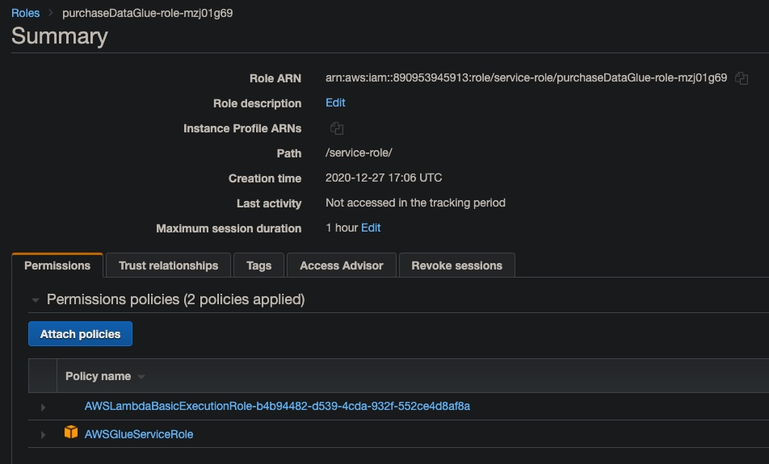

The following (updated) lambda, will now be triggered by a S3 upload which in turn triggers our Glue job:

```python
import json
import boto3

def lambda_handler(event, context):
    client = boto3.client("glue")
    
    client.start_job_run(JobName = "purchase-data-transformer", Arguments = {})
    
    return {
        'statusCode': 200,
        'body': json.dumps('Hello from Lambda!')
    }
```