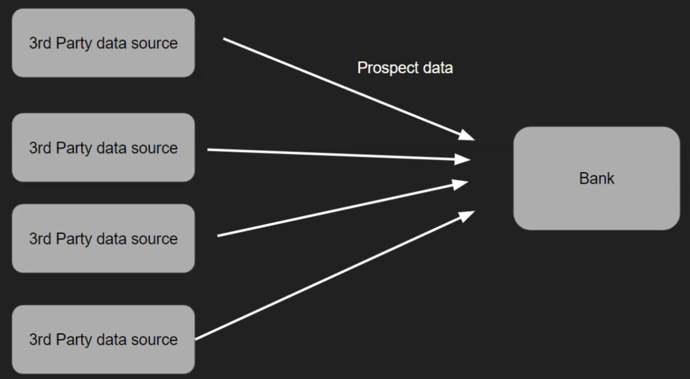

# Demo - Bank

Bank marketing prospects data:

| Age  | Salary | Gender | Country | Purchased |
| ---- | ------ | ------ | ------- | --------- |
| 18   | 20000  | Male   | Germany | N         |
| 19   | 22000  | Female | France  | N         |
| 20   | 24000  | Female | England | N         |
| 21   |        | Male   | England | N         |
| 22   | 50000  | Male   | France  | Y         |
| 23   | 35000  | Female | England | N         |
| 24   |        | Male   | Germany | N         |
| 25   | 32000  | Female | France  | Y         |
|      | 35000  | Male   | Germany | N         |
| 27   | 37000  | Female | France  | N         |
| 27   | 37000  | Female | unknown | N         |

Transformation using PySpark:
- Replace missing values with average values
- Delete records with **unknown** values
- After transformation, store data in a Hive table

There is a Python notebook to run in Google Colab.