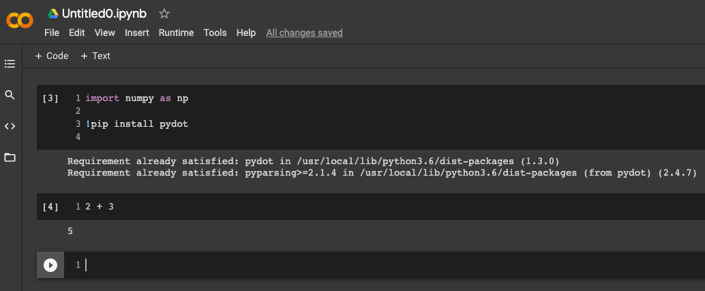
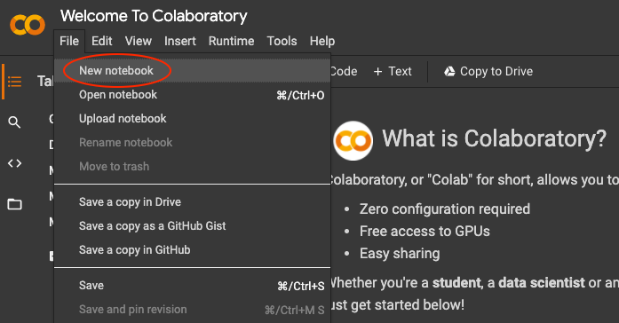

# Google Colab

Go to [Google Colab](https://colab.research.google.com/) which allows you to write and execute Python in your browser, with:
- Zero configuration required
- Free access to GPUs
- Easy sharing

## Installing Spark on Google Colab

NOTE that Colab is a Linux environment. You can execute Linux commands from Colab notebooks with a **!** prefix.

- Install JDK
- Install Spark
- Set environment variables
- Start Spark Session

And we have the completed [install-spark-testing-python](../src/main/python/install-spark-testing-pyspark.ipynb) notebook.