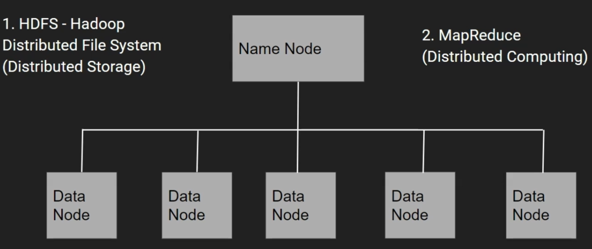
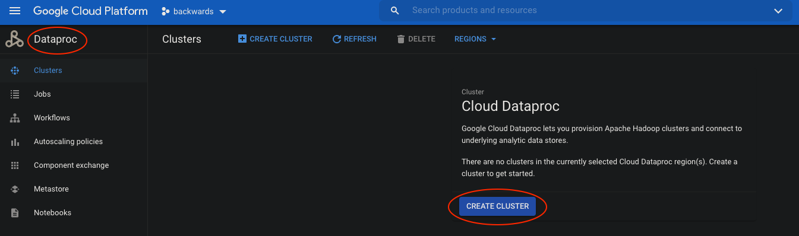
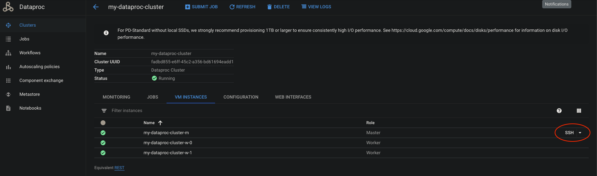
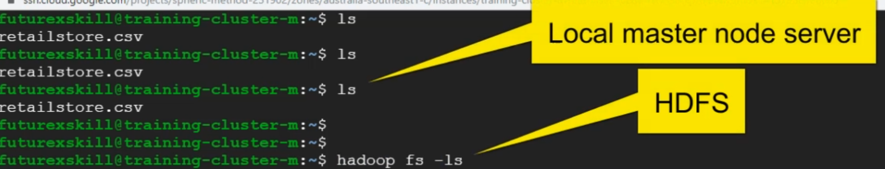

# Hadoop

Hadoop is a framework for **Distributed Storage** and **Distributed Computing**. The Hadoop framework in a nutshell:



Resource management and job scheduling are handled by **YARN**.

**Google Cloud Dataproc** is a fully managed cloud service for running **Apache Spark** and **Apache Hadoop**.



## Hive

**Hive** is a SQL like query tool to analyze data stored in **HDFS**. The layers are:

|   Hive    |
| :-------: |
| MapReduce |
|   YARN    |
|   HDFS    |

With our Dataproc cluster running and SSH onto master:



Example of the new console:

```bash
Connected, host fingerprint: ssh-rsa 0 20:6C:53:08:CE:AE:EB:B0:D2:C6:D1:91:4B:A7
:09:8F:C3:29:B9:00:03:EF:54:A9:FE:9F:46:0F:4F:9F:8D:92
Linux my-dataproc-cluster-m 5.8.0-0.bpo.2-amd64 #1 SMP Debian 5.8.10-1~bpo10+1 (
2020-09-26) x86_64
The programs included with the Debian GNU/Linux system are free software;
the exact distribution terms for each program are described in the
individual files in /usr/share/doc/*/copyright.
Debian GNU/Linux comes with ABSOLUTELY NO WARRANTY, to the extent
permitted by applicable law.

dainslie@my-dataproc-cluster-m:~$ pwd
/home/dainslie
```

Pull in the file [retailstore.csv](../src/main/resources/retailstore.csv), in this case, from Github into our cluster:

```bash
dainslie@my-dataproc-cluster-m:~$ wget https://raw.githubusercontent.com/backwards-limited/spark-backwards/master/courses/big-data-hadoop-spark/src/main/resources/retailstore.csv
```

Now we'll interact with the **HDFS** system (where initially there is nothing):

```bash
dainslie@my-dataproc-cluster-m:~$ hadoop fs -ls
ls: `.': No such file or directory
```

So remember the following distinction:



```bash
dainslie@my-dataproc-cluster-m:~$ hadoop fs -mkdir /user/dainslie

dainslie@my-dataproc-cluster-m:~$ hadoop fs -mkdir /user/dainslie/data

dainslie@my-dataproc-cluster-m:~$ hadoop fs -ls
Found 1 items
drwxr-xr-x   - dainslie hadoop          0 2020-12-19 23:33 data

dainslie@my-dataproc-cluster-m:~$ hadoop fs -put retailstore.csv /user/dainslie/data
```

```bash
dainslie@my-dataproc-cluster-m:~$ hadoop fs -cat /user/dainslie/data/retailstore.csv
Age,Salary,Gender,Country,Purchased
18,20000,Male,Germany,N
19,22000,Female,France,N
20,24000,Female,England,N
21,,Male,England,N
22,50000,Male,France,Y
23,35000,Female,England,N
24,,Male,Germany,N
25,32000,Female,France,Y
,35000,Male,Germany,N
27,37000,Female,France,N
```

Delete the file that was just pulled in:

```bash
dainslie@my-dataproc-cluster-m:~$ hadoop fs -rm /user/dainslie/data/retailstore.csv
Deleted /user/dainslie/data/retailstore.csv
```

Copy the file again (we were just showing delete):

```bash
dainslie@my-dataproc-cluster-m:~$ hadoop fs -put retailstore.csv /user/dainslie/data
```

To explore said file with **Hive** (we boot the Hive shell):

```bash
dainslie@my-dataproc-cluster-m:~$ hive
Logging initialized using configuration in file:/etc/hive/conf.dist/hive-log4j2.properties Async: true
hive>

# Create a database:
hive> create database if not exists dainslie;

hive> show databases;
OK
dainslie
default

hive> use dainslie;

hive> create table retailcust (age INT, salary FLOAT, gender String, country String, purchased String) ROW FORMAT DELIMITED FIELDS TERMINATED BY ',' LOCATION '/user/dainslie/data' 
TBLPROPERTIES ("skip.header.line.count"="1");

hive> show tables;
OK
retailcust

hive> select * from retailcust;
OK
18      20000.0 Male    Germany N
19      22000.0 Female  France  N
20      24000.0 Female  England N
21      NULL    Male    England N
22      50000.0 Male    France  Y
23      35000.0 Female  England N
24      NULL    Male    Germany N
25      32000.0 Female  France  Y
NULL    35000.0 Male    Germany N
27      37000.0 Female  France  N

hive> select age, country from retailcust where salary > 20000;
OK
19      France
20      England
22      France
23      England
25      France
NULL    Germany
27      France

hive> drop table retailcust;

hive> dfs -ls /user/dainslie/data;
ls: `/user/dainslie/data': No such file or directory
```