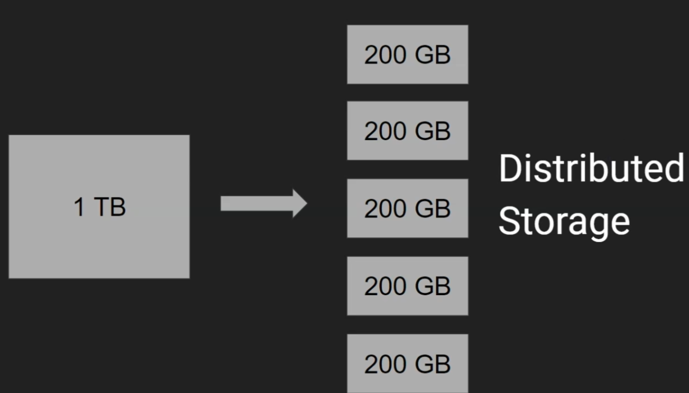
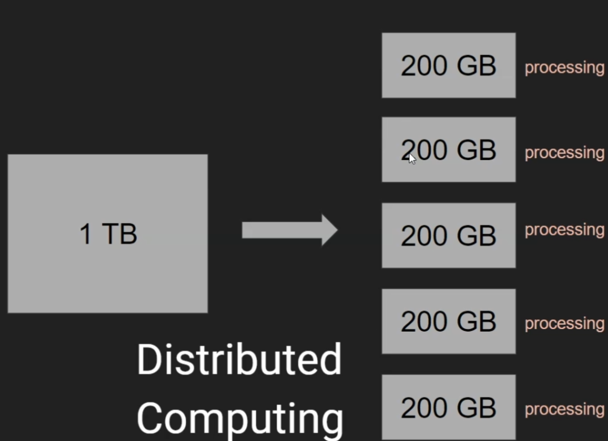

# Introduction

- Structured data - tabular data grouped into rows and columns
- Semi-structured data - typically key/value pairs that are grouped into elements within a file: data stored in XNL and JSON files
- Unstructured data - everything else: images, videos, unstructured text etc.

At the core of Big Data we have **distributed storage**.

Now we need to do **distributed computing**.

