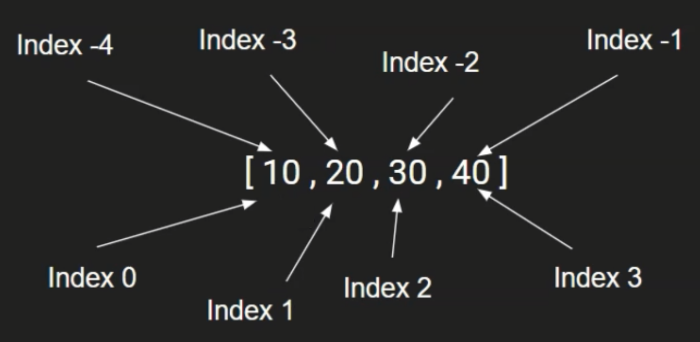
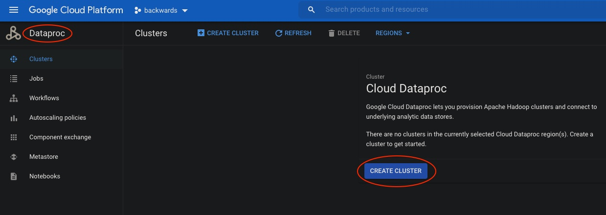
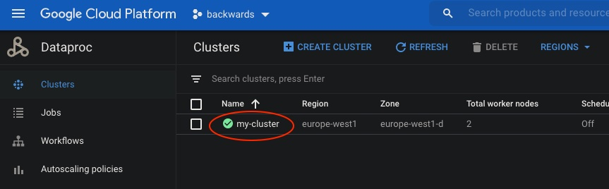
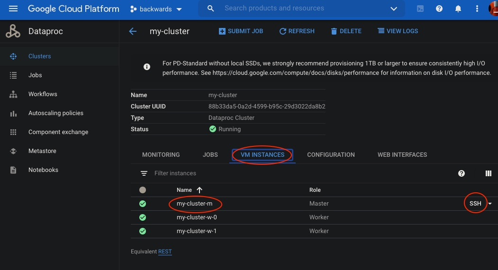

# PySpark

## Python



When working in Google Colab, we will want to upload and run [install-spark-testing-pyspark](../src/main/python/install-spark-testing-pyspark.ipynb) and then add to it and save with a different name, since this code configures our required Spark environment.

## Lambda
- An anonymous function
- E.g. x = lambda a, b: a + b

## RDD
- **Transformation** produces new RDD from an existing RDD (lazy and immutable)
- **Action** returns the final result of RDD computation (collect, count, take etc.)

## Dataframe

Spark Dataframe is like an in-memory excel.
It holds the data in row and column format and provides various methods to analyse and apply transformation on the data.
Dataframes can be constructed from a wide range of sources such as: structured data; files; tables in Hive; external databases; existing RDDs.

The **sql** function on a SparkSession enables applications to run SQL queries programmatically and return the result as a DataFrame.

## Running PySpark on Hadoop Cluster

Start a cluster on GCP:



Once created, SSH onto the master node:



---



Let's run PySpark on the Hadoop cluster, much the same as when we tried out Colab:

```bash
dainslie@my-cluster-m:~$ pwd
/home/dainslie

dainslie@my-cluster-m:~$ wget https://raw.githubusercontent.com/backwards-limited/spark-backwards/master/courses/big-data-hadoop-spark/src/main/resources/retailstore.csv

dainslie@my-cluster-m:~$ ls -las
...
4 -rw-r--r-- 1 dainslie dainslie  269 Dec 22 10:52 retailstore.csv

# Store CSV on Hadoop cluster
dainslie@my-cluster-m:~$ hadoop fs -mkdir /user/dainslie
dainslie@my-cluster-m:~$ hadoop fs -mkdir /user/dainslie/data
dainslie@my-cluster-m:~$ hadoop fs -put retailstore.csv /user/dainslie/data

dainslie@my-cluster-m:~$ hadoop fs -ls /user/dainslie/data
Found 1 items
-rw-r--r--   2 dainslie hadoop        269 2020-12-22 10:56 /user/dainslie/data/retailstore.csv

dainslie@my-cluster-m:~$ hadoop fs -cat /user/dainslie/data/retailstore.csv
Age,Salary,Gender,Country,Purchased
18,20000,Male,Germany,N
19,22000,Female,France,N
20,24000,Female,England,N
21,,Male,England,N
22,50000,Male,France,Y
23,35000,Female,England,N
24,,Male,Germany,N
25,32000,Female,France,Y
,35000,Male,Germany,N
27,37000,Female,France,Ndainslie@my-cluster-m:~$
 
dainslie@my-cluster-m:~$ pyspark

>>> customerDF = spark.read.csv("data/retailstore.csv", header = True)

>>> customerDF.show()                                                           
+----+------+------+-------+---------+
| Age|Salary|Gender|Country|Purchased|
+----+------+------+-------+---------+
|  18| 20000|  Male|Germany|        N|
|  19| 22000|Female| France|        N|
|  20| 24000|Female|England|        N|
|  21|  null|  Male|England|        N|
|  22| 50000|  Male| France|        Y|
|  23| 35000|Female|England|        N|
|  24|  null|  Male|Germany|        N|
|  25| 32000|Female| France|        Y|
|null| 35000|  Male|Germany|        N|
|  27| 37000|Female| France|        N|
+----+------+------+-------+---------+

>>> customerDF.groupBy("gender").count().show()
+------+-----+                                                                  
|gender|count|
+------+-----+
|Female|    5|
|  Male|    5|
+------+-----+

>>> customerDF.createOrReplaceTempView("customer")

>>> spark.sql("select * from customer where age > 22").show()
+---+------+------+-------+---------+
|Age|Salary|Gender|Country|Purchased|
+---+------+------+-------+---------+
| 23| 35000|Female|England|        N|
| 24|  null|  Male|Germany|        N|
| 25| 32000|Female| France|        Y|
| 27| 37000|Female| France|        N|
+---+------+------+-------+---------+

>>> exit()

dainslie@my-cluster-m:~$ hadoop fs -rm /user/dainslie/data/retailstore.csv
Deleted /user/dainslie/data/retailstore.csv
```

DON'T FORGET TO DELETE THE CLUSTER AND REMOVE ANY ASSOCIATED STORAGE.