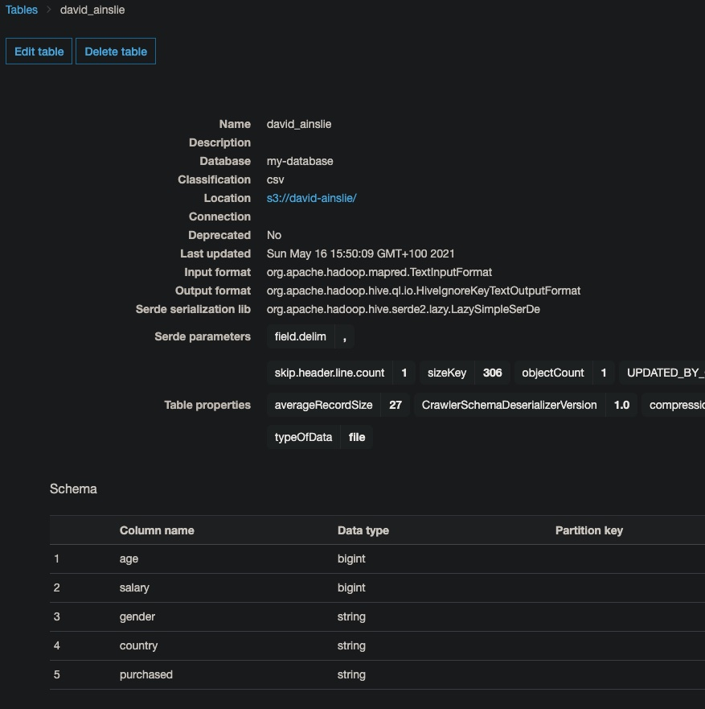

# AWS S3, Glue and Athena

## Glue

**Glue** allows you to run a Spark job as a **serverless** process.
With Glue, we can crawl a datastore and create a data catalog.
When Glue accesses S3, it is best (most secure) to go through a private VPC endpoint instead of exposing S3 publically.

Go to VPC to create an endpoint:

Now let's add a Glue crawler (calling it "my-crawler"):

When making a **connection** (between Glue and S3) we will use the **endpoint** we created:

We need to give permission to Glue to access S3 - via IAM:

And "run on demand".
Finally, the crawler needs a database to store the data catalog - we create a new database with defaults:

Run the crawler.
When done go to **Databases** and click on "my-database" and then click on "Tables in my-database":

Take a look at the generated table which shows the catalog generated from the data in S3:

## Athena

Athena can be used to query data in a datastore such as S3.
Upon querying S3, we query by attributes maybe being equal to something, but of course we need to know (well Athena needs to know) the attributes and their types.
This has already been handled for us via Glue, i.e. behind the scene, Athena uses the Glue catalog (that Glue itself generated) to query the data in S3.

Within Glue, we can "view data" where we will be taken to Athena:

## Run Spark Transformation Job on AWS Glue

This time we'll run Spark on Glue to transform our data into another S3 bucket:

We first need a bucket where the transformed data will end up.
I'll name it **david-ainslie-transformed** and then create a new Glue crawler for this new bucket, naming it "my-tranformed-crawler" (reusing connection and database):

We need a Glue ETL job to perform the data tranformation. We add a job:

But first we need our associated IAM role to read/write to S3 by attaching the relevant policies:

And our new Spark job looks like:

Finally, we can run the job:

When the job completes, you can run the Glue crawler for the transformed bucket.