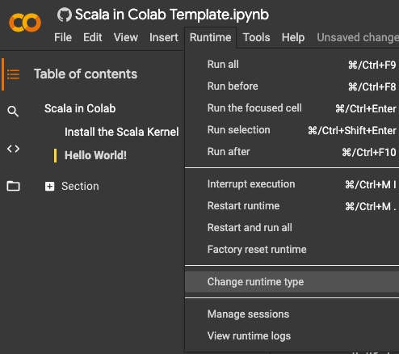
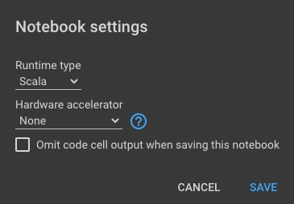
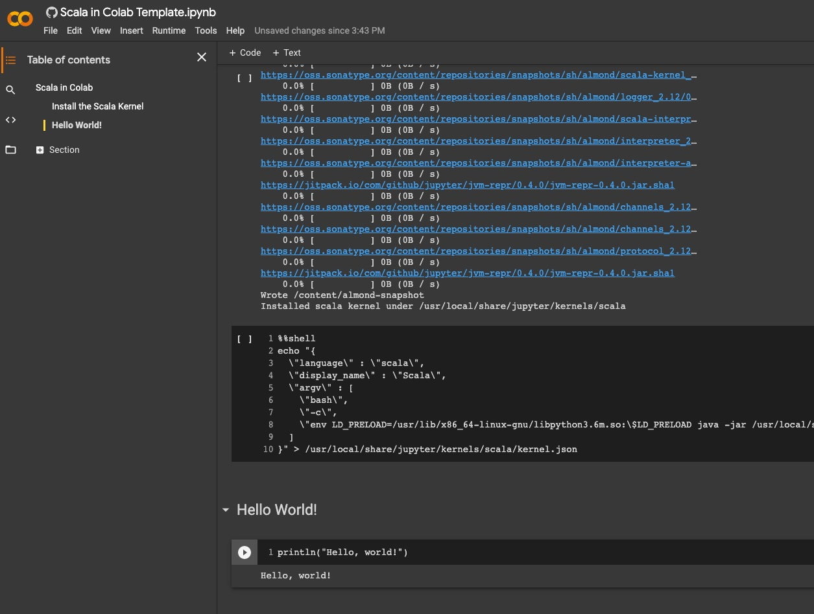
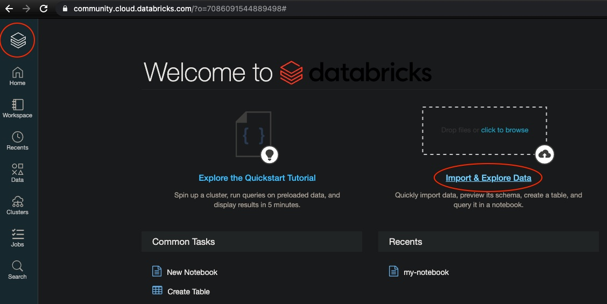
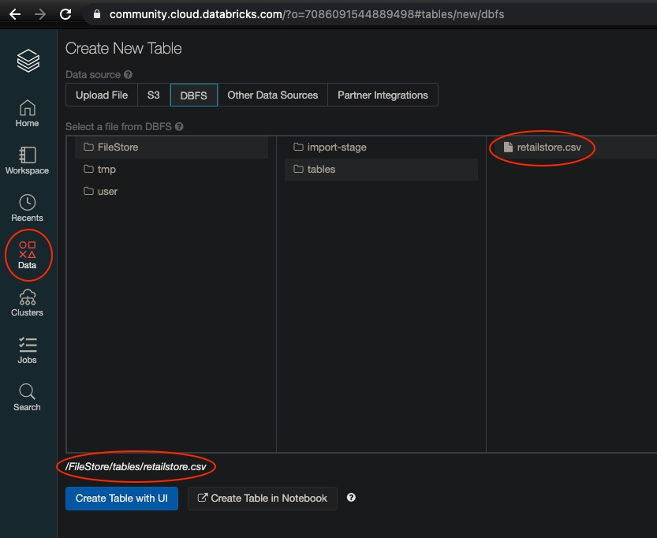

# Scala

## Scala in Google Colab

TODO - CURRENTLY ISSUES - FOLLOW THE NEXT SECTION WITH DATABRICKS

Google Colab needs some [setup to work with Scala](https://medium.com/@shadaj/machine-learning-with-scala-in-google-colaboratory-e6f1661f1c88).

Upload [install-scala-in-colab.ipynb](../src/main/python/install-scala-in-colab.ipynb) into Colab and **Run All**.

Then upload [scala-in-colab-template.ipynb](../src/main/python/scala-in-colab-template.ipynb) into Colab but before running, change the **Runtime type** to Scala:

---

Then **Run All**: 

## Scala in Databricks

After creating a cluster, we upload the CSV to work with:

and once uploaded:

You can take a look at the [Scala notebook](../src/main/scala/my-notebook.scala) that was generated in Databricks.