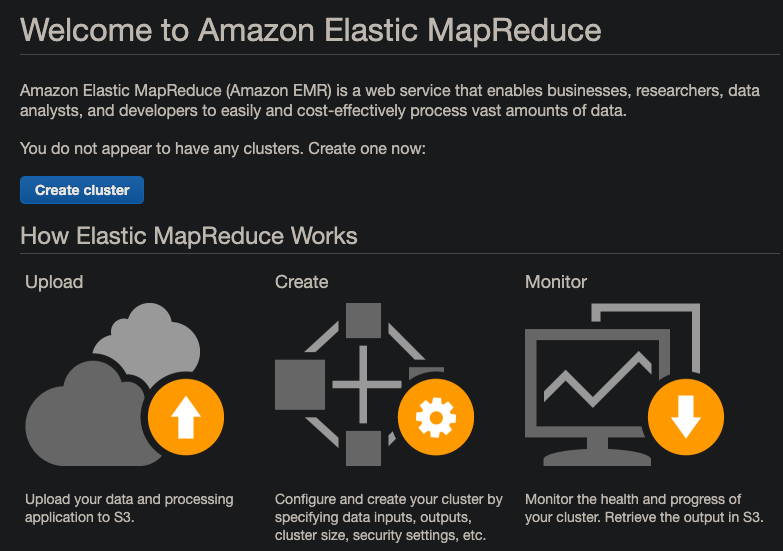
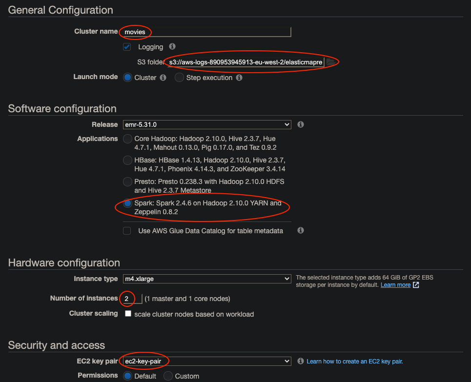
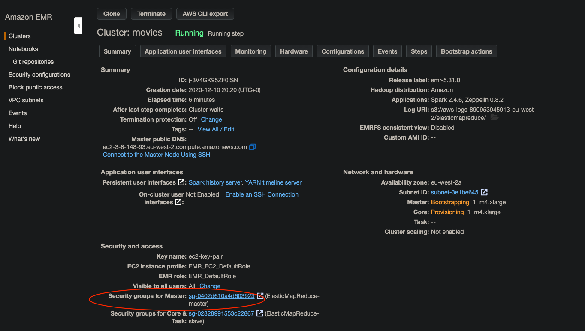
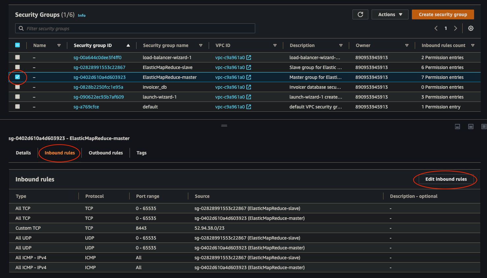
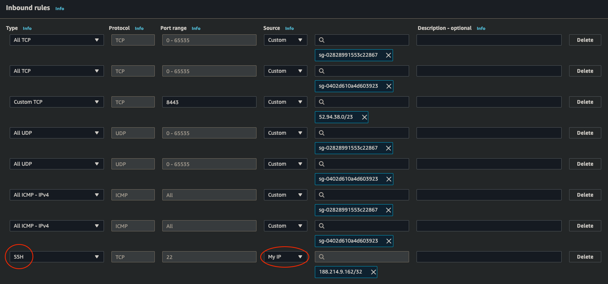
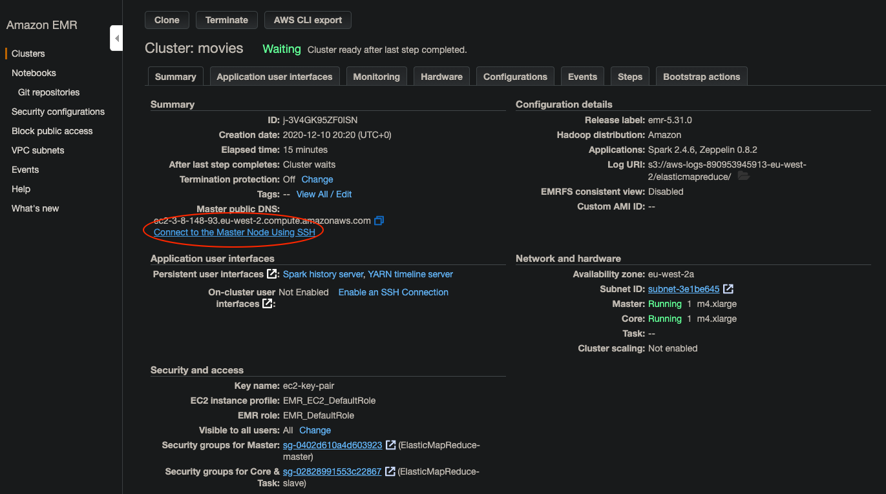
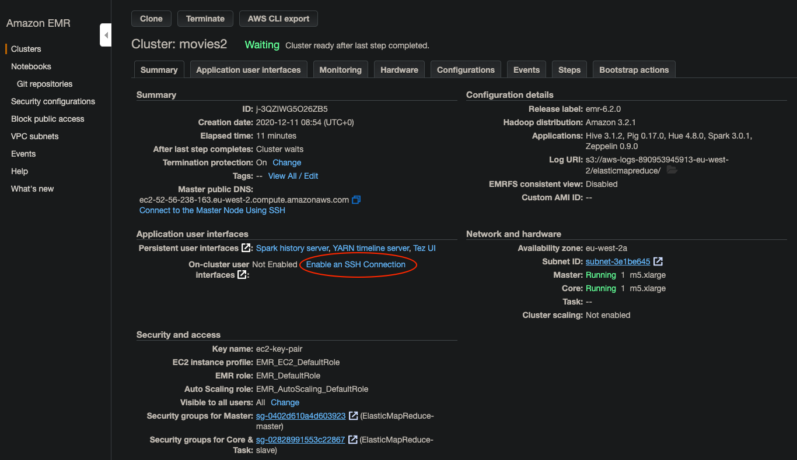
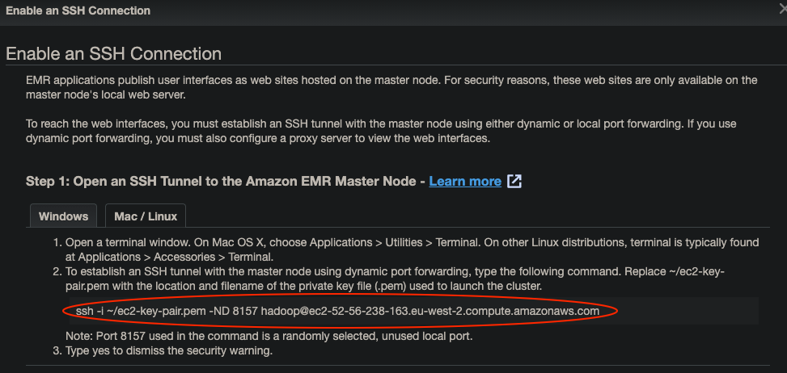
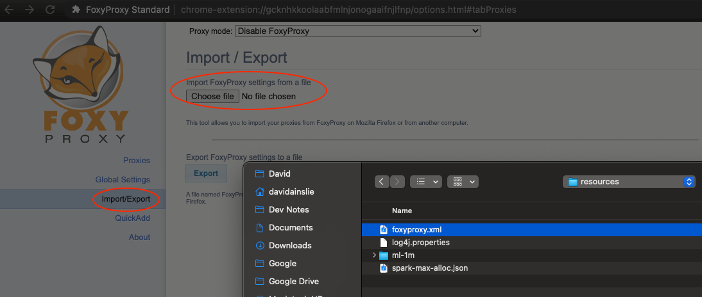
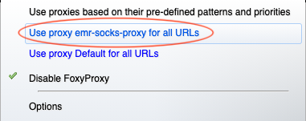

# EMR



---



To be able to SSH we need to do the following:



---



---



---



```bash
# Make sure your key pair has the necessary permissions e.g.
➜ chmod 400 ~/aws/credentials/ec2-key-pair.pem

➜ ssh -i ~/aws/credentials/ec2-key-pair.pem hadoop@ec2-3-8-148-93.eu-west-2.compute.amazonaws.com
[hadoop@ip-172-31-6-155 ~]$ 
```

Let's copy our JAR and data to the current directory on master:
```bash
[hadoop@ip-172-31-6-155 ~]$ aws s3 cp s3://david-ainslie/big-data-with-spark-emr_2.12-0.1.0-SNAPSHOT.jar ./
[hadoop@ip-172-31-6-155 ~]$ aws s3 cp s3://david-ainslie/big-data-with-spark-emr.jar ./

[hadoop@ip-172-31-6-155 ~]$ aws s3 cp s3://david-ainslie/ml-1m/ratings.dat ./

[hadoop@ip-172-31-6-155 ~]$ ls -las
...
  5884 -rw-rw-r-- 1 hadoop hadoop   6024022 Dec 10 21:01 big-data-with-spark-emr_2.12-0.1.0-SNAPSHOT.jar
355144 -rw-rw-r-- 1 hadoop hadoop 363666397 Dec 10 21:32 big-data-with-spark-emr.jar
 24020 -rw-rw-r-- 1 hadoop hadoop  24594131 Dec 10 18:12 ratings.dat
```

Submit our job:

```bash
[hadoop@ip-172-31-6-155 ~]$ spark-submit big-data-with-spark-emr_2.12-0.1.0-SNAPSHOT.jar
Exception in thread "main" java.lang.NoClassDefFoundError: scala/util/Using$Releasable
	at com.backwards.spark.ALSMovieRecs.main(ALSMovieRecs.scala)
```

... oh dear. I included the use of Scala JAR that comes from 2.13 world but has been built for 2.12 (which is what Spark currently uses).
However, with **sbt package** we don't get dependent JARs, and so we'll have to use **assembly**.

```bash
[hadoop@ip-172-31-6-155 ~]$ spark-submit big-data-with-spark-emr.jar
```

## SSH Tunnel

To use services such as Zeppelin, we need a SSH tunnel. Our browser, for Zepplin will then be able to proxy through the SSH tunnel to the webservices to interact with our EMR cluster.



---



```bash
➜ ssh -i ~/aws/credentials/ec2-key-pair.pem -ND 8157 hadoop@ec2-52-56-238-163.eu-west-2.compute.amazonaws.com
```

Then install the (chrome or firefox) [foxyproxy](https://chrome.google.com/webstore/detail/foxyproxy-standard/gcknhkkoolaabfmlnjonogaaifnjlfnp?hl=en/) browser extension - At this time the link in the AWS popup does not work so:

As per the rest of the instructions, save the following to a file (I've saved mine to [foxyproxy.xml](../src/main/resources/foxyproxy.xml)):

```xml
<?xml version="1.0" encoding="UTF-8"?>
<foxyproxy>
    <proxies>
        <proxy name="emr-socks-proxy" id="2322596116" notes="" fromSubscription="false" enabled="true" mode="manual" selectedTabIndex="2" lastresort="false" animatedIcons="true" includeInCycle="true" color="#0055E5" proxyDNS="true" noInternalIPs="false" autoconfMode="pac" clearCacheBeforeUse="false" disableCache="false" clearCookiesBeforeUse="false" rejectCookies="false">
            <matches>
                <match enabled="true" name="*ec2*.amazonaws.com*" pattern="*ec2*.amazonaws.com*" isRegEx="false" isBlackList="false" isMultiLine="false" caseSensitive="false" fromSubscription="false" />
                <match enabled="true" name="*ec2*.compute*" pattern="*ec2*.compute*" isRegEx="false" isBlackList="false" isMultiLine="false" caseSensitive="false" fromSubscription="false" />
                <match enabled="true" name="10.*" pattern="http://10.*" isRegEx="false" isBlackList="false" isMultiLine="false" caseSensitive="false" fromSubscription="false" />
                <match enabled="true" name="*10*.amazonaws.com*" pattern="*10*.amazonaws.com*" isRegEx="false" isBlackList="false" isMultiLine="false" caseSensitive="false" fromSubscription="false" />
                <match enabled="true" name="*10*.compute*" pattern="*10*.compute*" isRegEx="false" isBlackList="false" isMultiLine="false" caseSensitive="false" fromSubscription="false" />
                <match enabled="true" name="*.compute.internal*" pattern="*.compute.internal*" isRegEx="false" isBlackList="false" isMultiLine="false" caseSensitive="false" fromSubscription="false" />
                <match enabled="true" name="*.ec2.internal*" pattern="*.ec2.internal*" isRegEx="false" isBlackList="false" isMultiLine="false" caseSensitive="false" fromSubscription="false" />
            </matches>
            <manualconf host="localhost" port="8157" socksversion="5" isSocks="true" username="" password="" domain="" />
        </proxy>
    </proxies>
</foxyproxy>
```



---

