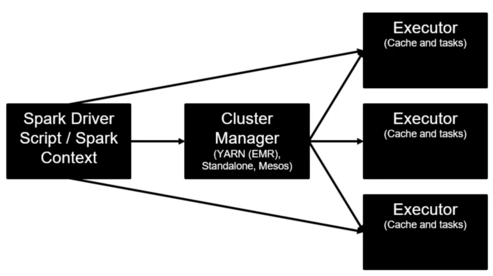

# Introduction



## Elastic Map Reduce (EMR)

- An Amazon web service
- Provision a cluster (EC2) on demand
    - Pre-installed with Hadoop and Spark
    - Also HBase, Presto, Hive, Flink and more
    
Spark on EMR:
- Spark runs on Hadoop YARN
- Everything is pre-configured
- Easy use of S3 and security setup
- Apache Zepplin, Scala, Java and Python support

## Spark Job

We have a simple script which is built as a JAR:

```bash
# From the root of our project (remembering that we have a submodule of a multimodule project):
spark-backwards
➜ sbt big-data-with-spark-emr/package
```

We will find out that **package** is not good enough, and the solution is **assembly**:

```bash
➜ sbt -J-Xms2048m -J-Xmx2048m big-data-with-spark-emr/assembly
```