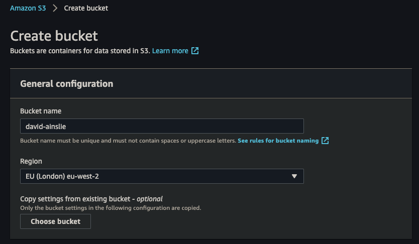

# S3

Create a bucket:



Copy/Upload the necessary files into S3:

```bash
# From the root of this submodule:
spark-backwards/courses/big-data-with-spark-emr 
➜ aws --profile david s3 cp target/scala-2.12/big-data-with-spark-emr_2.12-0.1.0-SNAPSHOT.jar s3://david-ainslie
➜ aws --profile david s3 cp target/scala-2.12/big-data-with-spark-emr.jar s3://david-ainslie

➜ aws --profile david s3 cp src/main/resources/ml-1m/movies.dat s3://david-ainslie/ml-1m/

➜ aws --profile david s3 cp src/main/resources/ml-1m/ratings.dat s3://david-ainslie/ml-1m/
```