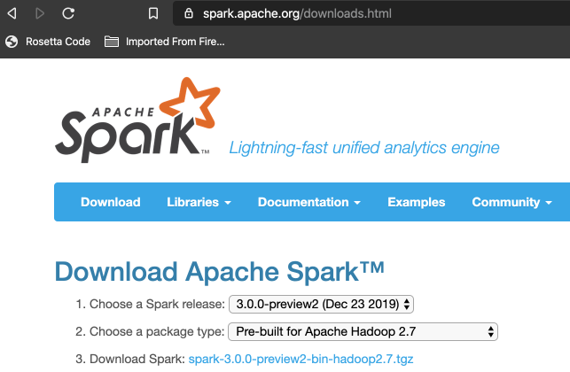

# Installation



And wherever you have installed, add the following into your profile such as **.zshrc**:

```shell
export SPARK_HOME=/Applications/spark-3.0.0-preview2-bin-hadoop2.7
export PATH=${SPARK_HOME}/bin:${SPARK_HOME}/sbin:${PATH}
```

At the time of writing, Spark required Java 8 and if using Scala (as we shall be) then Scala 2.12. If using [jenv](https://www.jenv.be/) we can set the Java version locally:

```bash
/Applications/spark-3.0.0-preview2-bin-hadoop2.7
➜ jenv local 1.8.0.202
```

We can run a Python shell for Spark:

```
➜ pyspark
Python 3.7.6 (default, Dec 30 2019, 19:38:26)
...
SparkSession available as 'spark'.
>>>
```

And for Scala, including example interaction:

```bash
➜ spark-shell
...
Using Scala version 2.12.10 (Java HotSpot(TM) 64-Bit Server VM, Java 1.8.0_202)
Type in expressions to have them evaluated.
Type :help for more information.

scala> val strings = spark.read.text("README.md")
strings: org.apache.spark.sql.DataFrame = [value: string]

scala> strings.show(numRows = 10, truncate = false)
+--------------------------------------------------------------------------------+
|value                                                                           |
+--------------------------------------------------------------------------------+
|# Apache Spark                                                                  |
|                                                                                |
|Spark is a unified analytics engine for large-scale data processing. It provides|
|high-level APIs in Scala, Java, Python, and R, and an optimized engine that     |
|supports general computation graphs for data analysis. It also supports a       |
|rich set of higher-level tools including Spark SQL for SQL and DataFrames,      |
|MLlib for machine learning, GraphX for graph processing,                        |
|and Structured Streaming for stream processing.                                 |
|                                                                                |
|<https://spark.apache.org/>                                                     |
+--------------------------------------------------------------------------------+
only showing top 10 rows

scala> strings.count()
res1: Long = 109

scala>
```

Spark computations are expressed as operations. These operations are then converted into low-level RDD-based bytecode as tasks, which are then distributed to Spark’s workers for execution.

| **Term**     | **Meaning**                                                  |
| ------------ | ------------------------------------------------------------ |
| Application  | User program built on Spark using its APIs. It consists of a driver program and executors on the cluster |
| SparkSession | SparkSession object provides a point of entry to interact with underlying Spark functionality and allows programming Spark with its APIs. In an interactive Spark shell, the Spark driver instantiates a SparkSession for you, while in a Spark application, you create a SparkSession object. |
| Job          | A parallel computation consisting of multiple tasks that gets spawned in response to a Spark action (e.g., save, collect) |
| Stage        | Each job gets divided into smaller sets of tasks called stages that depend on each other. |
| Task         | A single unit of work or execution that will be sent to a Spark Executor. |

## Transformations, Actions, and Lazy Evaluation


Spark operations on distributed data can be classified into two types: *transformations* and *actions*. Transformations, as the name suggests, transform Spark’s DataFrame into a new DataFrame without altering the original data, giving it the property of immutability.

By contrast, an *action* triggers the lazy evaluation of all the transformations recorded. In the above figure, all transformations T are recorded until the action A is invoked. Each transformation T produces a new DataFrame.

While lazy evaluation allows Spark to optimize your query, by peeking into your chained transformations, lineage and data immutability provide fault-tolerance.

Some examples of *transformations* and *actions* are:

| **Transformations** | **Actions** |
| ------------------- | ----------- |
| *orderBy*           | *show*      |
| *groupBy*           | *take*      |
| *filter*            | *count*     |
| *select*            | *collect*   |
| *join*              | *save*      |

Together with *actions*, *transformations* contribute to a Spark query plan, but nothing is executed until an *action* is invoked.

For example, the following has two *transformations* (read() and filter()) and one *action* (count() which actually triggers the execution plan):

```python
>>> strings = spark.read.text("README.md")
>>> filtered = strings.filter(strings.value.contains("Spark"))
>>> filtered.count()
20
```

## Spark UI

Spark includes a graphical user interface to inspect or monitor Spark applications in their various stages of decomposition. In local mode, you can access this interface at **http://<localhost>:4040** in a web browser.

**Note**: When you launch spark-shell, part of the output shows the localhost URL to access at port 4040.

Start a **pyspark** session and open your browser:


Execute the following:

```python
>>> strings = spark.read.text("README.md")
>>> filtered = strings.filter(strings.value.contains("Spark"))
>>> filtered.count()
20
```

and take a look at the UI having expanded **DAG Visualization**:


As well as testing locally, we can utilise a community instance of Spark provided by [Databricks](https://databricks.com/try), which seems to only work in Chrome.

## First Standalone Application

From your local machine in the installation directory, you can run one of the several sample programs; use **bin/run-example <class> [params]** to run one of many examples provided e.g.

```bash
➜ ls -las examples/src/main/java/org/apache/spark/examples
...
 8 -rw-r--r--@  1 davidainslie  staff  1968 17 Dec 03:48 JavaWordCount.java

➜ ./bin/run-example JavaWordCount README.md
```

and there are Scala and Python examples:

```bash
➜ ls -las examples/src/main/scala/org/apache/spark/examples
...
 8 -rw-r--r--@  1 davidainslie  staff  1550 17 Dec 03:48 SparkPi.scala
 
➜ ./bin/run-example SparkPi
```

## Building Standalone Applications in Scala

Let's build and deploy the [M&M](../modules/mnmcount) Count module:

```bash
spark-backwards/courses/learning-spark/modules/mnmcount 
➜ sbt clean package
```

Then we can submit the generated JAR:

```bash
spark-backwards/courses/learning-spark/modules/mnmcount 
➜ spark-submit --class com.backwards.myspark.MnmCount target/scala-2.12/mnmcount_2.12-0.1.0-SNAPSHOT.jar data/mnm_dataset.csv
```


