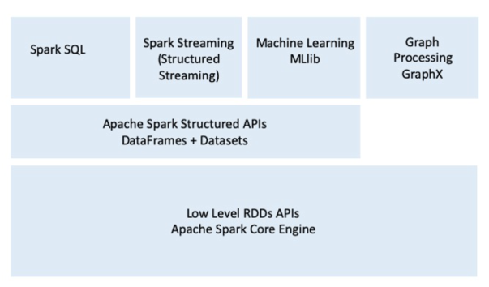

# Introduction



## Spark SQL Example

The Spark SQL module works well with structured data, meaning you can read data stored in an RDBMS table or from files with structured data in CSV, Text, JSON, Avro, ORC, or Parquet format and then construct permanent or temporary tables in Spark.

For example, with this Scala code snippet, you can read a JSON file stored on Amazon S3; create a temporary table; and issue a SQL-like query on the results read into memory as a Spark DataFrame:

```scala
// Read data off Amazon S3 bucket into a Spark DataFrame
spark.read.json("s3://apache_spark/data/committers.json").createOrReplaceTempView("committers")
            
// Issue an SQL query and return the result as a Spark DataFrame
val results = spark.sql(
  """
	SELECT name, org, module, release, num_commits
  FROM committers WHERE module = 'mllib' AND num_commits > 10 
  ORDER BY num_commits DESC
  """
)
```

## Spark MLlib Example

Spark MLlib provides data scientists with a popular list of machine learning algorithms, including classification, regression, clustering, collaborative filtering, build atop high-level DataFrame-based APIs to build predictive models.

Using just the high-level DataFame-based APIs, this Python code snippet encapsulates the basic operations a typical data scientist may do when building a model:

```python
from pyspark.ml.classification import LogisticRegression
...
training = spark.read.csv("s3://...")
test = spark.read.csv("s3://...")
            
# Load training data
lr = LogisticRegression(maxIter=10, regParam=0.3, elasticNetParam=0.8)
            
# Fit the model
lrModel = lr.fit(training)
            
# Predict
lrModel.transform(test)
...
```

## Spark Streaming Example

Necessary for big data developers to combine and react in real-time to both static data and streaming data from engines like Apache Kafka and other streaming sources, the new model viewed a stream as a continually growing table, with new rows of data appended at the end. And developers merely treated this as a structured table and issued queries against it as they would a static table.

This Python code snippet shows a typical anatomy of a Structured Streaming application doing the Hello World “word count” of a streaming application:

```python
# Read from Kafka stream
lines = (
  spark
  	.readStream 
    .format("kafka") 
    .option("subscribe", "input") 
    .load()
)

# Perform transformation
wordCounts = (
  lines
  	.groupBy("value.cast(‘string’) as key") 
    .agg(count("*") as "value")
)

# Write back out to the stream
query = (
  wordCounts
  	.writeStream() 
    .format("kafka") 
    .option("topic", "output")
)
```

## GraphX Example

GraphX is a library for manipulating graphs (e.g., social networks graphs, routes and connections points, network topology) and performing graph-parallel computations.

This code snippet shows a simple example of how to join two graphs using the GraphX APIs:

```scala
val graph = Graph(vertices, edges)
val messages = spark.textFile("hdfs://...")

val graph2 = graph.joinVertices(messages) {
  (id, vertex, msg) => ...
}
```

## Apache Spark’s Distributed Execution and Concepts

Spark is a distributed data processing engine working collaboratively with its components on a cluster of machines. Let's understand how all of its components within Spark’s distributed architecture work together and communicate, and what are some of the deployment modes that render it flexible and relatively easy to configure and deploy?


At a high level in the Spark architecture, a Spark application consists of a driver program that is responsible to orchestrate parallel operations on the Spark cluster. The driver accesses all the distributed components—Spark Executor and Cluster Manager—in the cluster through a SparkSession.

### Spark Session

In Spark 2.0, the SparkSession became a unified conduit to all Spark operations and data. Not only did it subsumes previous entry points to Spark like *SparkContext, SQLContext, HiveContext*, *SparkConf* and *StreamingContext*, but it also made working with Spark simpler and easier.

In a standalone Spark application, you can create a SparkSession using one of the high-level APIs in the programming language of your choice, whereas in Spark shells, it’s created for you, and you can access it via a global variable called **spark** or **sc**.

```scala
import org.apache.spark.sql.SparkSession

// Build SparkSession
val spark = SparkSession().builder()
	.appName("LearnSpark")
	.config("spark.sql.shuffle.partitions", 6)
	.getOrCreate()
...

val people = spark.read.json("...")
...

val resultsDF = spark.sql("SELECT city, pop, state, zip FROM zips_table")
```

### Spark Driver

As part of the Spark application responsible for instantiating a SparkSession, the Spark Driver has multiple responsibilities: it communicates with the Cluster Manager; it requests resources from the Cluster Manager for Spark’s Executors JVMs; and it transforms all the Spark operations into DAG computations, schedules them, and distributes their execution as tasks across all Spark Executors.

Its interaction with the Cluster Manager is merely to get Spark Executor resources: JVMs, CPU, memory, disk etc. Once allocated, it communicates directly with Spark Executors.

### Cluster Manager

The Cluster Manager is responsible for managing and allocating resources for a cluster of nodes on which your Spark application runs, regardless of the deployment modes. Sometimes called Spark or Cluster “workers,” these managed cluster nodes launch individual Spark Executors. Currently, Spark supports four cluster managers: a built-in standalone cluster manager, Apache Hadoop YARN, Apache Mesos, and Kubernetes.

### Spark Executor

The Spark Executor runs on each “worker” node in the cluster. Often called a Spark “worker,” it is responsible to launch Executors on which Spark’s tasks run. Usually, only a single Executor runs per node in various deployment modes.

### Deployment Modes

An attractive feature of Spark is its support for myriad deployment modes and in various popular environments. Because the cluster manager is agnostic to where they run (as long as they can manage Spark workers’ Executors and fulfill resource requests), Spark can be deployed in some of the most popular environments -- such as Apache Mesos, Apache Hadoop YARN, and Kubernetes -- and can operate in different modes.

| **Mode**        | **Spark Driver**                                       | **Spark Executor**                                        | **Cluster Manager**                                          |
| --------------- | ------------------------------------------------------ | --------------------------------------------------------- | ------------------------------------------------------------ |
| Local           | Runs on a single JVM, like a laptop and a single node. | Runs on the same JVM as the driver                        | Runs on the same host.                                       |
| Standalone      | Can run on any node in the cluster                     | Each node in the cluster will launch its own Executor JVM | Can be allocated arbitrarily to any host in the cluster      |
| YARN (client)   | On a client, not part of the cluster                   | YARN’s NodeManager’s Container                            | YARN’s Resource Manager works with YARN’s Application Master to allocate the containers on NodeManagers for Executors |
| YARN (cluster)  | Runs with the YARN’s Application Master                | Same as YARN client mode                                  | Same as the YARN client mode                                 |
| Mesos (client)  | Runs on a client, not part of Mesos cluster            | Container within Mesos Agent                              | Mesos’ Master                                                |
| Mesos (cluster) | Runs within one of Mesos’ Master                       | Same as client mode                                       | Mesos’ Master                                                |
| Kubernetes      | Kubernetes pod                                         | Each worker runs within its own pod                       |                                                              |

### Distributed Data and Partitions

Actual physical data is distributed across an entire Spark cluster as partitions residing in either HDFS or cloud storage. Often more than one partition may reside on a node in a cluster. 

While the data is distributed as partitions across the physical cluster, Spark treats them as a high-level logical data abstraction -- as an RDD or DataFrame in memory -- where each Spark worker’s Executor preferably (though not always possible) is allocated a task that can read the partition closest to it in the network (observing data locality).

This code snippet will break up the physical data stored across clusters into 8 partitions, and each Executor will get some partitions to read into its memory:

```python
log_df = spark.read.text(“path_to_large_text_file”).repartition(8)
println(log_df.rdd.getNumPartitions())>
            
# This code will create a DataFrame of 10,000 integers distributed over 8 partitions in memory.
df = spark.range(0, 10000, 1, 8)
println(df.rdd.getNumPartitions())
```

