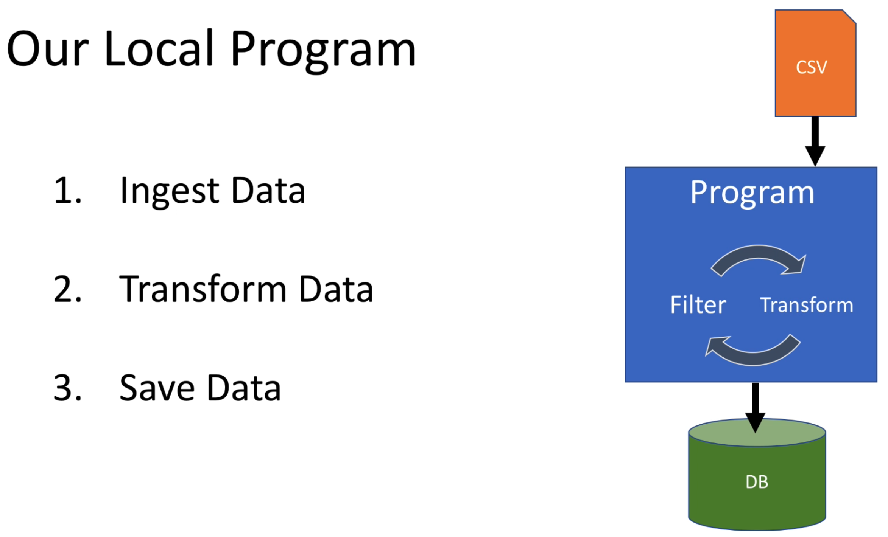

# Architecture Introduction

Take a look at [FirstApp](../src/main/scala/com/backwards/spark/FirstApp.scala) which locally reads a CSV, does some transformations, and persists to a Postgres database:

In a real world Spark application we'll have a Spark cluster:

Each worker will work on one or more partitions of the complete dataset:

and in a bit more detail:

where the tasks are our code e.g. FirstApplication which, after transforming data, wrote to a database:

And note, that the data will be distributed, instead of reading a file from a single (local) machine as we do in FirstApplication.

## Master/Worker Processes

The Driver process contains our code e.g. FirstApplication:

However, the Driver does not execute our code - the spawned workers execute our code.