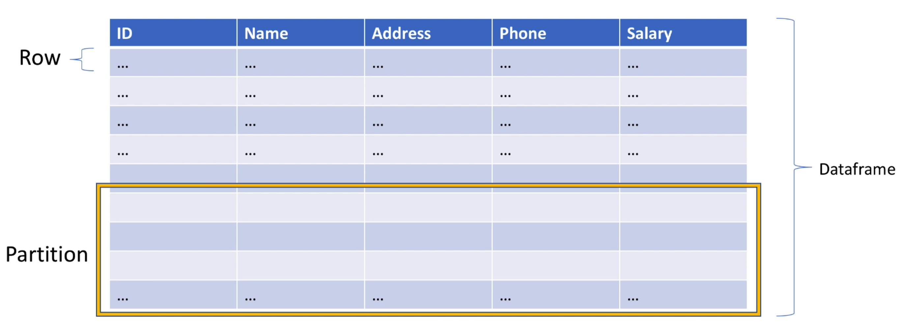
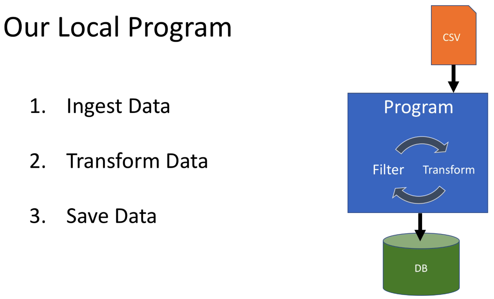

# Dataset

Take a look at [FirstApp](../src/main/scala/com/backwards/spark/FirstApp.scala) which locally reads a CSV, does some transformations, and persists to a Postgres database:

## Ingesting CSV

## Ingesting JSON