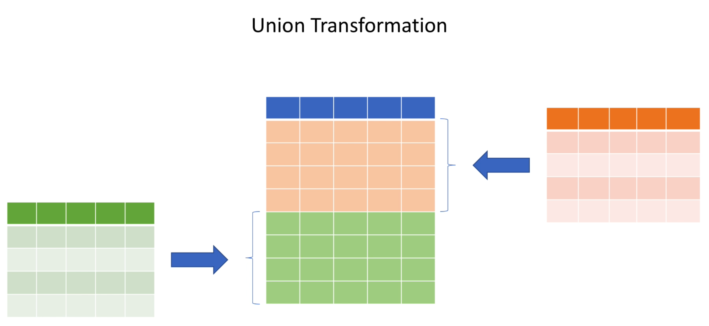

# Dataset


Take a look at [FirstApp](../src/main/scala/com/backwards/spark/FirstApp.scala) which locally reads a CSV, does some transformations, and persists to a Postgres database:


## Ingesting Two Different Datasets



## Dataset vs DataFrame

```scala
type DataFrame = Dataset[Row]
```

| Terminology | Code         | Tungsten memory optimise | Type safety |
| ----------- | ------------ | ------------------------ | ----------- |
| Dataset     | Dataset[Car] | ❌                       | ✅          |
| Dataframe   | Dataset[Row] | ✅                       | ❌          |

## Map and Reduce


---

