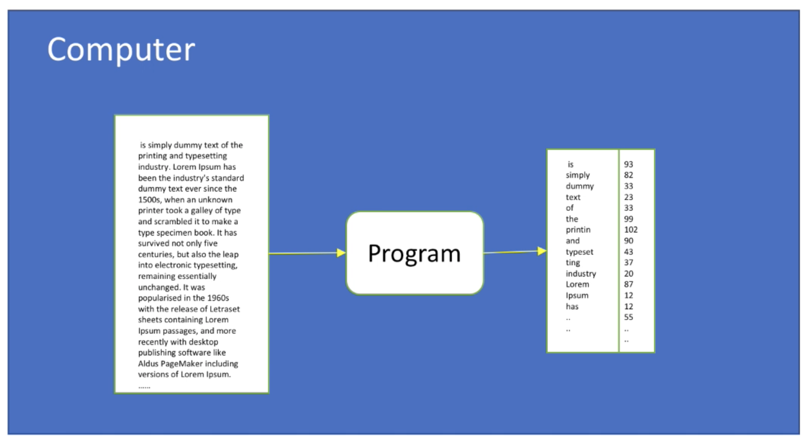
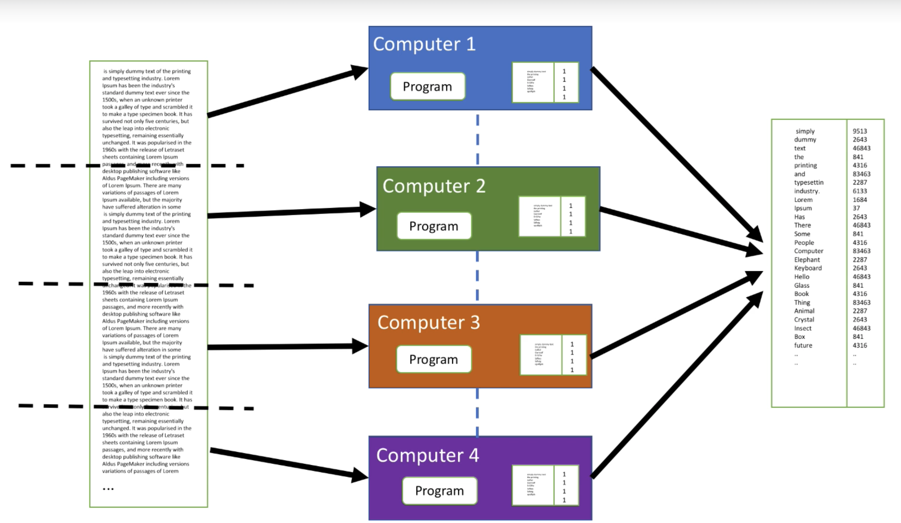

# Introduction

Word count example of a simple standalone program maybe reading a file to generate a HashMap:

Does this scale? No. We have to create something like:

In comes Spark:

- Handles complexity of writing distributed programs
    - Allows you to focus on the business problem
- Simple programming interface supporting various languages
    - Scala, Python, R, Java, SQL
- Develop locally on your computer without worrying much about distributed systems