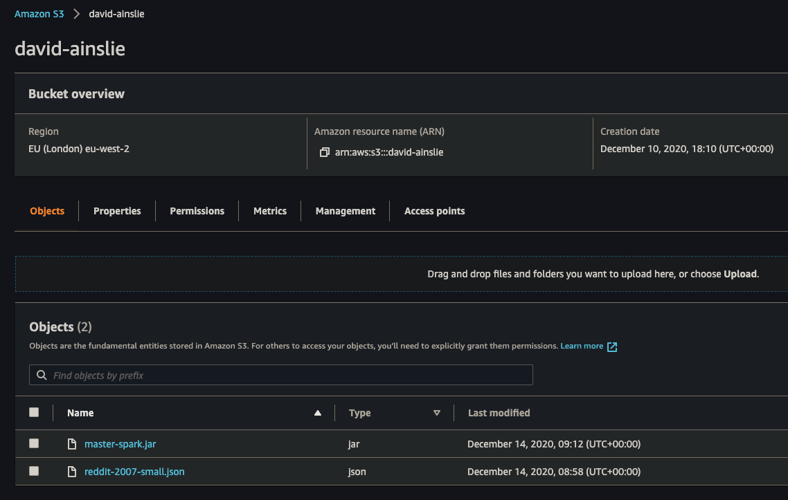
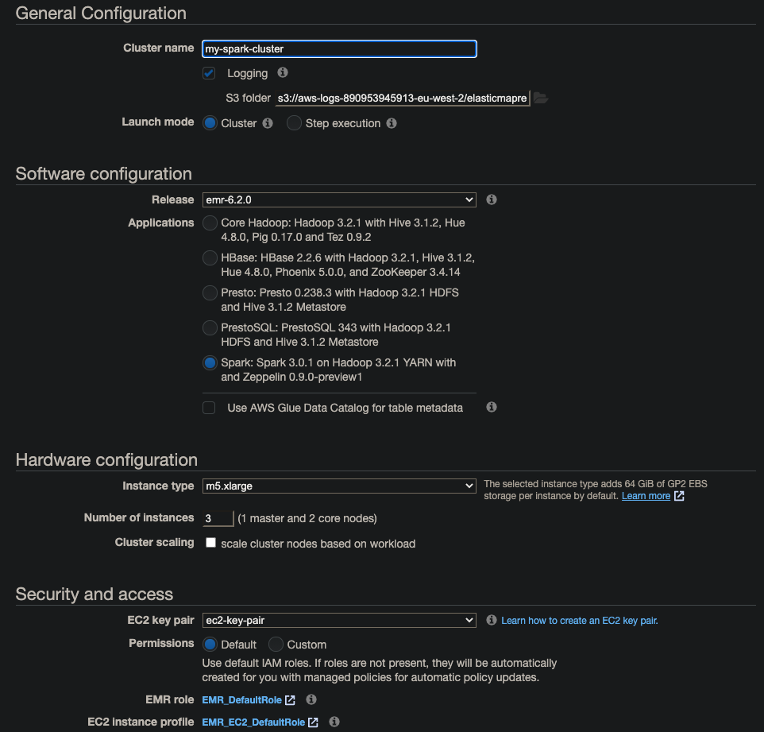
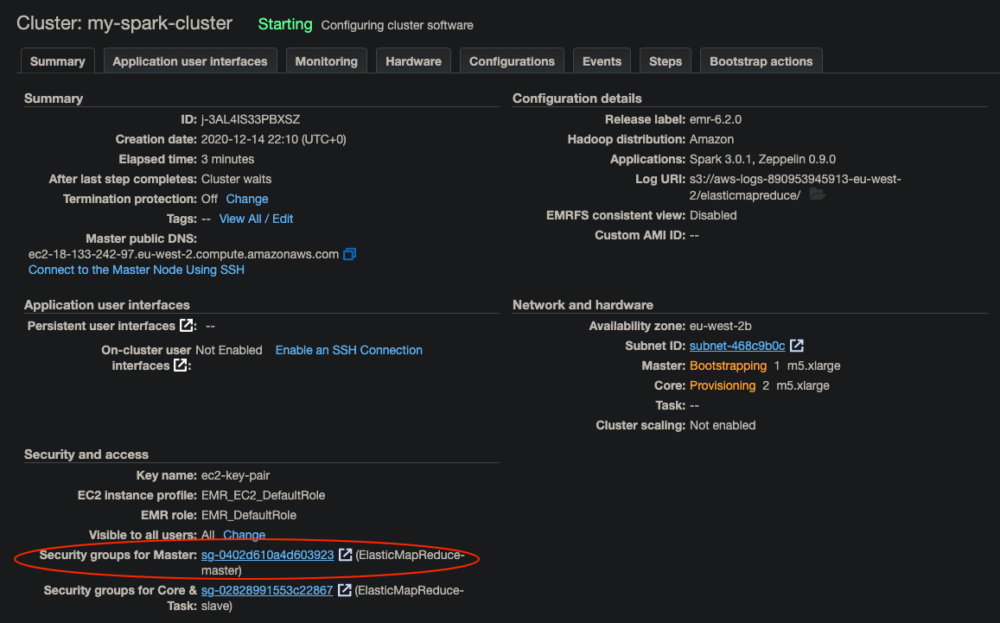
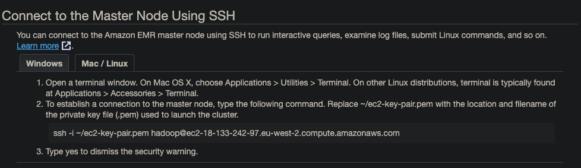

# Spark on the Cloud

We will work with two large files that can be downloaded from [https://files.pushshift.io/reddit/comments/](https://files.pushshift.io/reddit/comments/).

Upload to S3 the file [reddit-2007-small.json](../src/main/resources/reddit-2007-small.json).

Also build (from multi-project root as that is where our build.sbt resides) an assembled JAR and upload to S3, noting the build.sbt also stipulates which **main** object to use:

```bash
sbt -J-Xms2048m -J-Xmx2048m master-spark/assembly
```



Boot an EMR Spark cluster:



In order to be able to SSH into our cluster, we configure security groups on **master**:



Then we can get out SSH connection details:



```bash
➜ ssh -i ~/aws/credentials/ec2-key-pair.pem hadoop@ec2-18-133-242-97.eu-west-2.compute.amazonaws.com
```

Copy our JAR from S3:

```bash
[hadoop@ip-172-31-26-249 ~]$ aws s3 cp s3://david-ainslie/master-spark.jar .
```

Submit our JAR to Spark:

```bash
[hadoop@ip-172-31-26-249 ~]$ spark-submit master-spark.jar
```