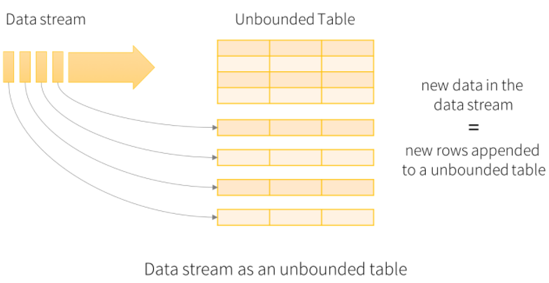
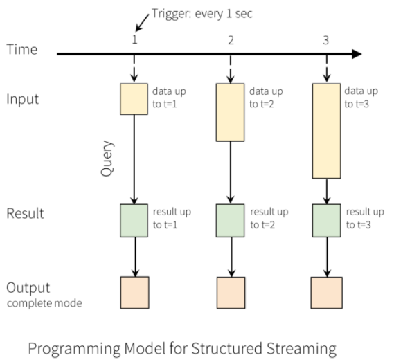
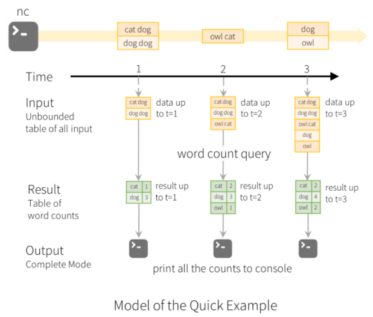
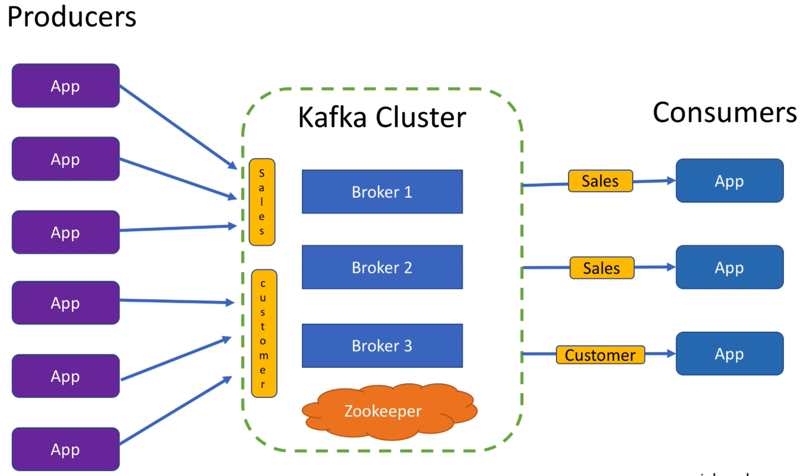
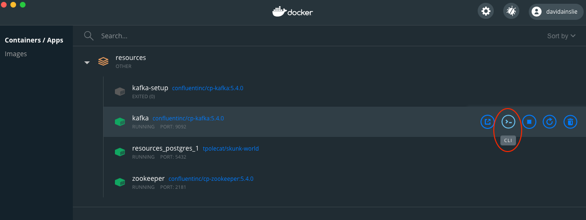

# Streaming

The [Spark Streaming documentation](https://spark.apache.org/docs/latest/structured-streaming-programming-guide.html) highlights the fact that streaming is really micro-batches being constantly run:



---



---



## Kafka Example

NOTE - We must include the following Spark dependency: **spark-sql-kafka-0-10**.

A Kafka cluster with topics "sales" and "customer" could look like:



We have a [docker-compose](../src/main/resources/docker-compose.yml) to start up Kafka that automatically creates the topic **test**.
Once booted, we need a Kafka Producer, so jump onto the Kafka Docker instance - the easiest way is via Docker Desktop:



and start a Kafka Producer:

```bash
# /usr/bin/kafka-console-producer --broker-list kafka:9092 --topic test
>
```

Of course, you may have Kafka scripts available on your machine so don't even have to jump onto Docker (even easier).

We are going to consume via a [Spark Streaming application](../src/main/scala/com/backwards/spark/_7b.scala).