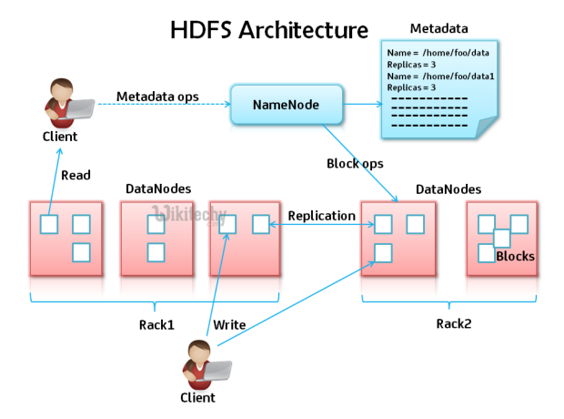

# HFDS

The Hadoop Distributed File System (**HDFS**) is the primary data storage system used by Hadoop applications. It employs a NameNode and DataNode architecture to implement a distributed file system that provides high-performance access to data across highly scalable Hadoop clusters.



- Properties files
  - /etc/hadoop/conf/core-site.xml
  - /etc/hadoop/conf/hdfs-site.xml
- Important properties
  - fs.defaultFS
  - dfs.blocksize
  - dfs.replication
- HDFS commands
  - Copying files
    - From local file system: **hadoop fs -copyFromLocal or -put**
    - To local file system: **hadoop fs -copyToLocal or -get**
  - Listing files: **hadoop fs -ls**
  - Previewing data files: **hadoop fs -tail or -cat**
  - Checking sizes of files: **hadoop fs -du**

Assuming you have [Cloudera](setup-cloudera.md) bootstrapped all services:

```bash
[root@quickstart /]# cd /etc/hadoop/conf

[root@quickstart conf]# ls -ltr
total 48
-rw-r--r-- 1 root root 3608 Apr 25 17:24 yarn-site.xml
-rwxr-xr-x 1 root root 1594 Apr 25 17:24 topology.py
-rw-r--r-- 1 root root  201 Apr 25 17:24 topology.map
-rw-r--r-- 1 root root  315 Apr 25 17:24 ssl-client.xml
-rw-r--r-- 1 root root 5101 Apr 25 17:24 mapred-site.xml
-rw-r--r-- 1 root root  314 Apr 25 17:24 log4j.properties
-rw-r--r-- 1 root root 1772 Apr 25 17:24 hdfs-site.xml
-rw-r--r-- 1 root root  574 Apr 25 17:24 hadoop-env.sh
-rw-r--r-- 1 root root 3862 Apr 25 17:24 core-site.xml
-rw-r--r-- 1 root root   26 Apr 25 17:24 __cloudera_metadata__
-rw-r--r-- 1 root root   21 Apr 25 17:24 __cloudera_generation__
```

```bash
[root@quickstart conf]# view core-site.xml

<!--Autogenerated by Cloudera Manager-->
<configuration>
  <property>
    <name>fs.defaultFS</name>
    <value>hdfs://quickstart.cloudera:8020</value>
  </property>
...  
```

```bash
[root@quickstart conf]# view hdfs-site.xml

<!--Autogenerated by Cloudera Manager-->
<configuration>
  ...
  <property>
    <name>dfs.namenode.servicerpc-address</name>
    <value>quickstart.cloudera:8022</value>
  </property>
  ...
  <property>
    <name>dfs.replication</name>
    <value>1</value>
  </property>
  <property>
    <name>dfs.blocksize</name>
    <value>134217728</value>
  ...  
```

## Commands

```bash
[root@quickstart ~]## hostname -f
quickstart.cloudera
```

If the following gives an error, you may need to restart the **namenode**:

```bash
[root@quickstart ~]## hadoop fs -ls /user/root
```

```bash
[root@quickstart ~]## sudo  service hadoop-hdfs-namenode status
Hadoop namenode is not running                             [FAILED]
```

```bash
[root@quickstart ~]## sudo  service hadoop-hdfs-namenode restart
no namenode to stop
Stopped Hadoop namenode:                                   [  OK  ]
starting namenode, logging to /var/log/hadoop-hdfs/hadoop-hdfs-namenode-quickstart.cloudera.out
log4j:ERROR Could not find value for key log4j.appender.RFA
log4j:ERROR Could not instantiate appender named "RFA".
log4j:WARN No appenders could be found for logger (org.apache.hadoop.hdfs.server.namenode.NameNode).
log4j:WARN Please initialize the log4j system properly.
log4j:WARN See http://logging.apache.org/log4j/1.2/faq.html#noconfig for more info.
Started Hadoop namenode:                                   [  OK  ]
```

```bash
[root@quickstart ~]## sudo  service hadoop-hdfs-datanode status
Hadoop datanode is not running                             [FAILED]
```

```bash
[root@quickstart ~]## sudo  service hadoop-hdfs-datanode restart
no datanode to stop
Stopped Hadoop datanode:                                   [  OK  ]
starting datanode, logging to /var/log/hadoop-hdfs/hadoop-hdfs-datanode-quickstart.cloudera.out
log4j:ERROR Could not find value for key log4j.appender.RFA
log4j:ERROR Could not instantiate appender named "RFA".
log4j:WARN No appenders could be found for logger (org.apache.hadoop.hdfs.server.datanode.DataNode).
log4j:WARN Please initialize the log4j system properly.
log4j:WARN See http://logging.apache.org/log4j/1.2/faq.html#noconfig for more info.
Started Hadoop datanode (hadoop-hdfs-datanode):            [  OK  ]
```

And the following should no longer give an error:

```bash
[root@quickstart ~]## hadoop fs -ls /user/root
```

Just in case, you may need to actually create the required directory (in our case it already existed):

```bash
[root@quickstart ~]## sudo -u hdfs hadoop fs -mkdir /user/root; sudo -u hdfs hadoop fs -chown -R root /user/root
mkdir: `/user/root': File exists
```

## Command - copyFromLocal

When using hadoop running within a docker container, there is an extra step before executing **copyFromLocal**:

First copy a file (directory) inside the container e.g. [blah.txt](../data/blah.txt):

```bash
$ docker ps
CONTAINER ID      IMAGE       COMMAND                  PORTS             NAMES
6655543ee6a4      cloudera    "/usr/bin/docker-qui…"   ...mapped ports   quickstart.cloudera

$ docker cp blah.txt quickstart.cloudera:/tmp/
```

Then, if required, create a directory inside HDFS:

```bash
[root@quickstart ~]#sudo -u hdfs hadoop fs -mkdir /user/root/data
```

Note that in order to perform **copyFromLocal** HDFS cannot be in **safe mode** which effectively prevents writing:

```bash
[root@quickstart ~]# sudo -u hdfs hdfs dfsadmin -safemode leave
Safe mode is OFF
```

Now from the container, upload into HDFS:

```bash
[root@quickstart ~]# sudo -u root hadoop fs -copyFromLocal /tmp/blah.txt /user/root/.
```

```bash
[root@quickstart ~]# hadoop fs -ls /user/root
Found 1 items
-rw-r--r--   1 root supergroup         10 2019-04-25 21:49 /user/root/blah.txt
```

Let's get the size:

```bash
[root@quickstart ~]# hadoop fs -du -s -h /user/root
10  10  /user/root
```

And more information:

```bash
[root@quickstart ~]# hdfs fsck /user/root -files -blocks -locations
Connecting to namenode via http://quickstart.cloudera:50070/fsck?ugi=root&files=1&blocks=1&locations=1&path=%2Fuser%2Froot
FSCK started by root (auth:SIMPLE) from /172.17.0.2 for path /user/root at Thu Apr 25 21:55:37 UTC 2019
/user/root <dir>
/user/root/blah.txt 10 bytes, 1 block(s):  OK
0. BP-1388946040-10.0.0.8-1508802350597:blk_1073742758_1934 len=10 Live_repl=1 [DatanodeInfoWithStorage[172.17.0.2:50010,DS-9ba65517-ab17-4617-bc97-35adb5015e06,DISK]]

Status: HEALTHY
 Total size:	10 B
 Total dirs:	1
 Total files:	1
 Total symlinks:		0
 Total blocks (validated):	1 (avg. block size 10 B)
 Minimally replicated blocks:	1 (100.0 %)
 Over-replicated blocks:	0 (0.0 %)
 Under-replicated blocks:	0 (0.0 %)
 Mis-replicated blocks:		0 (0.0 %)
 Default replication factor:	1
 Average block replication:	1.0
 Corrupt blocks:		0
 Missing replicas:		0 (0.0 %)
 Number of data-nodes:		1
 Number of racks:		1
FSCK ended at Thu Apr 25 21:55:37 UTC 2019 in 6 milliseconds
```

