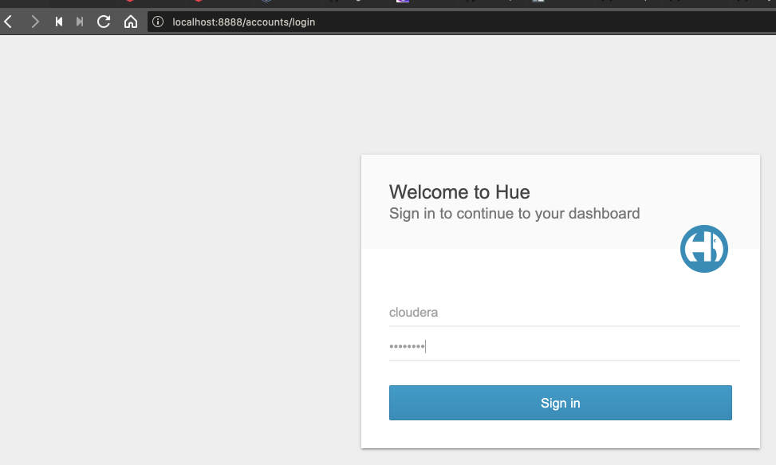
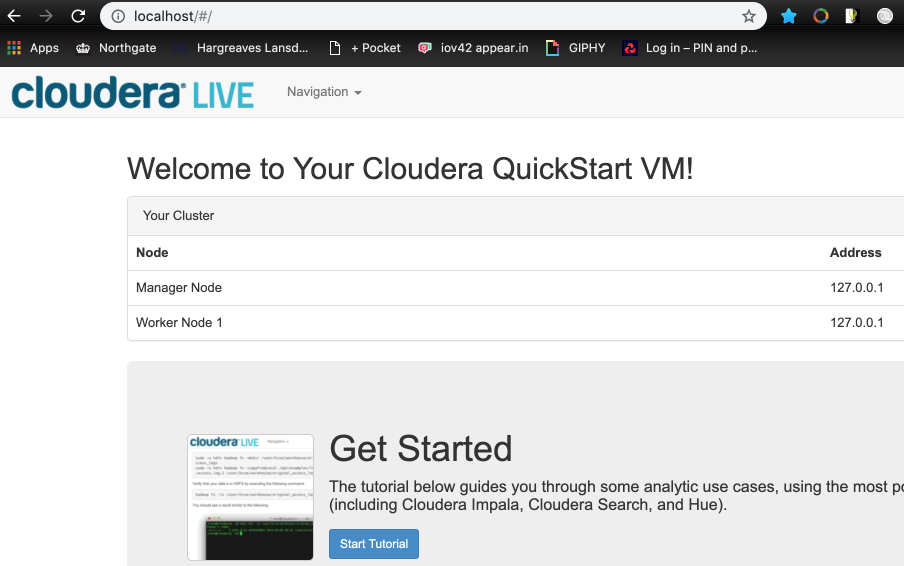
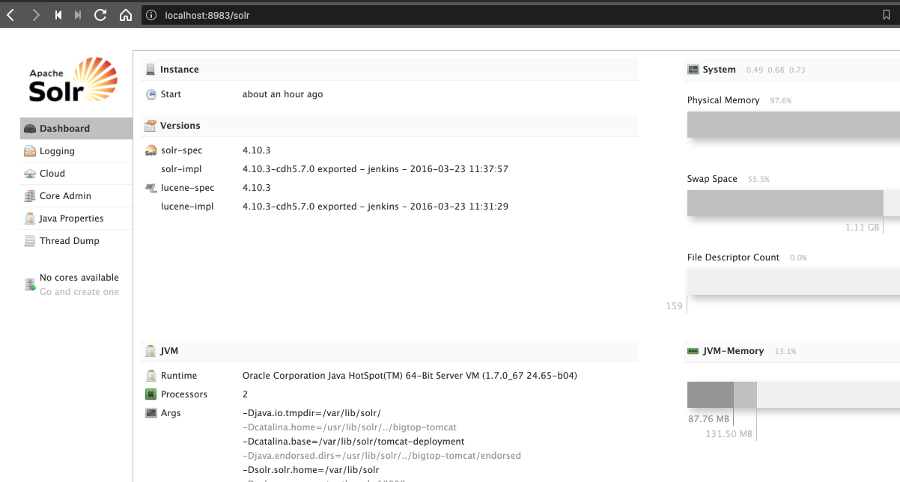
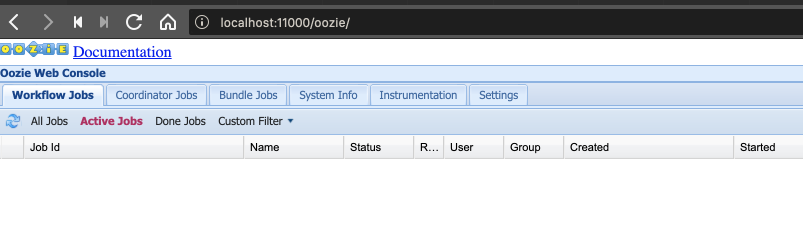
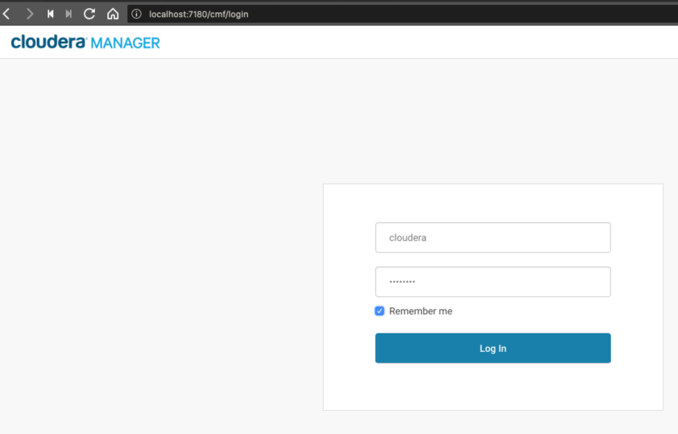
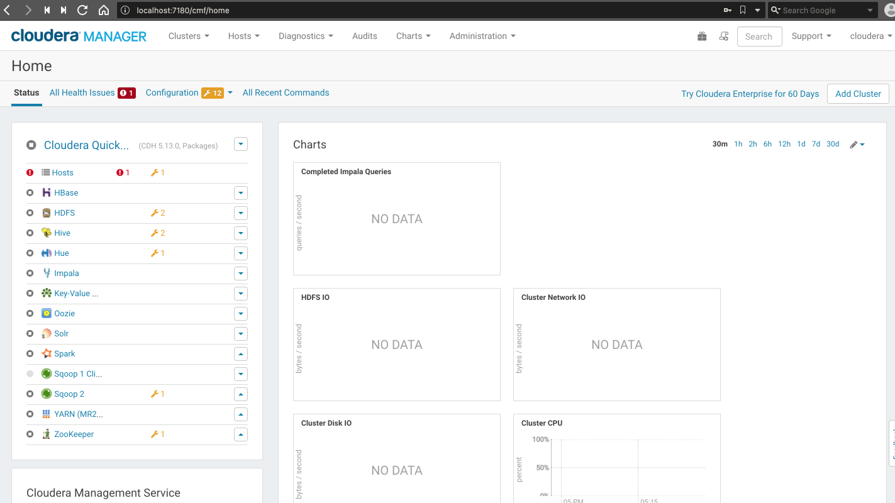

# Setup Cloudera

## Virtualbox

- Make sure you have followed the initial [setup](../../docs/setup.md).
- Download [Cloudera VM](https://www.cloudera.com/downloads/quickstart_vms/5-13.html).
- TODO - WIP (for the time being, follow the docker setup in the next section).

## Docker

Useful resources at:

- [https://gist.github.com/davideicardi/21aabb65faaa3c655770cf0ccbac6564](https://gist.github.com/davideicardi/21aabb65faaa3c655770cf0ccbac6564)
- [https://medium.com/@SnazzyHam/how-to-get-up-and-running-with-clouderas-quickstart-docker-container-732c04ed0280](https://medium.com/@SnazzyHam/how-to-get-up-and-running-with-clouderas-quickstart-docker-container-732c04ed0280)

```bash
$ docker run \
  --name quickstart.cloudera \
  --hostname=quickstart.cloudera \
  --privileged=true \
  --publish-all=true \
  -it \
  -v ~/workspace/backwards/spark-backwards/spark-and-hadoop-course/data:/src \
  -p 8888:8888 -p 7180:7180 -p 80:80 -p 8983:8983 -p 11000:11000 -p 50070:50070 -p 9092:9092 -p 2181:2181 -p 3306:3306 \
  cloudera/quickstart \
  /usr/bin/docker-quickstart
```

(Choose an appropriate volume mapping). There is an equivalent [docker-compose](../docker/docker-compose-cloudera.yml) file:

```bash
$ docker-compose -f docker-compose-cloudera.yml up
```

Even though **hue** will probably state that it failed to start, fear not.

```bash
[root@quickstart /]# service hue start
Starting hue: already running
```

```bash
$ docker ps
CONTAINER ID        IMAGE               COMMAND                  CREATED             STATUS              PORTS                                                                                                                                                                                          NAMES
6655543ee6a4        cloudera            "/usr/bin/docker-qui…"   12 minutes ago      Up 12 minutes       0.0.0.0:80->80/tcp, 0.0.0.0:2181->2181/tcp, 0.0.0.0:3306->3306/tcp, 0.0.0.0:7180->7180/tcp, 0.0.0.0:8888->8888/tcp, 0.0.0.0:8983->8983/tcp, 0.0.0.0:9092->9092/tcp, 0.0.0.0:11000->11000/tcp   quickstart.cloudera
```

```bash
$ docker inspect quickstart.cloudera
[
...
        "NetworkSettings": {
            "Bridge": "",
            "SandboxID": "b4d85aa0abbf6671ab4d9f4d6e1a7dde55c8c92aa42fb3ef1e2acabd8999a814",
            "HairpinMode": false,
            "LinkLocalIPv6Address": "",
            "LinkLocalIPv6PrefixLen": 0,
            "Ports": {
                "11000/tcp": [
                    {
                        "HostIp": "0.0.0.0",
                        "HostPort": "11000"
                    }
                ],
                "2181/tcp": [
                    {
                        "HostIp": "0.0.0.0",
                        "HostPort": "2181"
                    }
                ],
                "3306/tcp": [
                    {
                        "HostIp": "0.0.0.0",
                        "HostPort": "3306"
                    }
                ],
                "7180/tcp": [
                    {
                        "HostIp": "0.0.0.0",
                        "HostPort": "7180"
                    }
                ],
                "80/tcp": [
                    {
                        "HostIp": "0.0.0.0",
                        "HostPort": "80"
                    }
                ],
                "8888/tcp": [
                    {
                        "HostIp": "0.0.0.0",
                        "HostPort": "8888"
                    }
                ],
                "8983/tcp": [
                    {
                        "HostIp": "0.0.0.0",
                        "HostPort": "8983"
                    }
                ],
                "9092/tcp": [
                    {
                        "HostIp": "0.0.0.0",
                        "HostPort": "9092"
                    }
                ]
...            
```

Various ports are exposed.

```bash
$ docker port quickstart.cloudera 80
0.0.0.0:80
```

**Hue** on port **8888** - Loging with credentials cloudera/cloudera:



**Tutorial** on port **80**:



**Solr** on port **8983**:



**Oozie** on port **11000**:



Cloudera manager does not start by default:

```bash
[root@quickstart /]# /home/cloudera/cloudera-manager --express --force
```

or

```bash
[root@quickstart /]# /home/cloudera/cloudera-manager --enterprise --force
```

Then access **cloudera manager** on port **7180**:



---



Note, you may receive clock sync problems - try manually running the following to sync time:

```bash
[root@quickstart conf]# /etc/init.d/ntpd start
Starting ntpd:
```