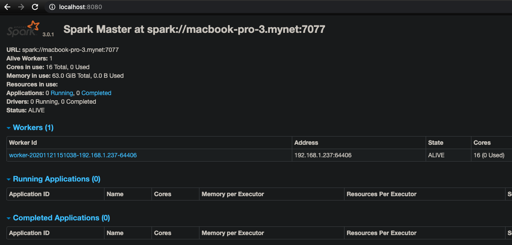

# Introduction

We'll be following [Spark by Examples](https://sparkbyexamples.com/spark/sparksession-explained-with-examples/).

## Install

We are on a Mac (sorry everyone else) and will install using [homebrew](https://brew.sh/):

```bash
➜ brew install apache-spark
```

Verify:
```bash
➜ spark-shell
...
Welcome to
      ____              __
     / __/__  ___ _____/ /__
    _\ \/ _ \/ _ `/ __/  '_/
   /___/ .__/\_,_/_/ /_/\_\   version 3.0.1
      /_/

Using Scala version 2.12.10 (OpenJDK 64-Bit Server VM, Java 11.0.9)
Type in expressions to have them evaluated.
Type :help for more information.

scala>
```

There's also **pyspark shell***:
```bash
➜ pyspark
...
Welcome to
      ____              __
     / __/__  ___ _____/ /__
    _\ \/ _ \/ _ `/ __/  '_/
   /__ / .__/\_,_/_/ /_/\_\   version 3.0.1
      /_/

Using Python version 2.7.16 (default, Oct 30 2020 02:15:49)
SparkSession available as 'spark'.
>>>
```

## Example

Run a sample job that comes with the Spark binary distribution (which depends on where homebrew install Spark):

Add Spark path to your profile e.g.
```bash
➜ spark-submit --deploy-mode client --class org.apache.spark.examples.SparkPi /usr/local/Cellar/apache-spark/3.0.1/libexec/examples/jars/spark-examples_2.12-3.0.1.jar 10
...
20/11/21 14:55:35 INFO Utils: Successfully started service 'SparkUI' on port 4040.
20/11/21 14:55:35 INFO SparkUI: Bound SparkUI to 0.0.0.0, and started at http://macbook-pro-3.mynet:4040
20/11/21 14:55:35 INFO SparkContext: Added JAR file:/usr/local/Cellar/apache-spark/3.0.1/libexec/examples/jars/spark-examples_2.12-3.0.1.jar at spark://macbook-pro-3.mynet:62426/jars/spark-examples_2.12-3.0.1.jar with timestamp 1605970535388
20/11/21 14:55:35 INFO Executor: Starting executor ID driver on host macbook-pro-3.mynet
...
20/11/21 14:55:36 INFO BlockManagerInfo: Added broadcast_0_piece0 in memory on macbook-pro-3.mynet:62428 (size: 1816.0 B, free: 434.4 MiB)
20/11/21 14:55:36 INFO SparkContext: Created broadcast 0 from broadcast at DAGScheduler.scala:1223
20/11/21 14:55:36 INFO DAGScheduler: Submitting 10 missing tasks from ResultStage 0 (MapPartitionsRDD[1] at map at SparkPi.scala:34) (first 15 tasks are for partitions Vector(0, 1, 2, 3, 4, 5, 6, 7, 8, 9))
20/11/21 14:55:36 INFO TaskSchedulerImpl: Adding task set 0.0 with 10 tasks
20/11/21 14:55:36 INFO TaskSetManager: Starting task 0.0 in stage 0.0 (TID 0, macbook-pro-3.mynet, executor driver, partition 0, PROCESS_LOCAL, 7393 bytes)
20/11/21 14:55:36 INFO TaskSetManager: Starting task 1.0 in stage 0.0 (TID 1, macbook-pro-3.mynet, executor driver, partition 1, PROCESS_LOCAL, 7393 bytes)
...
20/11/21 14:55:36 INFO TransportClientFactory: Successfully created connection to macbook-pro-3.mynet/192.168.1.237:62426 after 32 ms (0 ms spent in bootstraps)
20/11/21 14:55:36 INFO Utils: Fetching spark://macbook-pro-3.mynet:62426/jars/spark-examples_2.12-3.0.1.jar to /private/var/folders/mg/b2drd58d7_d3dn_01lsl2vk80000gn/T/spark-7ead7bfc-0f0a-4e17-905e-251744b6826b/userFiles-a3c10c71-c967-4f62-9897-a7597636070c/fetchFileTemp16074041659801493119.tmp
20/11/21 14:55:36 INFO Executor: Adding file:/private/var/folders/mg/b2drd58d7_d3dn_01lsl2vk80000gn/T/spark-7ead7bfc-0f0a-4e17-905e-251744b6826b/userFiles-a3c10c71-c967-4f62-9897-a7597636070c/spark-examples_2.12-3.0.1.jar to class loader
...
Pi is roughly 3.1403431403431403
20/11/21 14:55:37 INFO SparkUI: Stopped Spark web UI at http://macbook-pro-3.mynet:4040
...
```

There are a bunch of Spark services we can boot, or just "boot all":
```bash
➜ ls -las /usr/local/Cellar/apache-spark/3.0.1/libexec/sbin
total 168
 0 drwxr-xr-x  22 davidainslie  staff   704 28 Aug 10:22 .
 0 drwxr-xr-x  14 davidainslie  admin   448 21 Nov 14:41 ..
 8 -rwxr-xr-x   1 davidainslie  staff  2803 28 Aug 10:22 slaves.sh
 8 -rwxr-xr-x   1 davidainslie  staff  1429 28 Aug 10:22 spark-config.sh
16 -rwxr-xr-x   1 davidainslie  staff  5689 28 Aug 10:22 spark-daemon.sh
 8 -rwxr-xr-x   1 davidainslie  staff  1262 28 Aug 10:22 spark-daemons.sh
 8 -rwxr-xr-x   1 davidainslie  staff  1190 28 Aug 10:22 start-all.sh
 ...
 8 -rwxr-xr-x   1 davidainslie  staff  1478 28 Aug 10:22 stop-all.sh
 ...
```

Now you might receive the following:
```bash
➜ /usr/local/Cellar/apache-spark/3.0.1/libexec/sbin/start-all.sh
starting org.apache.spark.deploy.master.Master, logging to /usr/local/Cellar/apache-spark/3.0.1/libexec/logs/spark--org.apache.spark.deploy.master.Master-1-macbook-pro-3.mynet.out
failed to launch: nice -n 0 /usr/local/Cellar/apache-spark/3.0.1/libexec/bin/spark-class org.apache.spark.deploy.master.Master --host macbook-pro-3.mynet --port 7077 --webui-port 8080
  jenv: version `12.0.2' is not installed
```

So let's set up Java 8 (since I only have versions 8 and 15 currently) at the location where the above scripts are run:
```bash
➜ jenv local 1.8.0.202
```

and try again:
```bash
➜ /usr/local/Cellar/apache-spark/3.0.1/libexec/sbin/start-all.sh
starting org.apache.spark.deploy.master.Master, logging to /usr/local/Cellar/apache-spark/3.0.1/libexec/logs/spark--org.apache.spark.deploy.master.Master-1-macbook-pro-3.mynet.out
Password:
localhost: starting org.apache.spark.deploy.worker.Worker, logging to /usr/local/Cellar/apache-spark/3.0.1/libexec/logs/spark-davidainslie-org.apache.spark.deploy.worker.Worker-1-macbook-pro-3.mynet.out
```

We can access the [Spark Master UI](http://localhost:8080):



Don't forget to stop all services:
```bash
➜ /usr/local/Cellar/apache-spark/3.0.1/libexec/sbin/stop-all.sh
```
