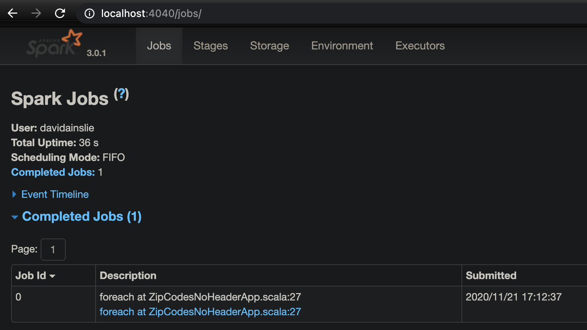
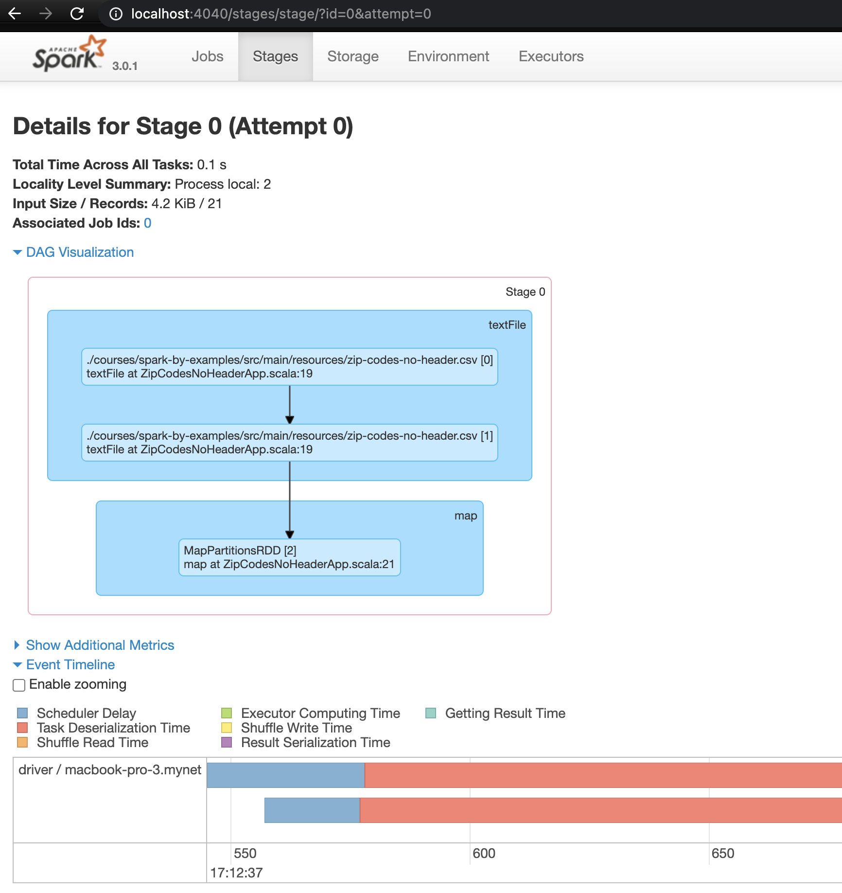

# Spark Web UI

Run the example [ZipCodesNoHeaderApp](../src/main/scala/com/backwards/spark/ZipCodesNoHeaderApp.scala) then:

[Spark Jobs](http://localhost:4040/jobs/) on [Spark Application UI](http://localhost:4040)

---

There's also:

[Resource Manager](http://localhost:9870)

[Spark JobTracker](http://localhost:8088)

[Node Specific Info](http://localhost:8042)