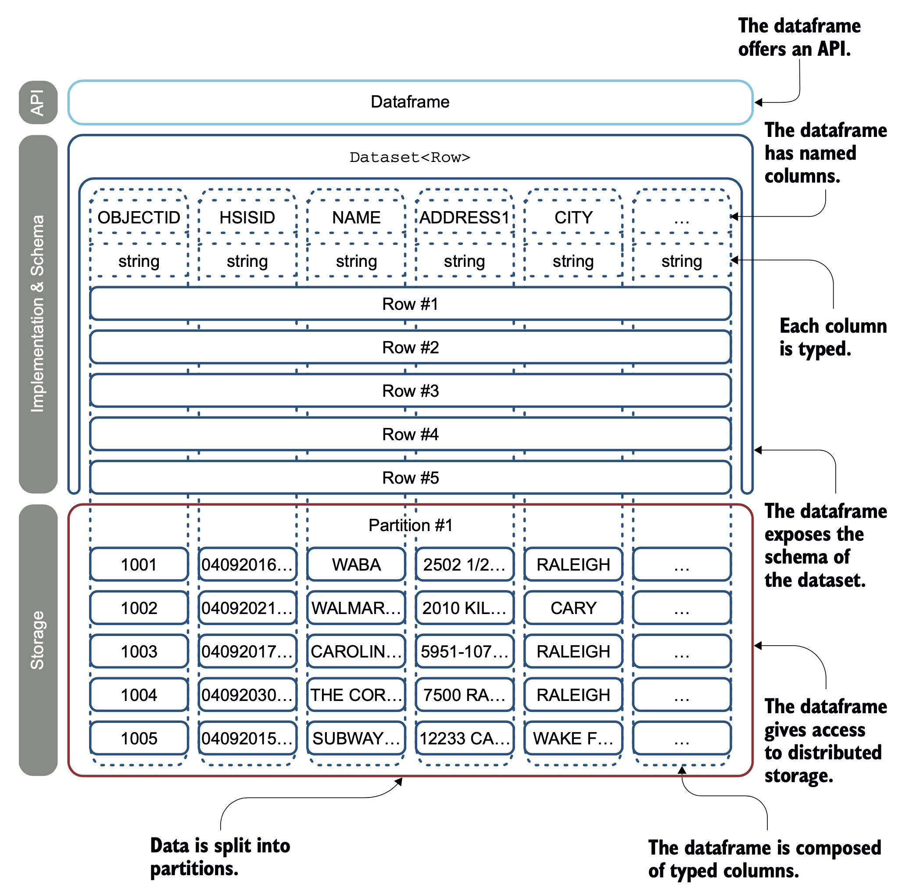

# Dataframe

A `Dataframe` is a set of records organised into named columns.
It is equivalent to a table in a relational database or a `ResultSet` in Java.

Note that partitions are not directly accessible from the dataframe; you will need to look at partitions through the RDDs.