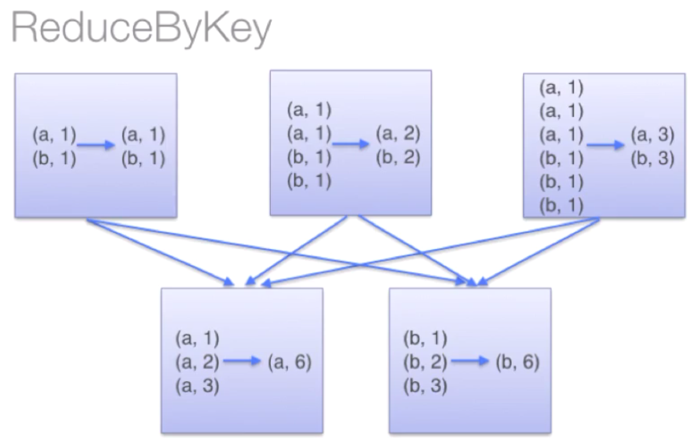
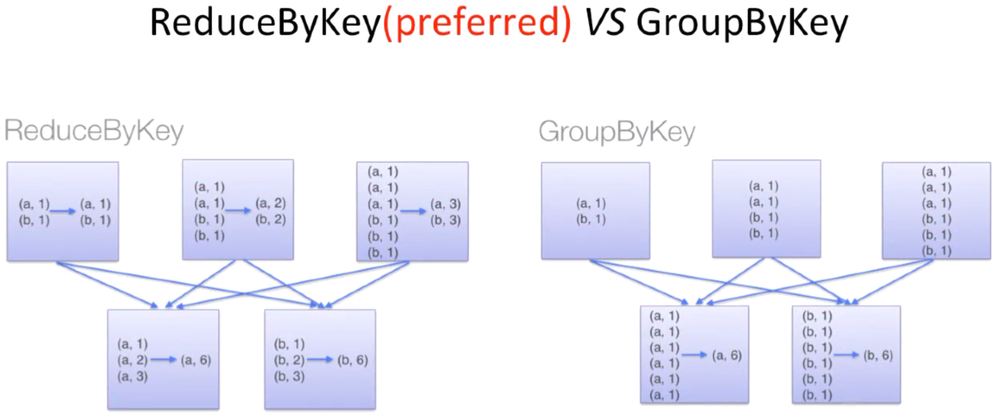
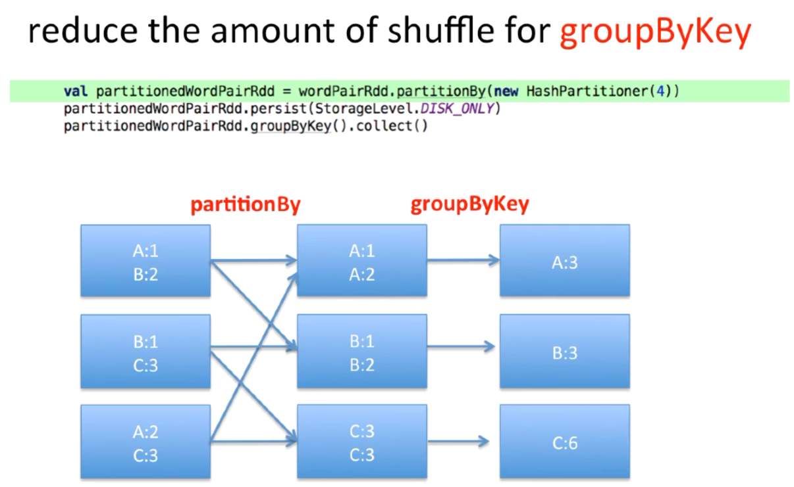

# Pair RDD

A lot of datasets we see in real life examples are usually **key value pairs** e.g

- A dataset which contains passport IDs and the names of the passport holders.
- A dataset contains course names and a list of students that enrolled in the courses.

Typical pattern of this kind of dataset is that each row is one key mapped to one or multiple values. Spark provides a data structure called **Pair RDD** instead of regular RDDs, which makes working with this kind of data simpler and more efficient.

## How To Create Pair RDDs

Either:

1. Return Pair RDDs from a list of key/value data structure called **tuple**.
2. Turn a regular RDD into a Pair RDD.

## Examples

Examples are under [src/main/scala/com/backwards/spark/rdd/pair](src/main/scala/com/backwards/spark/rdd/pair).

[WordCount.scala](src/main/scala/com/backwards/spark/rdd/pair/WordCount.scala) uses function **reduceByKey**:

> 

We can also use **groupByKey** but often it is less efficient:

> 

We can improve the efficiency of **groupByKey**:

> 