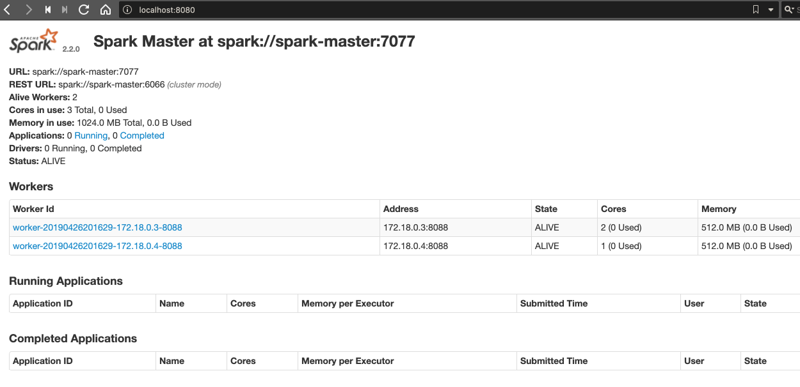

# Docker

Within the [root directory](../) of this module run:

```bash
$ docker-compose up
```

and navigate to [localhost:8080](http://localhost:8080):



## REST API

#### Job status

```bash
$ http http://localhost:6066/v1/submissions/status/driver-20151008145126-0000
HTTP/1.1 200 OK
Content-Length: 147
Content-Type: application/json;charset=utf-8
Date: Fri, 26 Apr 2019 21:42:18 GMT
Server: Jetty(9.3.z-SNAPSHOT)

{
    "action": "SubmissionStatusResponse",
    "serverSparkVersion": "2.2.0",
    "submissionId": "driver-20151008145126-0000",
    "success": false
}
```

#### Kill job

```bash
$ http POST http://localhost:6066/v1/submissions/kill/driver-20151008145126-0000
HTTP/1.1 200 OK
Content-Length: 235
Content-Type: application/json;charset=utf-8
Date: Fri, 26 Apr 2019 21:44:54 GMT
Server: Jetty(9.3.z-SNAPSHOT)

{
    "action": "KillSubmissionResponse",
    "message": "Driver driver-20151008145126-0000 has already finished or does not exist",
    "serverSparkVersion": "2.2.0",
    "submissionId": "driver-20151008145126-0000",
    "success": false
}
```

#### Submit job

```bash
$ curl -X POST http://localhost:6066/v1/submissions/create --header "Content-Type:application/json;charset=UTF-8" --data '{
  "action" : "CreateSubmissionRequest",
  "appArgs" : [ "myAppArgument1" ],
  "appResource" : "file:/Users/davidainslie/workspace/backwards/spark-backwards/spark-and-hadoop-course/target/scala-2.12/spark-and-hadoop-course_2.12-0.1.0-SNAPSHOT.jar",      
  "clientSparkVersion" : "1.5.0",
  "environmentVariables" : {
    "SPARK_ENV_LOADED" : "1"
  },
  "mainClass" : "com.backwards.spark.SimpleExampleJob",
  "sparkProperties" : {
    "spark.jars" : "file:Users/davidainslie/workspace/backwards/spark-backwards/spark-and-hadoop-course/target/scala-2.12/spark-and-hadoop-course_2.12-0.1.0-SNAPSHOT.jar",
    "spark.driver.supervise" : "false",
    "spark.app.name" : "MyJob",
    "spark.eventLog.enabled": "true",
    "spark.submit.deployMode" : "cluster",
    "spark.master" : "spark://localhost:6066"
  }
}'
```

